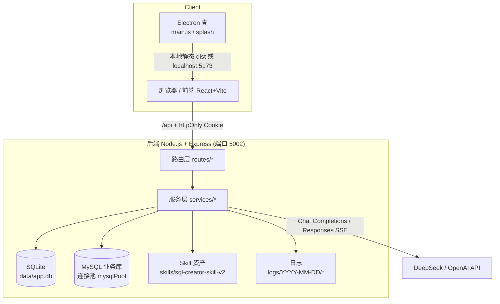
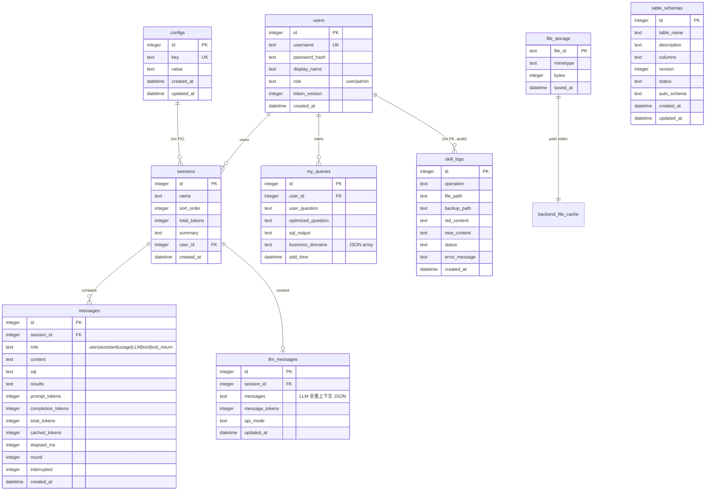

# 02 架构设计

> 版本：V1 · 核对日期：2026-08-25（补 `/api/files` 路由与 `services/files.js`/`vision.js`；SQLite 补 `file_storage` 路径索引表；Skill 资产计数刷新）

## 1. 总体架构



设计要点：

1. **前后端同仓分目录**：`backend/`（Express，ESM）、`frontend/`（Vite+React，代理 `/api` → 5002）、`electron/`（桌面壳，启动时托管后端子进程）。
2. **双本地库职责分离**：SQLite 存应用数据（用户/会话/消息/配置/审计），MySQL 是用户查询的目标业务库（只读使用，经连接池）。
3. **LLM 双协议实现**：默认 `chat_completions` 路径（`llm.js`），可选 `responses_api` 路径（`responsesApi.js` + `agentHelpers.js`），两路径事件协议 1:1 对齐，前端零改动。
4. **Skill 驱动**：LLM 的系统提示与表信息全部来自 `skills/sql-creator-skill-v2/` 本地资产，改动实时生效（每次对话重新读盘 / md5 感知缓存）。

## 2. 技术栈

| 层 | 技术 | 说明 |
|---|---|---|
| 前端 | React 18 + Vite 5 + Ant Design 5 | `frontend/package.json` |
| 编辑器 | Monaco Editor 0.55（本地 `public/monaco`） | SQL 预览 / Skill 文件编辑 |
| 渲染 | react-markdown + remark-gfm + react-syntax-highlighter | GFM 表格与代码高亮，无 CDN |
| 后端 | Express 4（ESM）+ LangChain Core（仅 DynamicTool schema） | 无 Agent 框架运行时，Agent 循环为手写 |
| 数据库 | better-sqlite3 12（WAL）+ mysql2/promise | SQLite 应用库；MySQL 目标库连接池 |
| 鉴权 | jsonwebtoken + bcryptjs | httpOnly Cookie + token_version 吊销 |
| 限流 | express-rate-limit | 认证写 10/h、读 100/h |
| 日志 | winston（自研按日/按用户 transport） | 系统日志 + LLM 全量日志 |
| Token 统计 | DeepSeek 官方 BPE（tokenizer.json） | 中文/多字节正确计数，含回退算法 |
| 桌面 | Electron 42 + electron-builder | splash + 后端托管 + 打包 |
| 校验 | node-sql-parser 5 | validate_sql_fields 的 AST 解析 |

## 3. 后端模块职责（代码地图）

### 3.1 入口与基础设施

| 文件 | 职责 |
|---|---|
| `backend/src/index.js` | 组装 Express：CORS（任意 origin + credentials）、10mb JSON、cookie-parser、9 组路由、全局错误中间件、`unhandledRejection`/`uncaughtException` 兜底；启动顺序 initDatabase → initSkillLogTable → listen |
| `backend/src/config.js` | 静态配置（环境变量）：PORT / DB_PATH / SKILL_PATH / LOG_PATH / PROJECT_ROOT，路径基于本文件解析为绝对路径，不依赖 CWD |
| `backend/src/logger.js` | winston 单例：控制台 + 按日目录 `logs/YYYY-MM-DD/_system_app.log` / `_system_error.log`，同步写盘，跨天自动切流 |
| `backend/src/db/sqlite.js` | SQLite 初始化：建表、默认 admin、数据迁移（`cached_tokens`、`api_mode`）、索引；`getDb()` 幂等 |
| `backend/src/middleware/rateLimit.js` | `authRateLimiter`（10/h，key=IP+username，成功不计数）、`authMeRateLimiter`（100/h/IP） |
| `backend/src/utils/fs.js` | `ensureDir`：区分“已存在”与真实错误 |
| `backend/src/utils/asyncHandler.js` | 包装 async 路由，异常统一 `next(err)`，避免 Express 4 吞 rejected promise |

### 3.2 路由层（HTTP 入口）

| 路由前缀 | 文件 | 主要端点 |
|---|---|---|
| `/api/auth` | `routes/auth.js` | register / login / me / logout / change-password |
| `/api/config` | `routes/config.js` | test / db / llm / llm/models / agent |
| `/api/query` | `routes/query.js` | generate(SSE) / execute / explain / explain-analyze(SSE) / version / messages |
| `/api/sessions` | `routes/session.js` | CRUD + tokens + summarize |
| `/api/skills` | `routes/skill.js` | list / read / save / add-tag / check-table / fetch-ddl / create-table-files / domains / debug |
| `/api/queries` | `routes/favoriteQuery.js` | favorite / favorites/check / suggestions |
| `/api/files` | `routes/files.js` | upload（multipart → DeepSeek Files API 透传）/ 列表 / DELETE `/:id` / GET `/:id/content`（本地缓存回显代理）/ `_diagnose/:id` |
| `/api/tables`、`/api/table-schema`、`/api/export` | 空壳 | 仅 `authRequired`，历史遗留（见问题清单） |

### 3.3 服务层（业务逻辑）

| 文件 | 职责 | 关键导出 |
|---|---|---|
| `services/auth.js` | JWT（懒加载密钥、格式预校验）、Cookie、角色中间件、会话归属校验 | `authRequired`、`adminRequired`、`signToken`、`verifyToken`、`sessionBelongsToUser` |
| `services/config.js` | SQLite 动态配置读写 | `getConfig`、`getLlmConfig`、`getAgentConfig`、`updateAgentConfig`、`getTokenWarningLevel` |
| `services/llm.js` | **CC 路径 Agent 核心**：主循环、流解析、thinking 剥离、工具三阶段、registry、去重、剪枝、checklist、压缩、DB 持久化、收藏专用非流式 LLM | `runSqlAgent`、`loadSkillMd`、`saveMessagesToDb`、`loadMessagesFromDb`、`getProviderConfig`、`LLM_TIMEOUTS`、`withTimeout`、`queueLog` |
| `services/responsesApi.js` | **Responses 路径**：`/responses` 流式事件翻译、终止事件、DB 落库、与 CC 1:1 对齐 | `runSqlAgentResponsesHandler` |
| `services/agentHelpers.js` | Responses 路径共享辅助：消息初始化、工具剪枝、工具三阶段执行、input items 转换 | `executeToolCallsInStages`、`convertMessagesToInputItems` 等 |
| `services/toolFuncs.js` | 6 个 DynamicTool 定义 + Skill 资产读取（表索引/域/DDL/field_config/模板）+ DDL 解析 | `tools`、`loadTableIndex`、`sliceTableIndexByDomains`、`getTableSchema`、`getTableDDL` |
| `services/validators.js` | `validate_sql_fields` 工具实现：R1/R2/R3/R5 四类规则 | `validateSqlFields` |
| `services/sqlParser.js` | node-sql-parser 封装：AST、表/列提取、CTE/窗口函数/JSON_TABLE/LIMIT 检测、别名映射、子查询列提取 | `parseSql`、`extractColumnRefs`、`buildAliasMap` 等 |
| `services/sqlValidator.js` | 执行/EXPLAIN 前置只读校验：注释状态机、前缀白名单、危险函数黑名单、多语句拒绝 | `validateReadOnlySql` |
| `services/tokenizer.js` | DeepSeek BPE token 计数 + 回退计数 | `countTokens`、`countMessagesTokens` |
| `services/mysqlPool.js` | MySQL 连接池（配置指纹重建、10 连接、15s 获取/30s 查询超时、keepalive） | `poolQuery`、`getPool`、`closePool` |
| `services/ddlUtils.js` | 按表加载列名集合（DDL + field_aliases 合并，per-table Set） | `loadColumnsMap` |
| `services/fieldConfigUtils.js` | 加载表字段别名（mtime 缓存） | `loadFieldAliases` |
| `services/skillCache.js` | Skill 文件树缓存（fs.watch + mtime 双失效） | `createSkillTreeCache` |
| `services/skillDomains.js` | 业务域文件读写 + 表→域反向索引（5s TTL） | `getDomainsForTables`、`addTableToDomains` |
| `services/favoriteQuery.js` | 收藏全流程：LLM 优化标题/提取表名、域反查、upsert、批量查、随机建议 | `saveFavoriteQuery`、`checkFavorites`、`getFavoriteSuggestions` |
| `services/files.js` | DeepSeek Files API 代理 + 本地文件缓存（上传后二进制落盘 `backend/file_cache/`，DB 只存元数据、路径由 file_id 推导；回显优先本地，DeepSeek content 端点实测永远 404） | `uploadFile`、`downloadFile`、`deleteFile`、`readStorage`/`writeStorage`、`ensureFileCacheDir` |
| `services/vision.js` | vision 模型判定（非 vision 模型带 fileIds 静默丢 + warn） | `isVisionModel` |

## 4. 前端模块

| 文件 | 职责 |
|---|---|
| `src/App.jsx`（约 **1655 行**，经 hooks 拆分持续瘦身） | 主应用：多会话并行流式状态机（messagesBySession/streamBatchesRef）、SSE 消费、页签编排、SQL 执行、EXPLAIN/AI 分析、Skill 抽屉、主题 |
| `src/api/index.js` | axios 实例（withCredentials、拦截器：401 触发事件、4xx/5xx toast）、SSE fetch 封装、附件上传 XHR（进度/取消）、旧 localStorage token 清理 |
| `src/utils/sseStream.js` | 通用 SSE 解析：UTF-8 增量解码 + 半行缓冲 + 收尾 flush |
| `src/context/AuthContext.jsx` | 登录态：bootstrap `/me`、login/register/logout、401 事件监听 |
| `src/context/ThemeContext.jsx` | 主题切换（light/dark，localStorage 持久化） |
| `src/components/*` | ChatPanel（聊天区容器）、ChatInput（输入框 + 附件 picker/vision 提示条）、ChatMessage、RoundGroup（轮次分组折叠）、CloseableMessage、Sider（侧边栏）、ConfigPanel（数据库/LLM/Agent 三区）、SqlPanel、SkillDrawer、UserChoiceDialog（链式问答）、ConfirmDialog（标签确认）、LoginPage、markdownRenderers、ResizableTitle、AppIcon |
| `src/components/modals/*` | AddTableModal、ChangePasswordModal、ExplainAnalyzeModal、SessionMessagesModal |
| `src/hooks/*` | useFileUpload（附件上传/勾选/blobURL 缓存）、useUserChoice（跨会话弹窗，记录发起方 sessionId）、useTagConfirmation、useFavorites、useScrollMemory（按会话记忆滚动位置）、useSessionList、useAppConfig |
| `src/utils/*` | monacoEnv（Monaco worker + hover 抑制）、sseStream、groupMessages（按 round 分组）、messageHistory、excel（导出）、toolName 等 |
| `src/constants/vision.js` | vision 模型常量与判定（镜像后端 `services/vision.js`） |

## 5. SQLite 数据模型（`data/app.db`）



### 表说明与关键字段语义

| 表 | 用途 | 关键点 |
|---|---|---|
| `users` | 账号 | `token_version` 用于改密/登出后吊销旧 token；首启空表自动创建 admin |
| `sessions` | 会话 | 按 `user_id` 隔离；`total_tokens` 为 usage 行累计 |
| `messages` | 前端历史 + 审计 | `role` 含 `usage`/`LLM`/`tool`/`tool_return` 等非对话角色；`round` 用于前端日志分组；`interrupted=1` 标记中断消息；**每条 SSE 事件都落一行，行数增长快** |
| `llm_messages` | LLM 真实上下文持久化 | 每会话一行，`messages` 为完整 JSON；`message_tokens` 为**最近一轮 API 权威 prompt_tokens**（2026-08-25 起，替代原本地 BPE 全量计算）；中断时 `loadMessagesFromDb` 会补合成 tool 响应（`sanitizeMessagesForLLM`）保证协议合法 |
| `configs` | 键值配置 | `db_config`、`llm_config`、`jwt_secret`、`agent_*`；`jwt_secret` 首次启动随机生成持久化 |
| `my_queries` | 收藏 | `(user_id, sql_output)` 唯一，重复收藏自动更新 |
| `skill_logs` | Skill 变更审计 | save / add-tag / create-table-files / overwrite_ddl 全部记录，含新旧内容与备份路径 |
| `table_schemas` | 预留 | 当前代码未使用（0 行），历史遗留 |
| `file_storage` | 附件元数据索引 | **不存 BLOB、不存任何路径**——缓存目录扁平，磁盘路径由 `file_id` 直接推导（`FILE_CACHE_DIR/<file_id>`，见 `services/files.js`），项目挪目录 / 换盘符天然有效；本表经历过 BLOB 版 → 绝对路径列 → 相对文件名列三次演进，一次性迁移代码已在存量升级后删除（历史见 changelog 2026-08-25 §B）；删除附件时磁盘文件与索引同步清理 |

迁移策略：`CREATE TABLE IF NOT EXISTS` + `PRAGMA table_info` 检查后 `ALTER TABLE ADD COLUMN`（已有 `cached_tokens`、`api_mode` 等迁移），非破坏式。file_storage 表的一次性 schema 迁移（BLOB→路径→去路径列）已随存量升级完成而移除。

## 6. Skill 资产模型（`skills/sql-creator-skill-v2/`）

```
sql-creator-skill-v2/
├── SKILL.md                    # LLM 系统提示（核心规则、系统约定、输出格式；末尾内嵌可用业务域清单）
├── table_index.json            # 表索引：135 张表（name/description/tags/related_tables/业务约束/规则）
├── domain_router_index.json    # 业务域路由：11 个已注册域（id/name/description）
├── domains/{id}.json           # 域→表清单（12 个文件，report 未注册到索引）
├── ddl/{table}.sql             # 每表 DDL（134 个）
├── field_config/{table}.json   # 每表字段配置（133 个）：field_aliases/field_enums/virtual_associations/business_rules 等
├── templates/output_format.md  # 输出格式模板
└── docs/                       # mysql57_limits.md、table_index文档说明.md
```

读取规则：

- 每次对话**实时读盘**（`loadSkillMd`），保证编辑即时生效；
- `table_index.json` / `domains/*.json` 在工具链路（`get_sliced_index`、compact 折叠）中同样**实时读盘不缓存**——这是有意决策（用户 2026-08-25 确认）：保证 Skill 编辑即时生效，接受少量 IO 开销。md5 缓存仅存在于 `/api/query/version` 版本端点；
- `field_config` 别名有 mtime 缓存（`fieldConfigUtils`）；
- `domain_router_index.json` 反查域有 5s TTL 内存缓存，写操作后 `invalidateReverseIndex()`。

## 7. 配置体系

### 7.1 环境变量（静态配置，`backend/src/config.js`）

| 变量 | 默认 | 说明 |
|---|---|---|
| `PORT` | `5002` | 后端 HTTP 端口 |
| `DB_PATH` | `<root>/data/app.db` | SQLite 路径 |
| `SKILL_PATH` | `<root>/skills` | Skill 根目录 |
| `LOG_PATH` | `<root>/logs` | 日志目录 |
| `PROJECT_ROOT` | 由 `config.js` 位置推导 | 以上路径的 fallback 基准 |
| `JWT_SECRET` | 自动生成存 SQLite | 生产环境建议显式设置 |
| `JWT_EXPIRES_IN` | `7d` | token 有效期 |
| `ALLOW_DEFAULT_ADMIN` | dev=true / prod=false | 是否自动创建 admin 默认账号 |
| `NODE_ENV` | - | `production`：禁用默认 admin + secure cookie + 调试接口 404 |
| `FAVORITE_LLM_MODEL` | `deepseek-chat` | 收藏功能专用模型（避免烧快模型配额） |

### 7.2 动态配置（SQLite configs 表，界面可改）

| key | 默认 | 范围 | 说明 |
|---|---|---|---|
| `db_config` | - | - | MySQL 连接（JSON） |
| `llm_config` | - | - | provider / apiKey / model / apiMode |
| `agent_max_tool_calls` | 30 | 1-100 | Agent 最大工具轮数 |
| `agent_timeout_ms` | 60000 | 1000-300000 | 界面可保存，但**代码未消费**（LLM fetch 实际固定 120s），见问题清单 A18 |
| `agent_token_warning_level` | 30000 | 1000-300000 | 前端 token 进度条警告阈值 |
| `jwt_secret` | 随机生成 | - | 自动维护，勿手改 |

## 8. 日志体系

| 日志 | 路径 | 内容 |
|---|---|---|
| 系统应用日志 | `logs/YYYY-MM-DD/_system_app.log` | 启动/路由/业务事件（winston JSON） |
| 系统错误日志 | `logs/YYYY-MM-DD/_system_error.log` | error 级别 |
| LLM 全量日志 | `logs/YYYY-MM-DD/{username}_llm.log` | 每轮完整请求/响应/usage/checklist/工具日志（含 prompt，敏感） |
| 收藏 LLM 日志 | `logs/YYYY-MM-DD/{username}_favorite_llm.log` | 收藏标题优化请求/响应 |
| Electron 启动日志 | `logs/electron-startup-<ts>.log` | 壳启动、端口处理、后端子进程 stdout/stderr |
| Skill 审计 | SQLite `skill_logs` 表 | 文件变更 + 备份路径 |

LLM/收藏日志采用“按用户名分组批量 flush（1s 定时）”，用户名经 `sanitizeUsername` 清洗，避免路径注入。

## 9. 安全设计

### 9.1 鉴权
- JWT 放 `xtsql_auth` httpOnly Cookie（SameSite=Lax，生产加 Secure），前端 JS 不可读，防 XSS 窃取；
- 每次请求重新查库比对 `token_version`，改密/登出即时吊销；
- JWT 格式预校验正则，减少垃圾 token 触发 `jwt.verify` 的 CPU 开销；
- `Authorization: Bearer` 头兼容 CLI/脚本客户端。

### 9.2 输入与注入防护
- SQL 执行：注释剥离状态机（拒绝 MySQL 条件注释 `/*!...*/`）→ 长度 20k 限制 → 前缀白名单（execute: SELECT/WITH；explain: +EXPLAIN）→ 危险函数黑名单（SLEEP/BENCHMARK/LOAD_FILE/INTO OUTFILE/GET_LOCK/USER() 等）→ 多语句拒绝（含尾部 `;` 剥离后检测）；
- MySQL 连接 `multipleStatements: false`；
- Skill 路由：`isPathSafe` 防 `../` 与前缀撞名穿越；`fetch-ddl` 表名白名单正则 `^[a-zA-Z0-9_.]{1,64}$`；
- 请求体 10mb 上限。

### 9.3 数据保护
- API Key 只存 SQLite，读取接口返回掩码（`sk-****abcd`），前端仅在用户真正改动时提交新 key；
- 调试接口 `/api/query/messages` 生产环境 404 + 非生产要求 admin；
- 会话归属校验（`sessionBelongsToUser`）覆盖会话/消息/查询类接口。

### 9.4 已知安全短板（详见问题清单）
- 错误响应直接透传 `e.message`，可能泄露内部细节；
- CORS 任意 origin + credentials，依赖 SameSite 防护，浏览器部署需评估；
- 执行路径的 SQL 校验为“正则+白名单”级，`node-sql-parser` 仅用于 LLM 自检工具（`validate_sql_fields`）；
- Electron 启动时强杀 5002 端口占用进程，存在误杀风险。

## 10. 版本与演进参考

- 近期迭代主线（git log）：SSE 流式稳定性（UTF-8 截断、会话错乱）→ 工具去重/剪枝/checklist → `validate_sql_fields` 工具与 R1-R5 规则 → Responses API 双路径（v5.11-v5.19）→ 缓存命中率展示与 usage 事件修复；
- 历史实施计划与评审文档位于 `docs/superpowers/{plans,specs,reviews,changelog}`，可作为功能演进背景，但**以本文档集与代码为准**。
