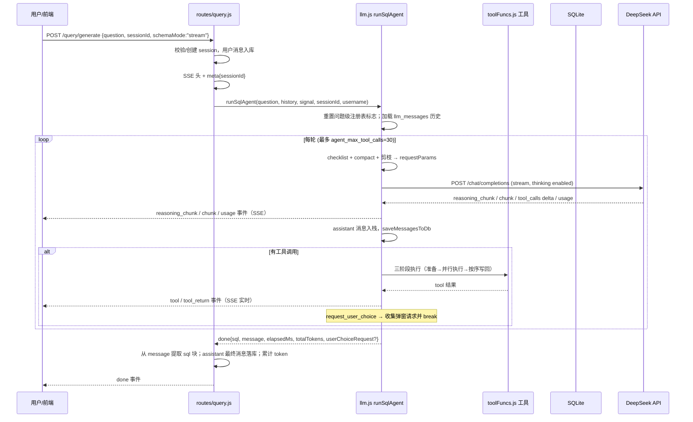
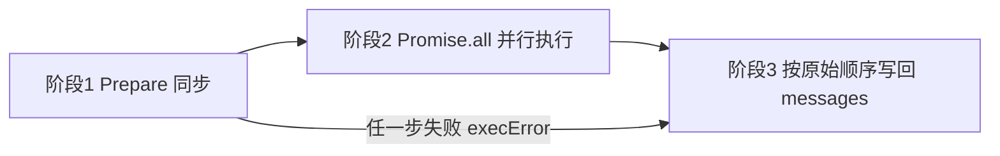
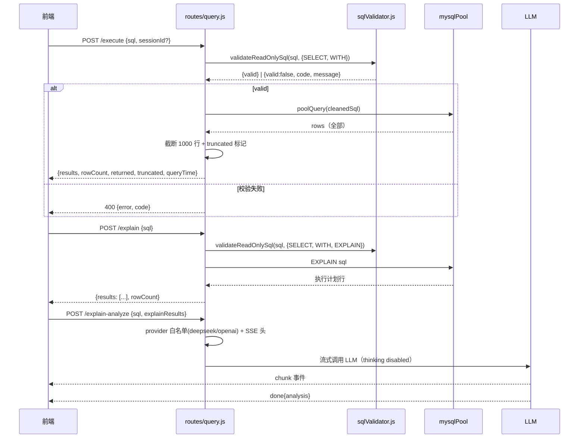
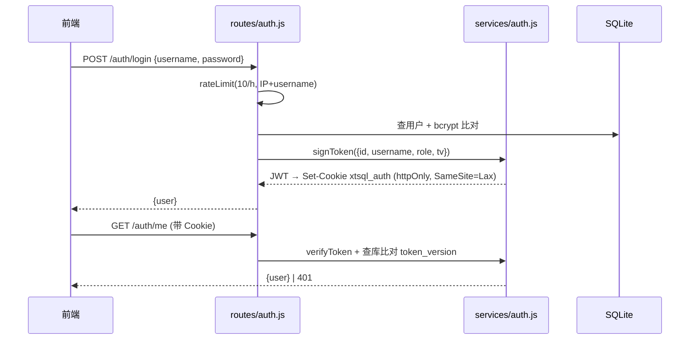
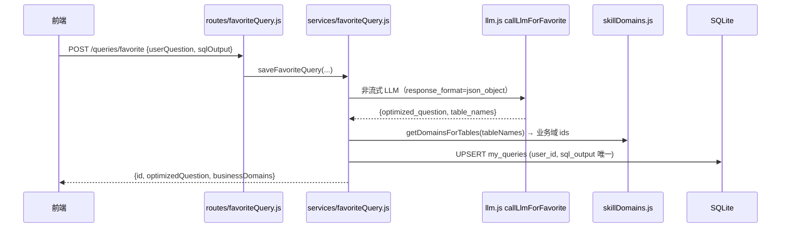
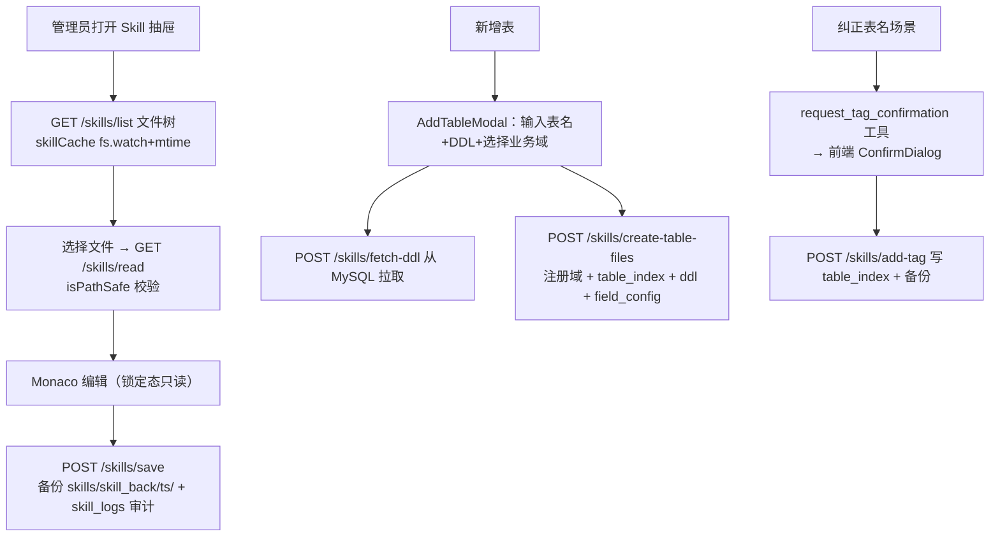
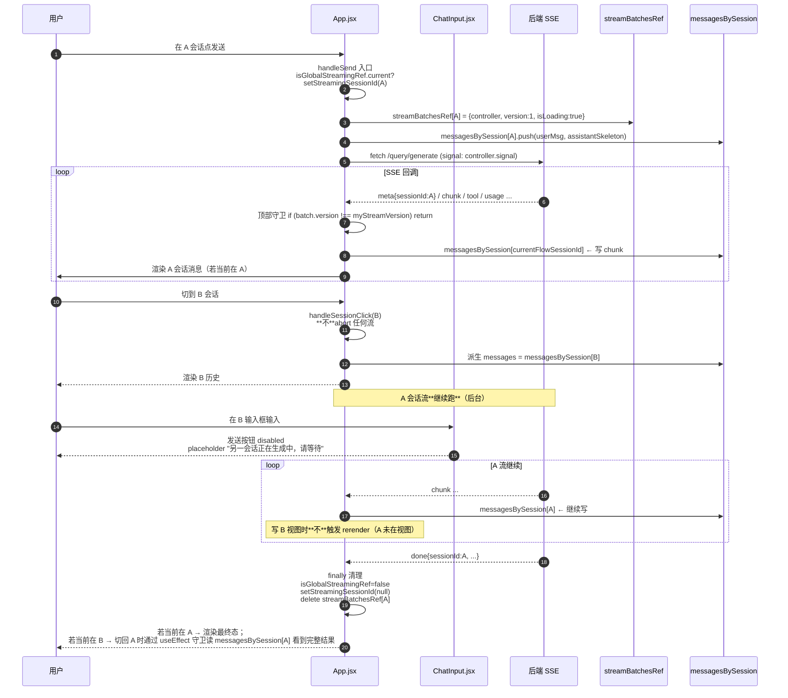
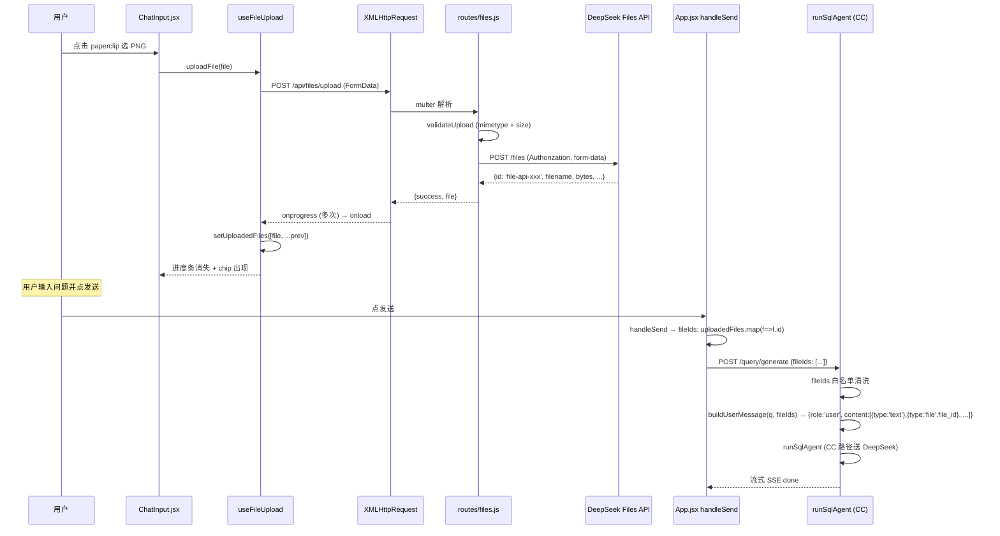

# 03 架构流程分析（核心流程）

> 版本：V1 · 核对日期：2026-08-24（追加 §11 多会话并行 + §13 DeepSeek Files API）
> 核心代码：`backend/src/routes/query.js`（HTTP 入口）、`backend/src/services/llm.js`（Agent 循环，CC 路径）、`backend/src/services/responsesApi.js` + `agentHelpers.js`（Responses 路径）、`backend/src/services/toolFuncs.js`（工具实现）
> 前端关键：`frontend/src/App.jsx` 多会话并行流式状态机（§11）+ 附件上传（§13）

## 1. 一次自然语言查询的完整链路



### 1.1 入口处理链（query.js POST /generate）

| 步骤 | 位置                         | 作用                                                                                 |
| -- | -------------------------- | ---------------------------------------------------------------------------------- |
| 1  | `router.use(authRequired)` | JWT 校验，设置 `req.user`                                                               |
| 2  | sessionId 校验/自动创建          | 无 id 则 `ensureSession()` 归属当前用户；有 id 校验归属                                          |
| 3  | 用户消息入库                     | `messages(role='user')`                                                            |
| 4  | `loadSkillMd()`            | 实时读 SKILL.md（不缓存）                                                                  |
| 5  | SSE 头 + `setNoDelay(true)` | 关 Nagle，避免小包批处理 100-200ms 延迟                                                       |
| 6  | `meta{sessionId}` 首事件      | 保证中断/异常路径前端也能拿到会话 id（F9 修复）                                                        |
| 7  | 按 `apiMode` 分派             | `chat_completions` → `runSqlAgent`；`responses_api` → `runSqlAgentResponsesHandler` |
| 8  | `for await` 消费 generator   | 分派 SSE 事件 + 同步入库                                                                   |
| 9  | SQL 兜底提取                   | 从 `message`/`fullContent` 提取 sql 块或 “SQL:” 行                                       |
| 10 | 落库最终消息                     | 含 token 统计、耗时、round、interrupted 标记；更新 `sessions.total_tokens`                      |

### 1.2 超时与中止（防御性分层）

| 层级           | 超时    | 位置                                                                       |
| ------------ | ----- | ------------------------------------------------------------------------ |
| 整体 SSE       | 5 min | query.js overallTimer → abort                                            |
| 单轮 LLM fetch | 120s  | llm.js `LLM_TIMEOUTS.FETCH_MS`                                           |
| 流中单次 read    | 30s   | llm.js `LLM_TIMEOUTS.READ_MS`（`withPromiseTimeout`，超时 `reader.cancel()`） |
| 用户停止/切会话/断连  | 即时    | 前端 AbortController → `req.on('close')` → abort                           |
| MySQL 连接获取   | 15s   | mysqlPool `ACQUIRE_TIMEOUT_MS`                                           |
| MySQL 单查询    | 30s   | mysql2 `queryTimeout`（超时 destroy 连接防泄漏）                                  |

## 2. Agent 主循环（runSqlAgent）

### 2.1 每轮请求准备（三步）

1. **checklist**：`buildToolCallChecklistMessage(reg)` 生成临时 system 消息，列出本会话已调用工具（冻结清单），**只进 requestMessages，不进累积 messages 数组**，避免污染 DB；
2. **compact**：`compactConsumedToolResults(messages, foldedCache)` 折叠已消费的 `get_sliced_index` tool 结果（去掉 related\_tables，保留规则/约束），`foldedCache` 单请求级 cache-aside；
3. **prune**：从发给 LLM 的 tools 列表剪枝一次性工具（`get_sliced_index` 有任意域 sliced 后移除）；`validate_sql_fields` **永不剪枝**（历史教训：Round 0 剪枝导致跨问题场景误拦）。`get_domain_index` 已废弃（2026-08，域清单改为内嵌到 system 消息），工具定义保留以兼容旧会话 history，但 description 显式标"已废弃，请勿调用"，剪枝逻辑不再涉及。

请求参数关键字段：`model`、`messages`、`temperature:0`、`stream:true`、`stream_options.include_usage`、`tools`（剪枝后）、`thinking:{type:'enabled'}`（DeepSeek 特有）。

### 2.2 流式解析要点

- 按 `data.choices[0].delta` 累积三个变量：`responseText`、`reasoningContent`、`streamToolCalls`（按 `tool_calls[i].index` 重组分片参数）；
- DeepSeek 协议约束：**两个 user 之间若发生过工具调用，assistant 的** **`reasoning_content`** **必须回传**，否则 API 400；实现为：无 tool\_calls 的 assistant 剥离 reasoning\_content，有 tool\_calls 的保留；
- `splitThinkingFromContent`：若 content 首段 >100 字且含思考标记词且多行，视为误入 content 的 thinking 并剥离，向前端发 `message_final` 更新气泡，向 DB 写 `reasoning_done`；
- usage 事件：记录 prefix cache 命中率（`prompt_cache_hit_tokens`），yield `usage` 事件（v5.18 修复前前端永远收不到，导致缓存命中率不显示）。

### 2.3 工具执行三阶段（llm.js）



**阶段 1（prepare，必须串行）**，同一轮多次调用需顺序完成否则并发检查互相穿透：

1. JSON.parse 参数（失败 → `execError="参数解析失败"`；`request_user_choice` 有裸 ASCII 引号自动修复 `fixBareQuotesInJsonArgs`）；
2. 工具存在性（`toolsMap` 查不到 → “工具不存在”）；
3. 幻觉调用拦截（不在本轮 `prunedTools` 中 → “已剪枝，禁止重复调用”，2026-07-28 新增）；
4. 重复调用检查（`checkAndFilterDuplicateCall`，按工具类型去重/过滤）。

**阶段 2（并行 IO）**：`Promise.all` 执行所有通过 prepare 的工具；同步工具用 `Promise.resolve` 包装。副作用登记：

- 通用：`recordToolCall(toolName, args, sessionId, userChoiceId?)` 写注册表；
- `validate_sql_fields`：写 `validateSqlFieldsCalled/Passed/ErrorCount`（问题级）；
- `request_user_choice`：返回 `{markers, payloads, ids, content}`，payloads 拆入 `pendingUserChoiceList`。

**阶段 3（按序写回）**：`execResults` 是 Promise.all 结果（无序），必须按 `validToolCalls` 原始顺序 push `{role:'tool'}` 消息，保证 LLM 看到的顺序与决策顺序一致。写回分三类：重复调用拦截消息 / execError 消息 / 正常结果。

**TURN 1 终止**：`pendingUserChoiceList.length > 0` 立即 break；随后持久化 messages 并 yield `done{sql:"", userChoiceRequest:[...]}`（最多 3 个，DB 写失败降级为 null 不弹窗）。

### 2.4 状态注册表（sessionToolRegistries）

进程级 `Map<sessionId, reg>`，两类作用域：

| 字段                                          | 类型          | 作用域     | 重置                      |
| ------------------------------------------- | ----------- | ------- | ----------------------- |
| `slicedDomains`                             | Set         | **问题级** | 新问题清空；user\_choice 续问保留 |
| `tableSchema`                               | Set         | **问题级** | 新问题清空；user\_choice 续问保留 |
| `termConfirmed`                             | Set         | **问题级** | 新问题清空；user\_choice 续问保留 |
| `userChoiceAsked`                           | Map         | **问题级** | 新问题清空；user\_choice 续问保留 |
| `getTablesCalled`                           | bool        | **问题级** | 新问题清空（对应工具已停用，字段保留）     |
| `validateSqlFieldsCalled/Passed/ErrorCount` | bool/number | **问题级** | 每次新 user 消息始终重置         |

**重置时机（2026-08-13 起）**：每次新 user 消息（一次 `/generate` 调用）在加载历史后统一走 `resetRegistryForNewQuestion(reg, messages)`：

- `validateSqlFields*` **始终重置**（避免上一问的 “✓passed” 残留误导 LLM 跳过本轮校验，2026-07-28 严重 bug 教训）；
- 域路由状态（sliced / schema / tag / choice 计数）：**新问题全部清空**，允许模型重新调用 `get_sliced_index` 路由新业务域；**`request_user_choice`** **中断后的续问保留**（检测规则：最后一条 user 消息紧邻的前一条是含 `<!--user_choice:` 标记的 tool 消息，即用户作答后继续同一问题）。

历史教训：早期这些字段为会话级（永不重置），导致同一会话换新话题提问时 `get_sliced_index` 被整体剪枝、无法路由新域（2026-08-13 修复，见问题清单 A19）。

### 2.5 System 消息内嵌可用业务域（2026-08）

业务域列表从「`get_domain_index` 工具调用」迁移到 system 消息内嵌（节省 1 轮工具调用、消除"忘记选域直接调 `get_sliced_index`"的 LLM 误操作）。实现：

- `toolFuncs.js` 导出 `buildSystemMessage(skillMd)` 共用函数：读取 `domain_router_index.json` → 拼出 `## 可用业务域\n- <id> (<name>): <description>` 列表 → 追加到 SKILL.md 文本之后。
- CC 路径（`query.js`）与 Responses 路径（`responsesApi.js`）**统一调用同一函数**，避免两处各写一份导致漂移。
- `domain_router_index.json` 启动时或按 mtime 缓存加载，**不**每轮 IO；mtime 缓存意味着域文件热更新时 5 分钟内不生效（可接受）。
- `get_domain_index` 工具定义**保留但 description 显式标"已废弃，请勿调用"**，用于兼容旧会话（history 中已有 `get_domain_index` tool message 的续聊场景），1-2 个版本后评估移除。

业务影响：单域查询从「3 轮（`get_domain_index` → `get_sliced_index` → schema/validate/run）」降为「2 轮（`get_sliced_index` → schema/validate/run）」。

## 3. SSE 事件协议（/query/generate）

后端 `yield` 的事件经 query.js 透传为 `data: {json}\n\n`：

| type              | 触发时机           | 关键字段                                                                                      | 是否入 DB                |
| ----------------- | -------------- | ----------------------------------------------------------------------------------------- | --------------------- |
| `meta`            | 流开始            | `sessionId`                                                                               | 否                     |
| `chunk`           | LLM 流式 content | `content, round`                                                                          | 否（累积后随最终消息）           |
| `reasoning_chunk` | 思考 delta       | `content, round`                                                                          | 否（实时展示）               |
| `reasoning_done`  | 整轮思考结束         | `content, round`                                                                          | 是（role=LLM）           |
| `message_final`   | thinking 剥离后   | `content, extraThinking, round`                                                           | 否（前端更新气泡）             |
| `usage`           | LLM 返回 usage   | `usage{prompt/completion/total/cached}, round`                                            | 是（role=usage 行）       |
| `tool`            | LLM 决定调工具      | `log, round`                                                                              | 是（role=tool）          |
| `tool_return`     | 工具执行完          | `log, round`                                                                              | 是（role=tool\_return）  |
| `error`           | 异常/中止          | `content, interrupted?, round`                                                            | 否                     |
| `done`            | 循环结束           | `sql, message, sessionId, totalTokens, elapsedMs, user_choice_request?, confirm_tag_add?` | 是（role=assistant 最终行） |

> 前端消费统一走 `utils/sseStream.js`：增量 UTF-8 解码（`stream:true`）+ 半行缓冲 + 收尾 flush，避免中文跨 chunk 丢字和 JSON 解析失败。

## 4. Responses API 路径（apiMode=responses\_api）

与 CC 路径 1:1 对齐（同一事件协议、同一注册表、同一工具执行），差异仅在：

- 请求格式：`POST {baseURL}/responses`，`input` 为 input items（`agentHelpers.convertMessagesToInputItems`），`instructions` 传 system（路由层拼好 `systemMessage`，避免“instructions is empty”），`reasoning:{effort:'high'}`；
- tools 为扁平格式 `{type,name,description,parameters}`（CC 是嵌套 `function` 字段），这是 v5.7 修复的历史坑；
- 终止事件：`response.completed / response.incomplete / response.failed` 代替 `[DONE]`；
- 持久化：`saveRunState`（同 `saveMessagesToDb`）+ 工具执行复用 `agentHelpers.executeToolCallsInStages`。

路由分派：`query.js` 在 meta 之后、创建 generator 之前读 `getLlmConfig().apiMode` 决定路径。

## 5. SQL 执行 / EXPLAIN / AI 分析流程



要点：

- `/execute` 与 `/explain` **不调用 LLM**，只走 MySQL；
- 校验器先剥离注释（拒绝 `/*!...*/` 条件注释、检测未闭合引号/注释），再校验长度/多语句/前缀/危险函数；尾部 `;` 剥离后视为单语句；
- 执行**不追加 LIMIT**（避免破坏含 LIMIT 的复杂查询与 UNION 语义），改为应用层显示截断；
- `/explain-analyze`：5min 整体超时 + 客户端断连 abort + UTF-8 buffer 修复；`thinking:{type:'disabled'}` 节省思考 token；结果不落库，仅 SSE 返回。

## 6. 消息持久化双轨

| 存储               | 用途                   | 写入时机                                              | 读取                                                            |
| ---------------- | -------------------- | ------------------------------------------------- | ------------------------------------------------------------- |
| `messages` 表     | 前端历史 / 审计 / token 统计 | 每条 SSE 事件（usage/tool/LLM 日志）+ 最终 assistant + 用户消息 | `GET /sessions/:id/messages`、`GET /query/messages/:sessionId` |
| `llm_messages` 表 | LLM 真实上下文（JSON blob） | 每轮 assistant push 后立即 UPSERT                      | `runSqlAgent` 入口 `loadMessagesFromDb`                         |

两个关键修复点：

1. `saveMessagesToDb` 在 assistant push 后、tool 响应入栈前保存 → 用户中断时可能存下“未完成 tool\_calls”的 assistant；`loadMessagesFromDb` 时 `sanitizeMessagesForLLM` 为缺失响应的 `tool_call_id` 补合成 tool 消息（“\[用户中断,工具未完成]”），保证喂给 LLM 的协议合法；
2. `messages` 行数随 SSE 事件增长（实测 338 会话 10028 行），历史加载为全量 `SELECT *`，是已知性能问题（见问题清单 H4）。

## 7. 认证流程



- 401 统一触发前端 `xtsql:auth-expired` 事件 → 清本地用户 → 跳登录页；
- 登出/改密递增 `token_version`，即使 token 未过期也立即失效；
- 限流：登录/注册/改密按“IP+用户名”10 次/h（成功不计），`/me`、`/logout` 按 IP 100 次/h。

## 8. 收藏流程



- 历史回显：`POST /queries/favorites/check` 批量标记收藏态；取消：`DELETE /queries/favorite`；
- 新会话建议：`GET /queries/suggestions?count=4` 随机抽取（admin 跨用户），去重、空值过滤；
- LLM 请求/响应按用户写 `favorite_llm.log`，失败直接 500 提示（不做静默降级）。

## 9. Skill 管理流程



写操作后统一 `invalidateAfterWrite()`（skillCache）并写 `skill_logs`；`table_index.json` 缓存为 md5 感知，任何写路径（含外部手动编辑）都能自动失效。

## 10. Electron 启动流程

```mermaid
sequenceDiagram
    participant E as Electron 主进程
    participant S as Splash
    participant B as 后端子进程
    participant W as 主窗口

    E->>S: 创建 splash（无边框置顶）
    E->>E: 探测 5002 端口占用（netstat+taskkill 强杀，风险见问题清单）
    E->>E: 定位 Node 24（NVM_HOME→nvm24→系统 PATH 兜底）
    E->>B: spawn backend（env: DB_PATH/SKILL_PATH/LOG_PATH/PROJECT_ROOT）
    B-->>E: stdout “SQLite initialized” → “Server running on port 5002”
    E->>W: 加载 dist/index.html（打包）或 localhost:5173（开发）
    E->>E: installAuthCookieCompat：Set-Cookie 改 SameSite=None;Secure<br/>（file:// 页跨站访问 localhost:5002 的 Cookie 兼容）
    E->>S: 主窗口加载完成关闭 splash
    Note over E,B: window-all-closed / before-quit 时 kill 后端子进程
```

要点：

- 启动日志双写：控制台 + `logs/electron-startup-<ts>.log`，失败时 splash 提供“打开日志/复制日志”；
- 后端启动 60s 内未出现 “Server running on port” 判定失败，展示 stderr 尾部 2KB；
- 打包后优先使用项目根目录下的 `backend/`（便携模式），否则用 `app.asar.unpacked/backend`；
- 注意：Node 探测依赖 `NVM_HOME` 或 `NVM_SYMLINK` 环境变量，本机未设置时（当前默认 node 为 v12）会回退 PATH 上的 node.exe 导致 better-sqlite3 ABI 不匹配启动失败，详见操作手册与问题清单。

## 11. 多会话并行流式（前端状态机，2026-08-24 重构，O16 / E18-E24）

> **本节是纯前端架构**。后端 SSE 协议、HTTP 接口、限流策略均无改动；改动只发生在 `frontend/src/App.jsx` 状态层 + `ChatInput.jsx` / `ChatMessage.jsx` / `SqlPanel.jsx` / `useUserChoice.js` 派生 props。

### 11.1 设计目标与约束

| 项         | 目标 / 约束                                                                                                                  |
| --------- | ------------------------------------------------------------------------------------------------------------------------ |
| 切会话不中断    | A 在流时切到 B，**A 后台继续跑**直到 `done`/`error`/用户主动 stop                                                                         |
| 全局唯一活跃流   | 同一时间**只允许 1 个 LLM 流**，避免双跑抢资源（CPU / LLM 配额 / 后端 socket）                                                                  |
| UI 视图与流解耦 | `currentSessionId`（UI 视图）与 `currentFlowSessionId`（流式过程）必须独立，SSE 回调按后者写消息                                                 |
| meta 事件权威 | 后端可能改 sessionId（临时 id → 持久 id），`meta` 事件后做 `messagesBySession[oldId] → [newId]` + `streamBatchesRef[oldId] → [newId]` 迁移 |
| 停止按钮语义    | A 在流、当前在 A：停止；A 在流、当前在 B：发送按钮 disabled + 提示；都没流：发送可点                                                                     |
| 跨会话弹窗     | A 在流时切到 B，A 的 `request_user_choice` 弹窗可被接受；提交/取消时**写入 A**（发起方），不写到当前 UI 视图的 B                                            |

### 11.2 核心状态（4 件套）

```
// 1. 每个会话独立消息列表（替代旧的单数组 messages）
messagesBySession: { [sessionId]: Message[] }

// 2. 每个流独立 controller + 版本号
streamBatchesRef: { [sessionId]: { controller: AbortController, version: number, isLoading: boolean } }

// 3. 全局流守卫（同步 ref，不进渲染）
isGlobalStreamingRef: Ref<boolean>

// 4. 当前具体在流的 sessionId（粒度细于 loading 全局流标志）
streamingSessionId: string | null
```

派生量：

```
messages = currentSessionId
  ? messagesBySession[currentSessionId] || []
  : []

isCurrentSessionStreaming = streamingSessionId === currentSessionId
otherSessionStreaming     = streamingSessionId !== null && streamingSessionId !== currentSessionId
```

### 11.3 时序图（切会话不中断场景）



### 11.4 handleSend 关键流程

```text
handleSend(overrideSessionId?) {
  // 1. 全局守卫：已有活跃流直接拒绝
  if (isGlobalStreamingRef.current) { warning; return; }

  const targetSessionId = overrideSessionId || currentSessionId || autoCreateNew();
  const flowSessionId = targetSessionId;  // 流式过程 id（与 UI 视图可能不同）

  // 2. 写 user 消息到目标会话（不是 currentSessionId！）
  messagesBySession[flowSessionId].push({role:'user', content: question});
  setMessagesBySession({...messagesBySession});

  // 3. 标记全局流状态
  isGlobalStreamingRef.current = true;
  setStreamingSessionId(flowSessionId);
  setLoading(true);  // 兼容老逻辑的 loading 标志

  // 4. 创建 batch + controller
  const controller = new AbortController();
  const myStreamVersion = ++versionCounter;
  streamBatchesRef.current[flowSessionId] = { controller, version: myStreamVersion, isLoading: true };

  try {
    for await (const evt of sseStream(url, {signal: controller.signal})) {
      // 5. 顶部守卫：防止旧流乱写新流
      const batch = streamBatchesRef.current[flowSessionId];
      if (!batch || batch.version !== myStreamVersion) return;

      // 6. meta 事件迁移：后端权威 id 可能与临时 id 不同
      if (evt.type === 'meta' && evt.sessionId !== flowSessionId) {
        const oldId = flowSessionId;
        const newId = evt.sessionId;
        messagesBySession[newId] = messagesBySession[oldId];
        delete messagesBySession[oldId];
        streamBatchesRef.current[newId] = streamBatchesRef.current[oldId];
        delete streamBatchesRef.current[oldId];
        currentFlowSessionId = newId;  // 后续 SSE 写入用新 id
        // 同步会话列表
        if (!currentSessionId) setCurrentSessionId(newId);
      }

      // 7. 按 currentFlowSessionId 写入（与 UI currentSessionId 解耦）
      switch (evt.type) {
        case 'chunk':       messagesBySession[currentFlowSessionId].lastAssistant.content += evt.content; break;
        case 'reasoning_chunk': messagesBySession[currentFlowSessionId].lastAssistant.reasoning += evt.content; break;
        case 'tool':        messagesBySession[currentFlowSessionId].push({role:'tool', ...}); break;
        case 'tool_return': messagesBySession[currentFlowSessionId].push({role:'tool_return', ...}); break;
        case 'usage':       /* 更新 roundUsagesRef[currentFlowSessionId]，UI 视图会话才更新 sessionMessagesTokens */ break;
        case 'done':        messagesBySession[currentFlowSessionId].lastAssistant.finalize(evt); break;
      }
      setMessagesBySession({...messagesBySession});
    }
  } catch (e) {
    if (e.name === 'AbortError') { /* 用户主动 stop */ }
    else { /* error 事件写入 messagesBySession[currentFlowSessionId] */ }
  } finally {
    // 8. 清理：仅清自己（用 version 守卫避免误清新流）
    if (streamBatchesRef.current[flowSessionId]?.version === myStreamVersion) {
      delete streamBatchesRef.current[flowSessionId];
      delete roundUsagesRef.current[flowSessionId];
    }
    isGlobalStreamingRef.current = false;
    setStreamingSessionId(prev => prev === flowSessionId ? null : prev);
    setLoading(false);
  }
}
```

### 11.5 useEffect 守卫（防 loadMessages 覆盖正在流的消息）

```text
useEffect(() => {
  if (!currentSessionId) return;
  // 关键守卫：正在流式累积的会话不重新拉历史（否则会覆盖 buffer）
  if (streamBatchesRef.current[currentSessionId]) return;
  loadMessages(currentSessionId);
}, [currentSessionId]);
```

### 11.6 UI 状态矩阵

| 全局流状态 | `streamingSessionId` | `currentSessionId` | 发送按钮         | placeholder        | 停止按钮    |
| ----- | -------------------- | ------------------ | ------------ | ------------------ | ------- |
| 无流    | `null`               | 任意                 | 可点           | "请输入问题…"           | 隐藏      |
| A 在流  | `A`                  | `A`                | **变停止**      | —                  | 可点（仅自己） |
| A 在流  | `A`                  | `B`                | **disabled** | "另一会话正在生成中，请等待其结束" | 隐藏      |
| 异常态   | `A`                  | `null`             | disabled     | 同上                 | 隐藏      |

SqlPanel 的"AI 分析"按钮在 `otherSessionStreaming=true` 时同样 disabled，理由相同：避免多流抢 LLM 配额。

### 11.7 handleStop 语义变化（重要）

```text
// 旧：只停当前会话的流（误杀：用户在 B 时点 B 的停止按钮会停 A）
const batch = streamBatchesRef.current[currentSessionId];
batch?.controller.abort();

// 新：找全局唯一活跃流并 abort（只有一个流，不存在歧义）
const activeId = Object.keys(streamBatchesRef.current)[0];
if (activeId) {
  streamBatchesRef.current[activeId].controller.abort();
  // 若 activeId !== currentSessionId，提示"已停止 A 会话"
}
```

### 11.8 useUserChoice 跨会话支持

`useUserChoice` 弹窗 state 增加 `sessionId` 字段记录**发起方** sessionId（A），提交/取消时透传给 `handleSend(overrideSessionId)`：

```text
useUserChoice state = {
  open: boolean,
  request: {...},        // 来自 SSE 的 userChoiceRequest
  sessionId: string,     // ← 2026-08-24 新增：发起方 sessionId（不是当前 UI 视图）
  onSubmit: (choice) => handleSend(choice, /* overrideSessionId */ sessionId),
  onCancel: () => handleSend(null, /* overrideSessionId */ sessionId),
}
```

`useUserChoice` 弹窗由 `useUserChoice` 暴露 `openSessionId`（触发弹窗的会话 id），SSE 回调 `if (evt.type === 'user_choice_request' && !userChoiceOpen) { open(evt.request, currentFlowSessionId); }`。

### 11.9 delete / rename 会话时的清理

```text
handleDeleteSession(sessionId) {
  // 1. 若该会话正在流 → abort + 清理 streamBatchesRef
  const batch = streamBatchesRef.current[sessionId];
  if (batch) {
    batch.controller.abort();
    delete streamBatchesRef.current[sessionId];
    delete roundUsagesRef.current[sessionId];
    if (streamingSessionId === sessionId) {
      isGlobalStreamingRef.current = false;
      setStreamingSessionId(null);
      setLoading(false);
    }
  }
  // 2. 清 messagesBySession
  delete messagesBySession[sessionId];
  // 3. 删后端
  await api.deleteSession(sessionId);
  // 4. 若是当前会话 → 重置 currentSessionId + currentSessionName
  if (currentSessionId === sessionId) {
    setCurrentSessionId(null);
    setCurrentSessionName('聊天');
  }
}
```

### 11.10 关键设计点（不可违反）

1. **禁止把** **`messages`** **改回单数组**：会丢失 A/B 并行累积的内容。
2. **禁止把 abort 写回** **`handleSessionClick`**：会误杀后台流。
3. **`currentFlowSessionId`** **必须在 try 块外声明**：`finally` 块要访问，否则 TDZ 报 `currentFlowSessionId is not defined`（F8 历史教训）。
4. **`isGlobalStreamingRef`** **用** **`useRef`** **而非** **`useState`**：同步访问，不进 render；UI 用的 `loading` / `streamingSessionId` 才用 state。
5. **`batch.version`** **守卫必须存在**：防止旧流（被新流覆盖后）的 SSE 回调继续写新数据。
6. **`useEffect([currentSessionId])`** **拉历史必须加** **`if (streamBatchesRef.current[currentSessionId]) return;`** **守卫**。
7. **meta 事件迁移必须同步** **`streamBatchesRef`** **+** **`messagesBySession`** **+** **`roundUsagesRef`**：后端权威 sessionId 可能与前端临时 id 不同。
8. **清理要在** **`finally`** **块、且用** **`version`** **守卫**：用户主动 stop / 超时 / 网络断 / 异常 都能正确清理。

### 11.11 与后端的契约（无改动说明）

后端**完全无感知**前端这套状态机。SSE 事件协议（§3）一字未动：

- `/query/generate` 仍是单请求单流，sessionId 由后端权威分配（meta 事件首发）；
- 后端不感知前端"切会话"动作，因为后端只认 sessionId，不认浏览器视图；
- `req.on('close')` 仍按旧逻辑 abort（用户关闭 tab / 网络断），但**前端不再因切会话主动 abort**，所以后端 `interrupted=1` 落库的场景从"切会话也会触发"降为"用户主动 stop / 网络断 / 异常"。

## 12. 与历史文档 `docs/执行流程.md` 的差异

| 项           | 历史文档                                    | 当前代码                                      |
| ----------- | --------------------------------------- | ----------------------------------------- |
| 函数名         | `generateSQLWithLangChainStreamGen_BAK` | `runSqlAgent`（2026-08 重命名，见 llm.js 注释）    |
| 工具数         | 7 个                                     | 6 个（`get_tables` 已停用、`get_table_ddl` 已合并） |
| 工具剪枝        | 含 `get_tables`                          | 不含；`validate_sql_fields` 永不剪枝             |
| 单轮 fetch 超时 | 文档记载有出入                                 | 120s（`LLM_TIMEOUTS.FETCH_MS`）             |
| API 模式      | 仅 CC                                    | CC + Responses 双路径                        |
| 中断落库        | 未提及                                     | `interrupted=1` + 占位符，2026-07-29 修复       |

## 13. 附件上传（DeepSeek Files API，2026-08-24 新增）

### 13.1 设计目标

- 用户在聊天输入框 footer meta 最左侧的 paperclip 按钮选择本地文件；
- 文件经后端代理透传到 DeepSeek Files API，获取 `file_id`（`file-api-xxx`）；
- 文件 ID 在下次发送消息时**自动附带**为 user 消息的 `{type:'file', file_id}` content block，供 LLM 消费；
- 进度条显示在**输入框上方**，带取消按钮；
- 已上传文件以 chip 形式显示在**输入框内顶部**，点 × 触发乐观删除 + 后端同步。

### 13.2 官方约束（按 DeepSeek 文档）

- **支持文件类型**：JPEG / PNG / GIF / WebP（4 种图片格式；其他类型 DeepSeek 拒绝）
- **单文件上限**：64 MiB
- **可用模型**：当前**仅** **`deepseek-v4-flash-vision-exp`** **支持 file content block**（其他模型调用会 400）
- **API 协议**：
  - 上传：`POST https://api.deepseek.com/files`（multipart/form-data，fields: `file`, `purpose='user_data'`, `expires_after[anchor]`, `expires_after[seconds]`）
  - 列表：`GET  https://api.deepseek.com/files?purpose=user_data&limit=&order=`
  - 删除：`DELETE https://api.deepseek.com/files/{file_id}`
- **对话引用**：
  ```jsonc
  // chat completions
  { "role": "user", "content": [
    { "type": "text", "text": "请分析这张图" },
    { "type": "file", "file_id": "file-api-xxxxxxxx" }
  ]}
  // responses api
  { "type": "message", "role": "user", "content": [
    { "type": "input_text", "text": "请分析这张图" },
    { "type": "file", "file_id": "file-api-xxxxxxxx" }
  ]}
  ```

### 13.3 后端架构

#### 13.3.1 配置层（`agent_files_config`）

- 存储：`configs` 表 key=`agent_files_config`，value=JSON `{allowedTypes, maxSizeMiB, expiresAfterSeconds}`
- 默认值（`services/config.js` `FILES_CONFIG_DEFAULTS`）：
  ```js
  { allowedTypes: ['image/jpeg','image/png','image/gif','image/webp'],
    maxSizeMiB: 64, expiresAfterSeconds: null }
  ```
- 读：普通用户（`GET /api/config/files`）— 前端按钮的 `accept` 字符串同步生成
- 写：仅 admin（`PUT /api/config/files`）— 白名单字段校验 + 大小上限 clamp 到 \[1, 64]

#### 13.3.2 路由层（`backend/src/routes/files.js`）

| 端点                  | 方法     | 行为                                                                                                 |
| ------------------- | ------ | -------------------------------------------------------------------------------------------------- |
| `/api/files/upload` | POST   | multer 单文件（`mimetype` fileFilter + 64 MiB 硬上限）→ validateUpload 二次校验 → services/files.js uploadFile |
| `/api/files`        | GET    | `?limit&order` 透传 DeepSeek，返回 `{success, files: [...]}`                                            |
| `/api/files/:id`    | DELETE | 校验 `^file-api-[A-Za-z0-9]+$` 后转发 DeepSeek                                                          |

#### 13.3.3 代理层（`backend/src/services/files.js`）

- `getApiKey()`：从 `getLlmConfig()` 读管理员配置的 key（不暴露明文）
- `validateUpload(file)`：白名单 + 大小校验 → `{ok, config} | {ok:false, code, message}`
- `uploadFile(file)`：构造 `FormData`（`file` + `purpose='user_data'` + 可选 `expires_after`）→ fetch `POST ${DEEPSEEK_BASE}/files` + `Authorization: Bearer <key>` → 解析响应
- `listFiles({limit, order})`：fetch `GET ${DEEPSEEK_BASE}/files?purpose=user_data&...`
- `deleteFile(fileId)`：fetch `DELETE ${DEEPSEEK_BASE}/files/{id}`

#### 13.3.4 LLM 透传（`buildUserMessage`）

```js
// backend/src/services/llm.js L1174-1191
export function buildUserMessage(question, fileIds) {
  const ids = Array.isArray(fileIds) ? fileIds.filter(id => typeof id === 'string' && id.length > 0) : [];
  if (ids.length === 0) {
    return { role: 'user', content: question };  // 旧版行为
  }
  return {
    role: 'user',
    content: [
      { type: 'text', text: question },
      ...ids.map(id => ({ type: 'file', file_id: id })),
    ],
  };
}
```

- 调用点：`runSqlAgent`（CC 路径）、`initMessagesForRun`（Responses 路径）— 两路径都增加 `fileIds` 入参
- **不破坏向后兼容**：无 fileIds → 行为与旧版完全一致

#### 13.3.5 Responses 路径 content 块映射（`agentHelpers.js`）

```js
// convertMessagesToInputItems user 分支
if (Array.isArray(m.content)) {
  contentBlocks = m.content.map(part => {
    if (part?.type === 'text')  return { type: 'input_text', text: String(part.text || '') };
    if (part?.type === 'file')  return { type: 'file', file_id: part.file_id };  // 原样保留
    return { type: 'input_text', text: String(part?.text || '') };  // 兜底
  });
} else {
  contentBlocks = [{ type: 'input_text', text: String(m.content || '') }];
}
```

#### 13.3.6 query.js 入口白名单清洗

```js
// routes/query.js POST /generate 入口
//   注意：file_id 含短横线（如 file-api-dc6f9a94-...），正则需包含 '-'
if (Array.isArray(fileIds)) {
  fileIds = fileIds.filter(id => typeof id === 'string' && /^file-api-[A-Za-z0-9-]+$/.test(id));
  if (fileIds.length === 0) fileIds = null;
} else {
  fileIds = null;
}
```

- **后端为权威**：前端传任何字符串数组都按白名单过滤；不在白名单 → 静默丢弃（不阻断请求）

### 13.4 前端架构

#### 13.4.1 API 层（`frontend/src/api/index.js`）

| 函数                                                   | 用途                                                                 |
| ---------------------------------------------------- | ------------------------------------------------------------------ |
| `getFilesConfig()`                                   | 拉 `GET /config/files` → 拿 allowlist 给按钮 `accept`                   |
| `listFiles({limit, order})`                          | 拉 `GET /files` → 初始化已上传文件列表                                        |
| `deleteFileApi(fileId)`                              | 删 `DELETE /files/:id`                                              |
| `uploadFileWithProgress(file, {onProgress, signal})` | XHR `POST /files/upload` + `upload.onprogress` + `AbortController` |

#### 13.4.2 Hook（`hooks/useFileUpload.js`）

- 状态：
  - `uploadedFiles: [{id, filename, bytes, created_at, purpose, expires_at?}]` — 全局已上传
  - `uploadingFiles: [{tempId, name, size, progress, controller}]` — 正在上传
  - `filesConfig: {allowedTypes, maxSizeMiB, expiresAfterSeconds}` — 后端配置
- 方法：
  - `uploadFile(file)` — 包装 `uploadFileWithProgress`，完成后入 `uploadedFiles` 头部；失败 toast
  - `cancelUpload(tempId)` — `controller.abort()` + 移出 `uploadingFiles`
  - `removeFile(fileId)` — 乐观删本地 → 失败回滚 + toast
  - `refreshFiles()` — 重新拉列表（其他客户端上传时手动同步用）
- 启动时拉取：`useEffect` 首次拉 `getFilesConfig` + `listFiles`

#### 13.4.3 ChatInput 集成

- **位置 1（footer meta 最左侧）**：paperclip 按钮（`PaperClipOutlined`）— 触发隐藏的 `<input type="file" accept={...} />`
- **位置 2（输入框上方）**：上传进度条 — `uploadingFiles.length > 0` 时渲染（每行 antd Progress + 文件名 + × 取消）
- **位置 3（输入框内顶部）**：已上传文件 chip 列表 — `uploadedFiles.length > 0` 时渲染（每行 antd Tag + 文件名 + × 删除）
- **禁用条件**：paperclip 与进度条取消在 `isCurrentSessionStreaming || otherSessionStreaming || disabled` 时禁用

#### 13.4.4 App.jsx 透传

- `useFileUpload()` 在组件顶层调用（hook 规则）；
- `handleSend` 的 `queryGenerateStream` body 增加 `fileIds: uploadedFiles.map(f => f.id)`（仅当 `uploadedFiles.length > 0`）；
- `messagesBySession` / `streamBatchesRef` / `streamingSessionId` 等多会话并行流式状态与文件无关（文件是全局的，不需按 sessionId 隔离）

### 13.5 数据流时序



### 13.6 关键设计点

1. **后端为权威**：`accept` 字符串、文件大小、白名单全走后端配置（`agent_files_config`），前端仅做 UX 提示；
2. **白名单清洗在 query.js 入口**：`/^file-api-[A-Za-z0-9]+$/` 严格匹配，避免前端误传任意字符串污染 LLM message；
3. **乐观更新删除**：`removeFile` 先 setState → 后端失败回滚 + toast（减少用户等待感）；
4. **流状态不污染**：附件 chip 列表 / 进度条 / paperclip 按钮在 `isCurrentSessionStreaming` / `otherSessionStreaming` 时禁用，避免在多会话并行流式下误点；
5. **不支持多文件 batch**：paperclip 每次只取 1 个文件（`e.target.files[0]`）；如要批量需重新设计 UI 流程；
6. **DeepSeek 共享 Key**：所有用户的已上传文件实际归属 LLM API Key，不做 per-user 隔离（与 DeepSeek 行为一致）；如要 per-user 隔离需自建中间存储；
7. **不做模型兼容性拦截**：上传时不知道用户当前模型；模型不兼容由 LLM 400 错误触发前端 axios 拦截器 toast 错误；
8. **`buildUserMessage`** **双路径导出**：`services/llm.js` 导出 + `agentHelpers.js` import；`initMessagesForRun` 同步改造；两路径行为一致。

