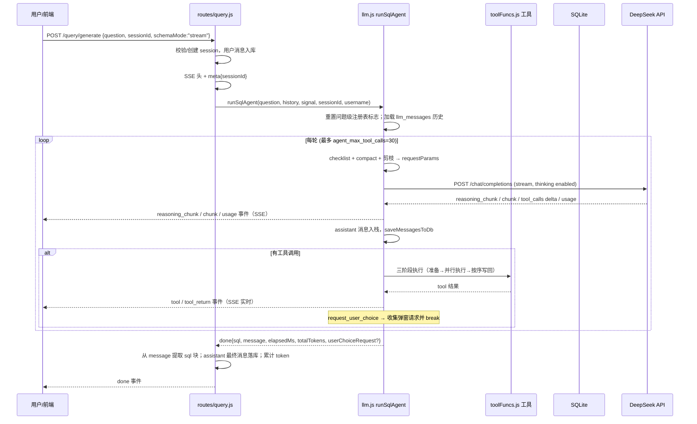
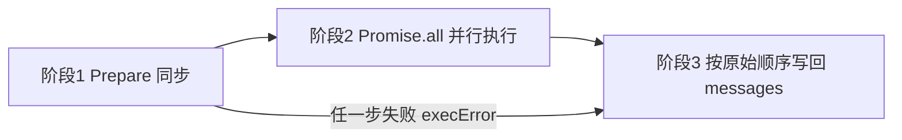
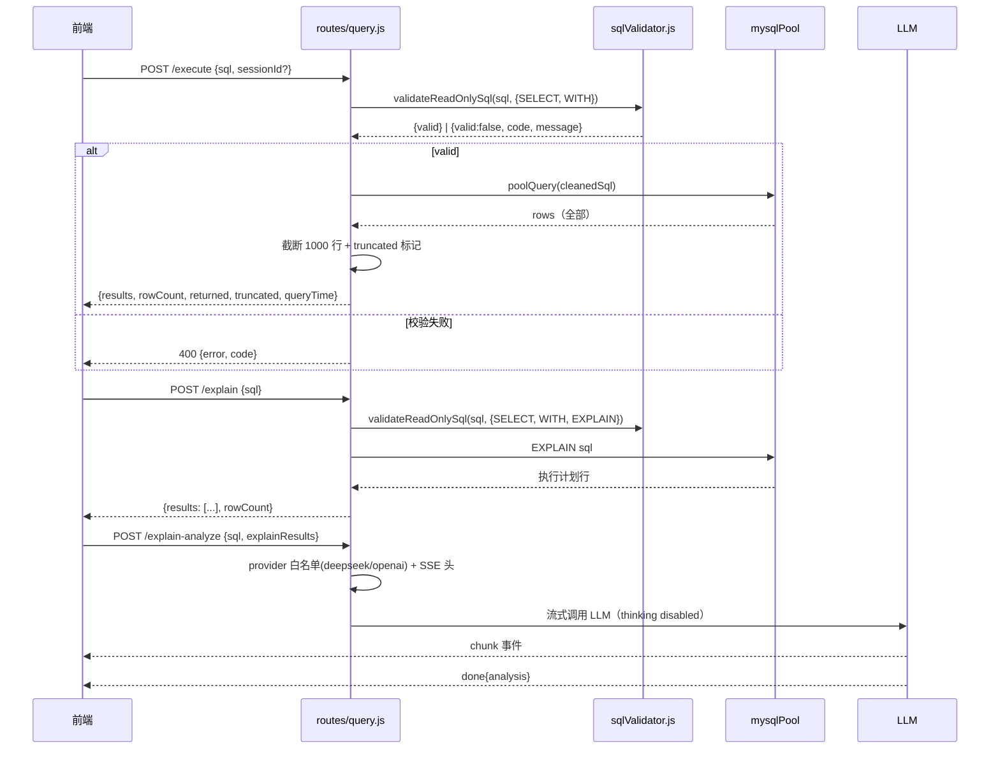
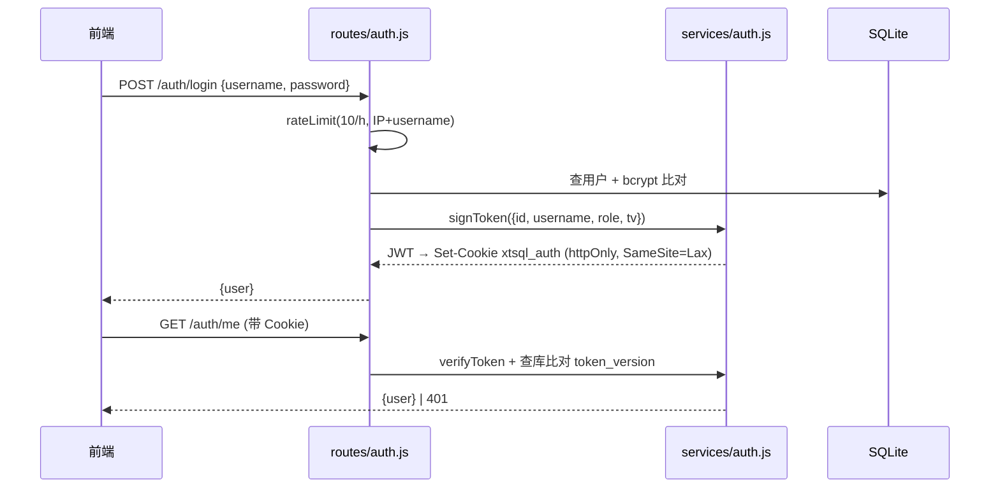
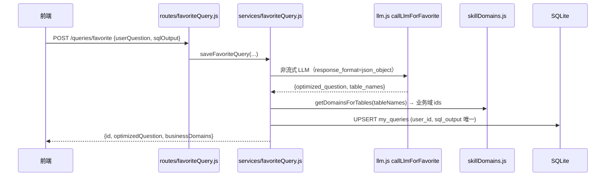
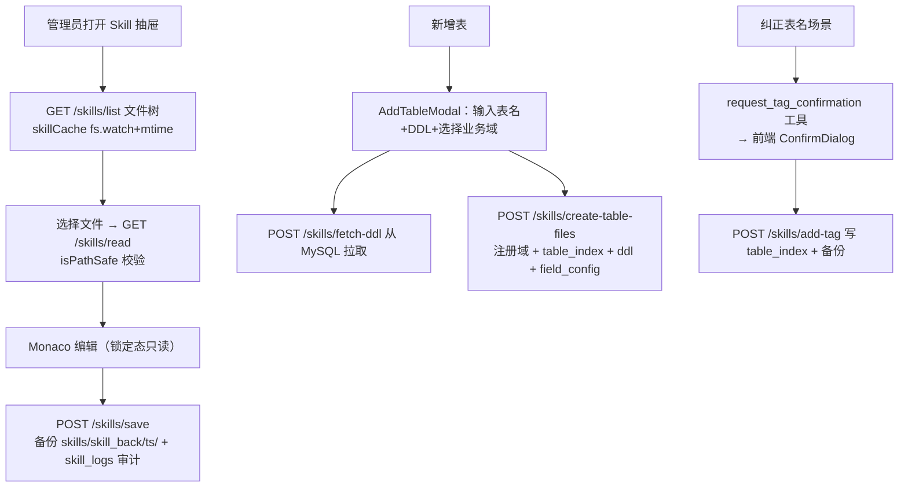

# 03 架构流程分析（核心流程）

> 版本：V1 · 核对日期：2026-08-12
> 核心代码：`backend/src/routes/query.js`（HTTP 入口）、`backend/src/services/llm.js`（Agent 循环，CC 路径）、`backend/src/services/responsesApi.js` + `agentHelpers.js`（Responses 路径）、`backend/src/services/toolFuncs.js`（工具实现）

## 1. 一次自然语言查询的完整链路



### 1.1 入口处理链（query.js POST /generate）

| 步骤 | 位置 | 作用 |
|---|---|---|
| 1 | `router.use(authRequired)` | JWT 校验，设置 `req.user` |
| 2 | sessionId 校验/自动创建 | 无 id 则 `ensureSession()` 归属当前用户；有 id 校验归属 |
| 3 | 用户消息入库 | `messages(role='user')` |
| 4 | `loadSkillMd()` | 实时读 SKILL.md（不缓存） |
| 5 | SSE 头 + `setNoDelay(true)` | 关 Nagle，避免小包批处理 100-200ms 延迟 |
| 6 | `meta{sessionId}` 首事件 | 保证中断/异常路径前端也能拿到会话 id（F9 修复） |
| 7 | 按 `apiMode` 分派 | `chat_completions` → `runSqlAgent`；`responses_api` → `runSqlAgentResponsesHandler` |
| 8 | `for await` 消费 generator | 分派 SSE 事件 + 同步入库 |
| 9 | SQL 兜底提取 | 从 `message`/`fullContent` 提取 sql 块或 “SQL:” 行 |
| 10 | 落库最终消息 | 含 token 统计、耗时、round、interrupted 标记；更新 `sessions.total_tokens` |

### 1.2 超时与中止（防御性分层）

| 层级 | 超时 | 位置 |
|---|---|---|
| 整体 SSE | 5 min | query.js overallTimer → abort |
| 单轮 LLM fetch | 120s | llm.js `LLM_TIMEOUTS.FETCH_MS` |
| 流中单次 read | 30s | llm.js `LLM_TIMEOUTS.READ_MS`（`withPromiseTimeout`，超时 `reader.cancel()`） |
| 用户停止/切会话/断连 | 即时 | 前端 AbortController → `req.on('close')` → abort |
| MySQL 连接获取 | 15s | mysqlPool `ACQUIRE_TIMEOUT_MS` |
| MySQL 单查询 | 30s | mysql2 `queryTimeout`（超时 destroy 连接防泄漏） |

## 2. Agent 主循环（runSqlAgent）

### 2.1 每轮请求准备（三步）

1. **checklist**：`buildToolCallChecklistMessage(reg)` 生成临时 system 消息，列出本会话已调用工具（冻结清单），**只进 requestMessages，不进累积 messages 数组**，避免污染 DB；
2. **compact**：`compactConsumedToolResults(messages, foldedCache)` 折叠已消费的 `get_sliced_index` tool 结果（去掉 related_tables，保留规则/约束），`foldedCache` 单请求级 cache-aside；
3. **prune**：从发给 LLM 的 tools 列表剪枝一次性工具（`get_sliced_index` 有任意域 sliced 后移除）；`validate_sql_fields` **永不剪枝**（历史教训：Round 0 剪枝导致跨问题场景误拦）。`get_domain_index` 已废弃（2026-08，域清单改为内嵌到 system 消息），工具定义保留以兼容旧会话 history，但 description 显式标"已废弃，请勿调用"，剪枝逻辑不再涉及。

请求参数关键字段：`model`、`messages`、`temperature:0`、`stream:true`、`stream_options.include_usage`、`tools`（剪枝后）、`thinking:{type:'enabled'}`（DeepSeek 特有）。

### 2.2 流式解析要点

- 按 `data.choices[0].delta` 累积三个变量：`responseText`、`reasoningContent`、`streamToolCalls`（按 `tool_calls[i].index` 重组分片参数）；
- DeepSeek 协议约束：**两个 user 之间若发生过工具调用，assistant 的 `reasoning_content` 必须回传**，否则 API 400；实现为：无 tool_calls 的 assistant 剥离 reasoning_content，有 tool_calls 的保留；
- `splitThinkingFromContent`：若 content 首段 >100 字且含思考标记词且多行，视为误入 content 的 thinking 并剥离，向前端发 `message_final` 更新气泡，向 DB 写 `reasoning_done`；
- usage 事件：记录 prefix cache 命中率（`prompt_cache_hit_tokens`），yield `usage` 事件（v5.18 修复前前端永远收不到，导致缓存命中率不显示）。

### 2.3 工具执行三阶段（llm.js）



**阶段 1（prepare，必须串行）**，同一轮多次调用需顺序完成否则并发检查互相穿透：

1. JSON.parse 参数（失败 → `execError="参数解析失败"`；`request_user_choice` 有裸 ASCII 引号自动修复 `fixBareQuotesInJsonArgs`）；
2. 工具存在性（`toolsMap` 查不到 → “工具不存在”）；
3. 幻觉调用拦截（不在本轮 `prunedTools` 中 → “已剪枝，禁止重复调用”，2026-07-28 新增）；
4. 重复调用检查（`checkAndFilterDuplicateCall`，按工具类型去重/过滤）。

**阶段 2（并行 IO）**：`Promise.all` 执行所有通过 prepare 的工具；同步工具用 `Promise.resolve` 包装。副作用登记：

- 通用：`recordToolCall(toolName, args, sessionId, userChoiceId?)` 写注册表；
- `validate_sql_fields`：写 `validateSqlFieldsCalled/Passed/ErrorCount`（问题级）；
- `request_user_choice`：返回 `{markers, payloads, ids, content}`，payloads 拆入 `pendingUserChoiceList`。

**阶段 3（按序写回）**：`execResults` 是 Promise.all 结果（无序），必须按 `validToolCalls` 原始顺序 push `{role:'tool'}` 消息，保证 LLM 看到的顺序与决策顺序一致。写回分三类：重复调用拦截消息 / execError 消息 / 正常结果。

**TURN 1 终止**：`pendingUserChoiceList.length > 0` 立即 break；随后持久化 messages 并 yield `done{sql:"", userChoiceRequest:[...]}`（最多 3 个，DB 写失败降级为 null 不弹窗）。

### 2.4 状态注册表（sessionToolRegistries）

进程级 `Map<sessionId, reg>`，两类作用域：

| 字段 | 类型 | 作用域 | 重置 |
|---|---|---|---|
| `slicedDomains` | Set | **问题级** | 新问题清空；user_choice 续问保留 |
| `tableSchema` | Set | **问题级** | 新问题清空；user_choice 续问保留 |
| `termConfirmed` | Set | **问题级** | 新问题清空；user_choice 续问保留 |
| `userChoiceAsked` | Map | **问题级** | 新问题清空；user_choice 续问保留 |
| `getTablesCalled` | bool | **问题级** | 新问题清空（对应工具已停用，字段保留） |
| `validateSqlFieldsCalled/Passed/ErrorCount` | bool/number | **问题级** | 每次新 user 消息始终重置 |

**重置时机（2026-08-13 起）**：每次新 user 消息（一次 `/generate` 调用）在加载历史后统一走 `resetRegistryForNewQuestion(reg, messages)`：

- `validateSqlFields*` **始终重置**（避免上一问的 “✓passed” 残留误导 LLM 跳过本轮校验，2026-07-28 严重 bug 教训）；
- 域路由状态（sliced / schema / tag / choice 计数）：**新问题全部清空**，允许模型重新调用 `get_sliced_index` 路由新业务域；**`request_user_choice` 中断后的续问保留**（检测规则：最后一条 user 消息紧邻的前一条是含 `<!--user_choice:` 标记的 tool 消息，即用户作答后继续同一问题）。

历史教训：早期这些字段为会话级（永不重置），导致同一会话换新话题提问时 `get_sliced_index` 被整体剪枝、无法路由新域（2026-08-13 修复，见问题清单 A19）。

### 2.5 System 消息内嵌可用业务域（2026-08）

业务域列表从「`get_domain_index` 工具调用」迁移到 system 消息内嵌（节省 1 轮工具调用、消除"忘记选域直接调 `get_sliced_index`"的 LLM 误操作）。实现：

- `toolFuncs.js` 导出 `buildSystemMessage(skillMd)` 共用函数：读取 `domain_router_index.json` → 拼出 `## 可用业务域\n- <id> (<name>): <description>` 列表 → 追加到 SKILL.md 文本之后。
- CC 路径（`query.js`）与 Responses 路径（`responsesApi.js`）**统一调用同一函数**，避免两处各写一份导致漂移。
- `domain_router_index.json` 启动时或按 mtime 缓存加载，**不**每轮 IO；mtime 缓存意味着域文件热更新时 5 分钟内不生效（可接受）。
- `get_domain_index` 工具定义**保留但 description 显式标"已废弃，请勿调用"**，用于兼容旧会话（history 中已有 `get_domain_index` tool message 的续聊场景），1-2 个版本后评估移除。

业务影响：单域查询从「3 轮（`get_domain_index` → `get_sliced_index` → schema/validate/run）」降为「2 轮（`get_sliced_index` → schema/validate/run）」。

## 3. SSE 事件协议（/query/generate）

后端 `yield` 的事件经 query.js 透传为 `data: {json}\n\n`：

| type | 触发时机 | 关键字段 | 是否入 DB |
|---|---|---|---|
| `meta` | 流开始 | `sessionId` | 否 |
| `chunk` | LLM 流式 content | `content, round` | 否（累积后随最终消息） |
| `reasoning_chunk` | 思考 delta | `content, round` | 否（实时展示） |
| `reasoning_done` | 整轮思考结束 | `content, round` | 是（role=LLM） |
| `message_final` | thinking 剥离后 | `content, extraThinking, round` | 否（前端更新气泡） |
| `usage` | LLM 返回 usage | `usage{prompt/completion/total/cached}, round` | 是（role=usage 行） |
| `tool` | LLM 决定调工具 | `log, round` | 是（role=tool） |
| `tool_return` | 工具执行完 | `log, round` | 是（role=tool_return） |
| `error` | 异常/中止 | `content, interrupted?, round` | 否 |
| `done` | 循环结束 | `sql, message, sessionId, totalTokens, elapsedMs, user_choice_request?, confirm_tag_add?` | 是（role=assistant 最终行） |

> 前端消费统一走 `utils/sseStream.js`：增量 UTF-8 解码（`stream:true`）+ 半行缓冲 + 收尾 flush，避免中文跨 chunk 丢字和 JSON 解析失败。

## 4. Responses API 路径（apiMode=responses_api）

与 CC 路径 1:1 对齐（同一事件协议、同一注册表、同一工具执行），差异仅在：

- 请求格式：`POST {baseURL}/responses`，`input` 为 input items（`agentHelpers.convertMessagesToInputItems`），`instructions` 传 system（路由层拼好 `systemMessage`，避免“instructions is empty”），`reasoning:{effort:'high'}`；
- tools 为扁平格式 `{type,name,description,parameters}`（CC 是嵌套 `function` 字段），这是 v5.7 修复的历史坑；
- 终止事件：`response.completed / response.incomplete / response.failed` 代替 `[DONE]`；
- 持久化：`saveRunState`（同 `saveMessagesToDb`）+ 工具执行复用 `agentHelpers.executeToolCallsInStages`。

路由分派：`query.js` 在 meta 之后、创建 generator 之前读 `getLlmConfig().apiMode` 决定路径。

## 5. SQL 执行 / EXPLAIN / AI 分析流程



要点：

- `/execute` 与 `/explain` **不调用 LLM**，只走 MySQL；
- 校验器先剥离注释（拒绝 `/*!...*/` 条件注释、检测未闭合引号/注释），再校验长度/多语句/前缀/危险函数；尾部 `;` 剥离后视为单语句；
- 执行**不追加 LIMIT**（避免破坏含 LIMIT 的复杂查询与 UNION 语义），改为应用层显示截断；
- `/explain-analyze`：5min 整体超时 + 客户端断连 abort + UTF-8 buffer 修复；`thinking:{type:'disabled'}` 节省思考 token；结果不落库，仅 SSE 返回。

## 6. 消息持久化双轨

| 存储 | 用途 | 写入时机 | 读取 |
|---|---|---|---|
| `messages` 表 | 前端历史 / 审计 / token 统计 | 每条 SSE 事件（usage/tool/LLM 日志）+ 最终 assistant + 用户消息 | `GET /sessions/:id/messages`、`GET /query/messages/:sessionId` |
| `llm_messages` 表 | LLM 真实上下文（JSON blob） | 每轮 assistant push 后立即 UPSERT | `runSqlAgent` 入口 `loadMessagesFromDb` |

两个关键修复点：

1. `saveMessagesToDb` 在 assistant push 后、tool 响应入栈前保存 → 用户中断时可能存下“未完成 tool_calls”的 assistant；`loadMessagesFromDb` 时 `sanitizeMessagesForLLM` 为缺失响应的 `tool_call_id` 补合成 tool 消息（“[用户中断,工具未完成]”），保证喂给 LLM 的协议合法；
2. `messages` 行数随 SSE 事件增长（实测 338 会话 10028 行），历史加载为全量 `SELECT *`，是已知性能问题（见问题清单 H4）。

## 7. 认证流程



- 401 统一触发前端 `xtsql:auth-expired` 事件 → 清本地用户 → 跳登录页；
- 登出/改密递增 `token_version`，即使 token 未过期也立即失效；
- 限流：登录/注册/改密按“IP+用户名”10 次/h（成功不计），`/me`、`/logout` 按 IP 100 次/h。

## 8. 收藏流程



- 历史回显：`POST /queries/favorites/check` 批量标记收藏态；取消：`DELETE /queries/favorite`；
- 新会话建议：`GET /queries/suggestions?count=4` 随机抽取（admin 跨用户），去重、空值过滤；
- LLM 请求/响应按用户写 `favorite_llm.log`，失败直接 500 提示（不做静默降级）。

## 9. Skill 管理流程



写操作后统一 `invalidateAfterWrite()`（skillCache）并写 `skill_logs`；`table_index.json` 缓存为 md5 感知，任何写路径（含外部手动编辑）都能自动失效。

## 10. Electron 启动流程

```mermaid
sequenceDiagram
    participant E as Electron 主进程
    participant S as Splash
    participant B as 后端子进程
    participant W as 主窗口

    E->>S: 创建 splash（无边框置顶）
    E->>E: 探测 5002 端口占用（netstat+taskkill 强杀，风险见问题清单）
    E->>E: 定位 Node 24（NVM_HOME→nvm24→系统 PATH 兜底）
    E->>B: spawn backend（env: DB_PATH/SKILL_PATH/LOG_PATH/PROJECT_ROOT）
    B-->>E: stdout “SQLite initialized” → “Server running on port 5002”
    E->>W: 加载 dist/index.html（打包）或 localhost:5173（开发）
    E->>E: installAuthCookieCompat：Set-Cookie 改 SameSite=None;Secure<br/>（file:// 页跨站访问 localhost:5002 的 Cookie 兼容）
    E->>S: 主窗口加载完成关闭 splash
    Note over E,B: window-all-closed / before-quit 时 kill 后端子进程
```

要点：

- 启动日志双写：控制台 + `logs/electron-startup-<ts>.log`，失败时 splash 提供“打开日志/复制日志”；
- 后端启动 60s 内未出现 “Server running on port” 判定失败，展示 stderr 尾部 2KB；
- 打包后优先使用项目根目录下的 `backend/`（便携模式），否则用 `app.asar.unpacked/backend`；
- 注意：Node 探测依赖 `NVM_HOME` 或 `NVM_SYMLINK` 环境变量，本机未设置时（当前默认 node 为 v12）会回退 PATH 上的 node.exe 导致 better-sqlite3 ABI 不匹配启动失败，详见操作手册与问题清单。

## 11. 与历史文档 `docs/执行流程.md` 的差异

| 项 | 历史文档 | 当前代码 |
|---|---|---|
| 函数名 | `generateSQLWithLangChainStreamGen_BAK` | `runSqlAgent`（2026-08 重命名，见 llm.js 注释） |
| 工具数 | 7 个 | 6 个（`get_tables` 已停用、`get_table_ddl` 已合并） |
| 工具剪枝 | 含 `get_tables` | 不含；`validate_sql_fields` 永不剪枝 |
| 单轮 fetch 超时 | 文档记载有出入 | 120s（`LLM_TIMEOUTS.FETCH_MS`） |
| API 模式 | 仅 CC | CC + Responses 双路径 |
| 中断落库 | 未提及 | `interrupted=1` + 占位符，2026-07-29 修复 |
