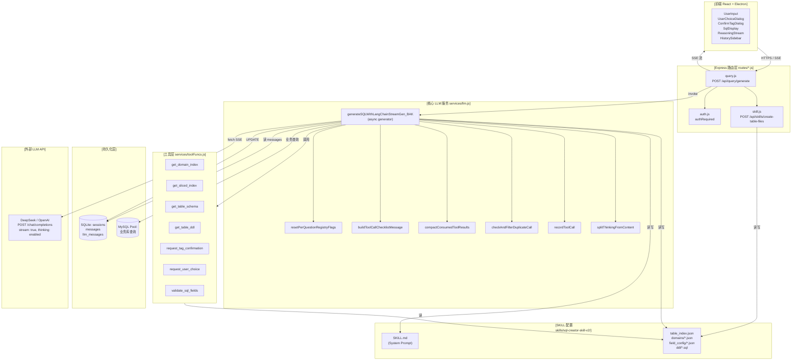
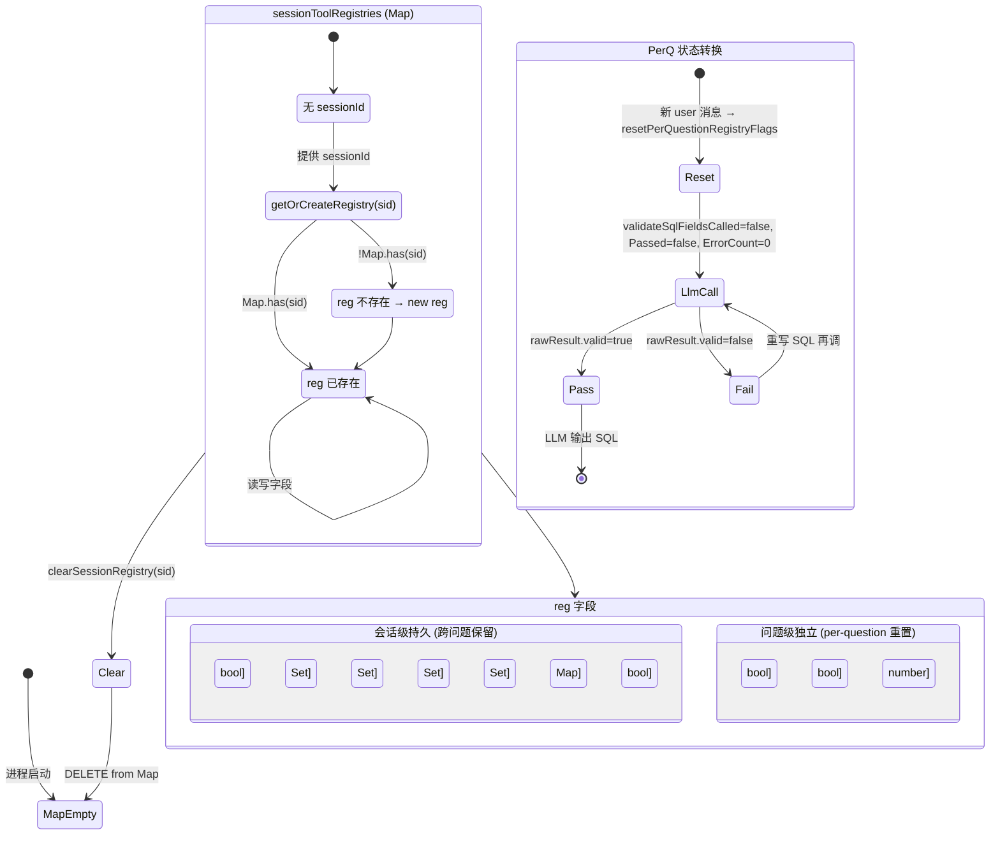
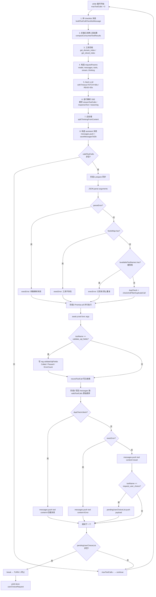
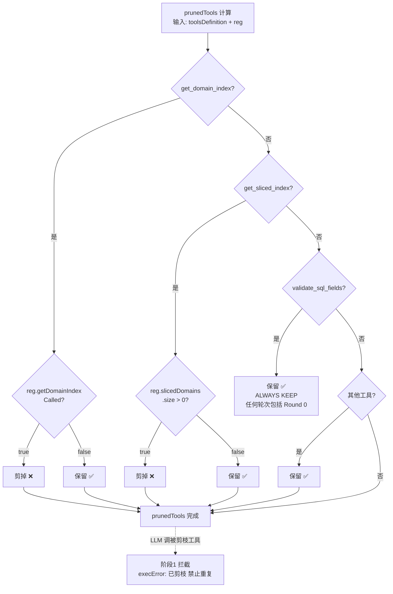
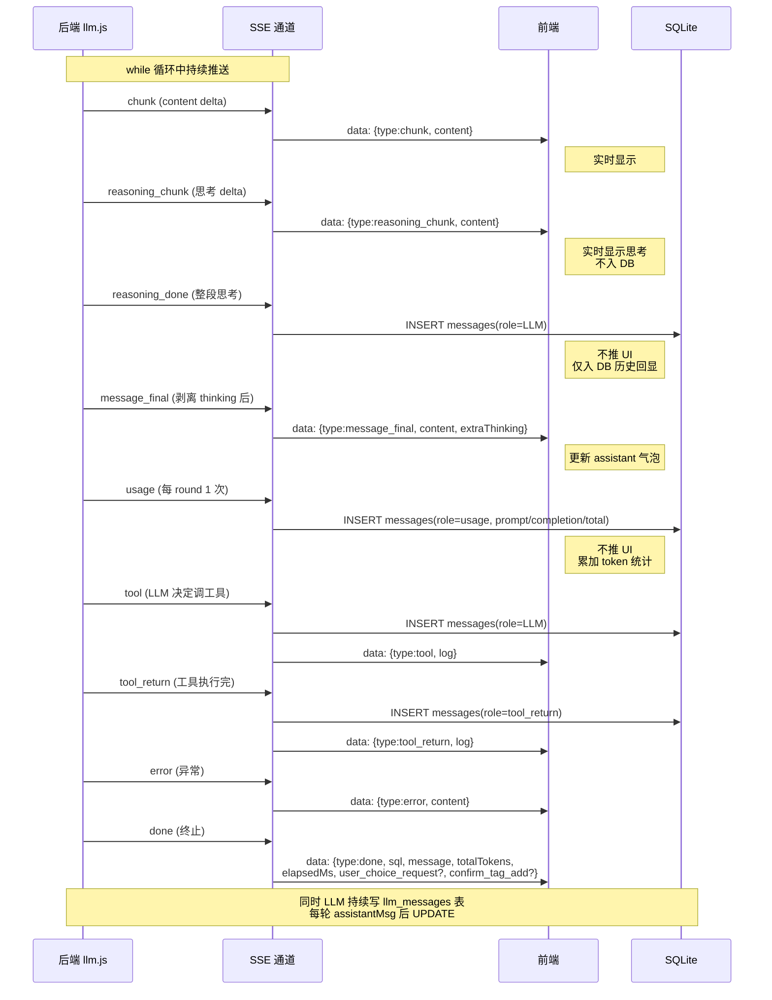
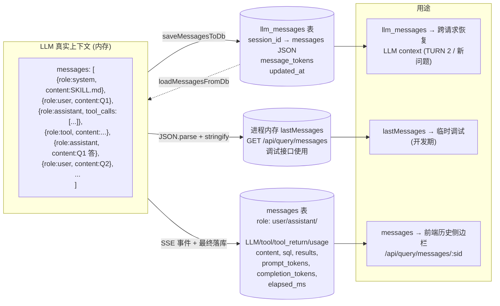
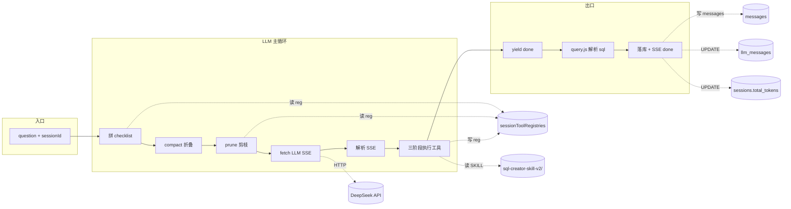

# XTSQLQueryAgent SQL 生成流程 — Mermaid 图集

## 1. 整体架构（模块 + 数据流）



---

## 2. 端到端时序图（用户问 → 拿到 SQL）

```mermaid
sequenceDiagram
    autonumber
    actor U as 用户
    participant FE as 前端 (React)
    participant Q as query.js (路由)
    participant L as llm.js (主循环)
    participant DB as SQLite
    participant API as DeepSeek/OpenAI
    participant T as 工具层

    U->>FE: 输入 question
    FE->>Q: POST /api/query/generate {question, sessionId}
    Q->>Q: authRequired 验证 JWT
    Q->>Q: ensureSession / sessionBelongsToUser
    Q->>DB: INSERT messages(role=user)
    Q->>Q: loadSkillMd() 读 SKILL.md
    Q->>Q: setNoDelay + flushHeaders (SSE)
    Q->>Q: 5min 整体超时 + abort 监听

    Q->>L: generateSQL...BAK(question, signal, sessionId, user)
    L->>L: resetPerQuestionRegistryFlags(reg)
    L->>DB: loadMessagesFromDb(sessionId)
    DB-->>L: savedMessages (历史)
    L->>L: 拼 system + 追加新 user question

    loop while (maxToolCalls-- > 0)
        L->>L: buildChecklist(reg) → 临时 system 消息
        L->>L: compactConsumedToolResults(messages)
        L->>L: prune tools (基于 reg)
        L->>API: POST /chat/completions (stream=true)

        API-->>L: SSE delta (reasoning_content / content / tool_calls)
        L->>L: 累积 streamToolCalls / responseText
        L->>L: splitThinkingFromContent (剥离误倒 thinking)
        L->>L: messages.push(assistantMsg)
        L->>DB: UPDATE llm_messages

        alt LLM 调用了工具
            L->>L: 阶段1 prepare (parse / 幻觉拦截 / 重复检查)
            L->>T: 阶段2 Promise.all (并行执行工具)
            T-->>L: rawResult
            L->>L: recordToolCall + 写 reg.validateSqlFields* (若是 validate_sql_fields)
            L->>L: 阶段3 写回 messages (tool role)
        else LLM 直接输出内容
            L->>L: continue
        end

        opt request_user_choice 被调用
            L->>L: pendingUserChoiceList 非空 → break
        end
    end

    L-->>Q: yield done {sql, message, userChoiceRequest?}
    Q->>Q: 解析 ```sql``` 块提取 SQL
    Q->>DB: INSERT messages(role=assistant, sql, tokens)
    Q->>DB: UPDATE sessions.total_tokens
    Q-->>FE: SSE done 事件
    FE-->>U: 显示 SQL + 思考过程
```



---

## 3. sessionToolRegistries 状态机



---

## 4. 单轮 LLM 请求详细流程（while 单次迭代）



---

## 5. 工具剪枝决策树



---

## 6. SSE 事件协议



---

## 7. 消息持久化双轨



---

## 8. 数据流总览（一张图横贯）



---

## 渲染说明

把以上任一 ```` ```mermaid ```` 代码块粘贴到以下任一工具即可查看：

- **Trae / VS Code**：装 `Markdown Preview Mermaid Support` 扩展，右键预览
- **GitHub / GitLab**：直接渲染
- **Obsidian / Typora**：原生支持
- **在线渲染**：<https://mermaid.live>（粘贴后导出 PNG/SVG/PDF）

如果想要 PlantUML / Graphviz DOT / 或我直接出 PNG 图片，告诉我换哪种。
