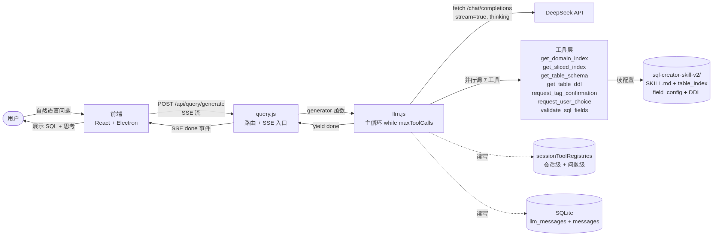
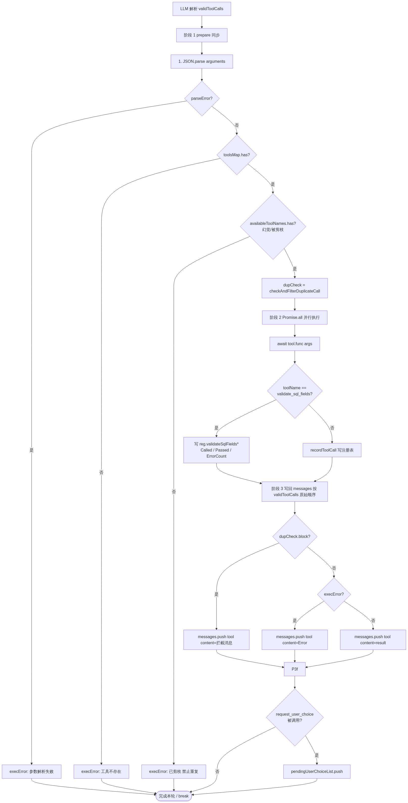
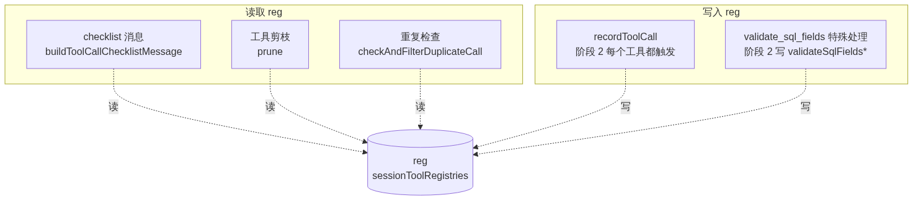
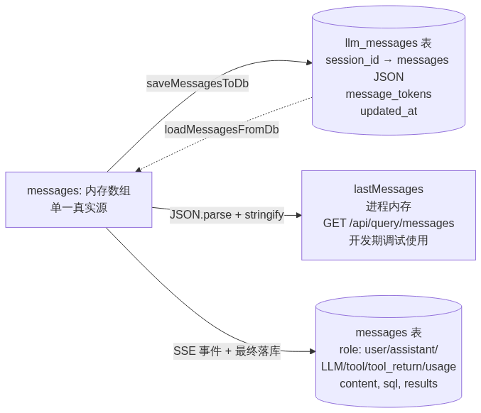

# XTSQLQueryAgent — 执行流程

> 目标读者：需要修改/调试/扩展 SQL 生成 Agent 的后端开发者。
> 阅读时间：完整阅读 ~25 分钟；查阅 ~5 分钟。
> 代码基线：`backend/src/services/llm.js`（核心循环）+ `backend/src/routes/query.js`（HTTP 入口）+ `backend/src/services/toolFuncs.js`（工具实现）。

---

## 目录

1. [整体定位](#1-整体定位)
2. [快速上手（30 秒版）](#2-快速上手30-秒版)
3. [入口层：HTTP → LLM](#3-入口层http--llm)
4. [LLM 主循环](#4-llm-主循环)
   - 4.1 [装配请求：checklist + compact + prune](#41-装配请求checklist--compact--prune)
   - 4.2 [工具剪枝逻辑](#42-工具剪枝逻辑)
   - 4.3 [LLM 调用与 SSE 解析](#43-llm-调用与-sse-解析)
   - 4.4 [工具执行三阶段](#44-工具执行三阶段)
5. [状态管理：sessionToolRegistries](#5-状态管理sessiontoolregistries)
   - 5.1 [两类状态的作用域](#51-两类状态的作用域)
   - 5.2 [状态的写入/读取时机](#52-状态的写入读取时机)
6. [消息持久化双轨](#6-消息持久化双轨)
7. [关键设计原则与"为什么"](#7-关键设计原则与为什么)
8. [常见调试场景](#8-常见调试场景)
9. [扩展点](#9-扩展点)
10. [附录：关键文件索引](#附录关键文件索引)

---

## 1. 整体定位

**Agent 做什么**：接收用户的自然语言问题，按"域路由 → 表索引 → 字段配置 → DDL"的工作流，借助 7 个工具自动收集信息，最终生成一条 MySQL 5.7 兼容的 SQL 语句并自检验证。

**核心循环**：单次 user 消息触发的"LLM ↔ 工具"多轮对话，循环上限 `agent_max_tool_calls`（默认 30）。每轮：拼请求 → 调 LLM → 解析响应 → 执行工具 → 写回 history，直到 LLM 输出最终 SQL 或被 `request_user_choice` 中断。

**关键不变量**：
- LLM 看到的 tools 列表 ≠ 实际可执行工具列表（剪枝只影响 LLM 视图，不影响 `toolsMap`）
- `messages` 数组是单一真实源，DB 是它的序列化
- `reg.validateSqlFields*` 是问题级状态，新 user 消息到来时必重置

---

## 2. 快速上手（30 秒版）



如果只看一张图，看上面这张。详细逻辑在第 4 节。

---

## 3. 入口层：HTTP → LLM

**入口文件**：[backend/src/routes/query.js](file:///d:/Ai_Program_Files/XTSQLQueryAgent/backend/src/routes/query.js)

### 3.1 路由定义

[query.js:292-552](file:///d:/Ai_Program_Files/XTSQLQueryAgent/backend/src/routes/query.js#L292-L552) 定义 `POST /api/query/generate`。

请求体：`{ question, sessionId?, schemaMode? }`

| 字段 | 必填 | 说明 |
|---|---|---|
| `question` | 是 | 用户自然语言问题 |
| `sessionId` | 否 | 不传则 `ensureSession()` 自动创建（归属当前用户） |
| `schemaMode` | 否 | `stream` 走 SSE；其他值走非流式（开发期调试） |

### 3.2 入口处理链

| 步骤 | 位置 | 作用 |
|---|---|---|
| 1 | [query.js:23](file:///d:/Ai_Program_Files/XTSQLQueryAgent/backend/src/routes/query.js#L23) | `router.use(authRequired)` 中间件验证 JWT，设 `req.user` |
| 2 | [query.js:296-304](file:///d:/Ai_Program_Files/XTSQLQueryAgent/backend/src/routes/query.js#L296-L304) | sessionId 校验归属；无则 `ensureSession(req.user.id)` |
| 3 | [query.js:312-319](file:///d:/Ai_Program_Files/XTSQLQueryAgent/backend/src/routes/query.js#L312-L319) | 用户消息入库 `messages(role=user)` |
| 4 | [query.js:322-323](file:///d:/Ai_Program_Files/XTSQLQueryAgent/backend/src/routes/query.js#L322-L323) | `loadSkillMd()` 实时读 SKILL.md（**不缓存**，因可能更新） |
| 5 | [query.js:341-368](file:///d:/Ai_Program_Files/XTSQLQueryAgent/backend/src/routes/query.js#L341-L368) | SSE 头 + `setNoDelay(true)`（关 Nagle 避免小包攒批） + 5min 整体超时 + `req.on('close')` abort |
| 6 | [query.js:371](file:///d:/Ai_Program_Files/XTSQLQueryAgent/backend/src/routes/query.js#L371) | `generator = generateSQLWithLangChainStreamGen_BAK(...)` |
| 7 | [query.js:383-446](file:///d:/Ai_Program_Files/XTSQLQueryAgent/backend/src/routes/query.js#L383-L446) | `for await (chunk of generator)` 消费 yield，分发 SSE 事件 + 同步入库 |
| 8 | [query.js:449-460](file:///d:/Ai_Program_Files/XTSQLQueryAgent/backend/src/routes/query.js#L449-L460) | 从 `done.message` 中正则提取 ```sql``` 块（LLM 未直接给 sql 字段时的兜底） |
| 9 | [query.js:474-495](file:///d:/Ai_Program_Files/XTSQLQueryAgent/backend/src/routes/query.js#L474-L495) | 落最终 assistant 消息 + 累加 `sessions.total_tokens` |

### 3.3 关键 SSE 事件类型

后端 `yield` 的 chunk 类型（前端消费）：

| type | 触发时机 | 关键字段 | 是否入 DB |
|---|---|---|---|
| `chunk` | LLM 流式 content | `content` | ❌（实时推送） |
| `reasoning_chunk` | LLM 思考 delta | `content` | ❌ |
| `reasoning_done` | 整轮思考结束 | `content` | ✅（role=LLM） |
| `message_final` | thinking 剥离后 | `content`, `extraThinking` | ❌（推 UI） |
| `usage` | LLM 返回 usage | `usage` | ✅（role=usage） |
| `tool` | LLM 决定调工具 | `log` | ✅（role=LLM） |
| `tool_return` | 工具执行完 | `log` | ✅（role=tool_return） |
| `error` | 异常 | `content` | ❌ |
| `done` | 循环退出 | `sql`, `message`, `totalTokens`, `elapsedMs`, `userChoiceRequest?` | ✅（role=assistant） |

---

## 4. LLM 主循环

**核心文件**：[backend/src/services/llm.js](file:///d:/Ai_Program_Files/XTSQLQueryAgent/backend/src/services/llm.js)

主函数：`generateSQLWithLangChainStreamGen_BAK` ([llm.js:973-1936](file:///d:/Ai_Program_Files/XTSQLQueryAgent/backend/src/services/llm.js#L973-L1936))

### 4.0 函数入口：3 件必做事

```js
export async function* generateSQLWithLangChainStreamGen_BAK(
  question, history, signal, sessionId, username
) {
  // 1. 日志记录
  logger.info("generateSQLWithLangChainStreamGen_BAK called (backup)", {...});

  // 2. ★ 重置问题级独立标志（每次新 user 消息必做）
  resetPerQuestionRegistryFlags(getOrCreateRegistry(sessionId));

  // 3. 加载 LLM 配置 / SKILL.md
  // ...
}
```

**为什么重置在入口**：[llm.js:1012-1017](file:///d:/Ai_Program_Files/XTSQLQueryAgent/backend/src/services/llm.js#L1012-L1017)

`validateSqlFieldsCalled` / `validateSqlFieldsPassed` / `validateSqlFieldsErrorCount` 是"上一问题的 SQL 校验结果"，**与当前问题无关**。如果不重置，新问题的 checklist 会显示"✓passed"，误导 LLM 跳过本轮 SQL 校验。

注意 reset 只发生在函数入口，**不影响同问题内 Round 1+**（校验失败重写场景需要历史状态）。

### 4.1 装配请求：checklist + compact + prune

每轮 LLM 请求前，**三步准备**：

#### 4.1.1 checklist 消息

[llm.js:1114-1136](file:///d:/Ai_Program_Files/XTSQLQueryAgent/backend/src/services/llm.js#L1114-L1136)

`buildToolCallChecklistMessage(reg)` 生成一条临时 system 消息，列出已调用的工具：

```
🚫 【冻结工具清单 - 绝对禁止重复调用】
[已调用] get_domain_index:✓ | get_sliced_index:[crm] | get_table_schema:[customer_info,customer_contact] | validate_sql_fields:✓passed

【铁律】以上工具的结果已在你的上下文中。
【禁止】任何"为了保险再调一次"、"再确认"、"重新看看"等重复调用。
【判定】若信息已全 → 立即输出 SQL，不要再调用任何工具。
```

**关键点**：
- 这条消息**仅放入 `requestMessages`，不 push 到累积的 `messages` 数组**，避免污染 history / DB
- 作用：对抗长上下文的"注意力衰减"——LLM 看不到自己几轮前调过什么工具

#### 4.1.2 compact 折叠

[llm.js:1153-1156](file:///d:/Ai_Program_Files/XTSQLQueryAgent/backend/src/services/llm.js#L1153-L1156)

`compactConsumedToolResults(messages, foldedCache)`：
- 把已消费的 `get_sliced_index` 工具返回结果中的 `related_tables` 折叠（删除）
- 保留 `rules` / `constraints`
- **用 `foldedCache` 跨轮次复用折叠结果**（cache-aside），避免重复计算

#### 4.1.3 prune 工具剪枝

[llm.js:1179-1203](file:///d:/Ai_Program_Files/XTSQLQueryAgent/backend/src/services/llm.js#L1179-L1203)

详见 [4.2 节](#42-工具剪枝逻辑)。

### 4.2 工具剪枝逻辑

```js
const prunedTools = toolsDefinition.filter((t) => {
  if (t.function.name === "get_domain_index" && pruneReg.getDomainIndexCalled)
    return false;  // 调过后从 LLM 视图中移除
  if (t.function.name === "get_sliced_index" && pruneReg.slicedDomains.size > 0)
    return false;  // 任何域 sliced 过就移除
  return true;
});
```

**剪枝矩阵**（修订时间 2026-07-28）：

| 工具 | 剪枝条件 | 说明 |
|---|---|---|
| `get_domain_index` | `reg.getDomainIndexCalled` | 业务域列表已在 history |
| `get_sliced_index` | `reg.slicedDomains.size > 0` | 任意域 sliced 过 |
| `validate_sql_fields` | **永不剪枝** | 跨问题场景下 LLM 可能 Round 0 直接调 |
| 其它（5 个） | **永不剪枝** | `get_table_schema` / `get_table_ddl` / `request_tag_confirmation` / `request_user_choice` 等 |

**重要不变量**：
- `prunedTools` 只影响 `requestParams.tools`（LLM 看到的可选工具）
- `toolsMap`（执行用）**不变**——LLM 调被剪枝工具时，程序能识别出来是"幻觉调用"并返回错误

**剪枝的副作用**：LLM 仍可能"幻觉"调用被剪枝工具 → 阶段 1 拦截 → 返回 `execError = "已剪枝 禁止重复"` 消息（[llm.js:1559-1575](file:///d:/Ai_Program_Files/XTSQLQueryAgent/backend/src/services/llm.js#L1559-L1575)）。

### 4.3 LLM 调用与 SSE 解析

#### 4.3.1 发起 fetch

[llm.js:1232-1256](file:///d:/Ai_Program_Files/XTSQLQueryAgent/backend/src/services/llm.js#L1232-L1256)

```js
fetchResponse = await fetch(`${baseURL}/chat/completions`, {
  method: "POST",
  headers: { "Content-Type": "application/json", Authorization: `Bearer ${apiKey}` },
  body: JSON.stringify(requestParams),
  signal: tFetch.signal,  // FETCH_MS=60s 超时
});
```

`requestParams` 关键字段：
- `model`: 来自 `getProviderConfig(provider, model)`
- `messages`: `[...compacted, ...checklist]`
- `tools`: `prunedTools`
- `stream: true`, `stream_options: { include_usage: true }`
- `thinking: { type: "enabled" }`：DeepSeek 思考模式
- `temperature: 0`

#### 4.3.2 流式解析

[llm.js:1264-1391](file:///d:/Ai_Program_Files/XTSQLQueryAgent/backend/src/services/llm.js#L1264-L1391)

逐行解析 SSE `data: {...}`，累积三个变量：

| 变量 | 用途 |
|---|---|
| `streamToolCalls[]` | 工具调用（按 `tool_calls[i].index` 重组，因为 delta 是分片的） |
| `responseText` | content 累积（**未剥离 thinking**） |
| `reasoningContent` | reasoning_content 累积 |

**关键陷阱**：DeepSeek 要求"两个 user 之间若发生过工具调用，assistant 的 `reasoning_content` 必须回传"，否则返回 400 ([llm.js:1138-1151](file:///d:/Ai_Program_Files/XTSQLQueryAgent/backend/src/services/llm.js#L1138-L1151))。

#### 4.3.3 thinking 剥离

[llm.js:1393-1412](file:///d:/Ai_Program_Files/XTSQLQueryAgent/backend/src/services/llm.js#L1393-L1412)

`splitThinkingFromContent(responseText)` 启发式正则剥离误倒进 content 的思考段。前端通过 `message_final` 事件更新气泡。

### 4.4 工具执行三阶段

[llm.js:1479-1844](file:///d:/Ai_Program_Files/XTSQLQueryAgent/backend/src/services/llm.js#L1479-L1844)

工具执行是**最容易出 bug 的部分**，分三阶段：



#### 阶段 1：prepare（同步，必须做）

**位置**：[llm.js:1488-1582](file:///d:/Ai_Program_Files/XTSQLQueryAgent/backend/src/services/llm.js#L1488-L1582)

四个检查按顺序执行，任何一个失败都设置 `execError`，工具不进入阶段 2：

1. **JSON.parse 解析参数**：失败时 `execError = "参数解析失败"`
2. **工具存在性**：`!toolsMap.has(toolName)` → `execError = "工具不存在"`
3. **幻觉调用拦截**：`!availableToolNames.has(toolName)` → `execError = "已剪枝 禁止重复"`（这条是 2026-07-28 修复的关键）
4. **重复调用拦截**：`checkAndFilterDuplicateCall(toolName, parsedArgs, sessionId)`

**为什么 prepare 是同步的**：同一 LLM 响应里可能调 N 次相同工具，N 次检查必须顺序完成，否则并发检查会互相穿透。

**JSON 修复特例**（[llm.js:1500-1522](file:///d:/Ai_Program_Files/XTSQLQueryAgent/backend/src/services/llm.js#L1500-L1522)）：`request_user_choice` 工具若 JSON.parse 失败，尝试把裸 ASCII `"` 替换为中文右引号后重试。仅此工具享受此豁免。

#### 阶段 2：Promise.all（并行 IO）

**位置**：[llm.js:1586-1694](file:///d:/Ai_Program_Files/XTSQLQueryAgent/backend/src/services/llm.js#L1586-L1694)

并行执行所有 prepare 成功的工具调用。同步工具（返回非 Promise）通过 `Promise.resolve()` 包装。

**每个工具的副作用**：

| 工具 | 副作用 |
|---|---|
| 通用 | `recordToolCall(toolName, args, sessionId, userChoiceId?)` 写 `userChoiceAsked` Map |
| `validate_sql_fields` | 写 `reg.validateSqlFieldsCalled / Passed / ErrorCount` |
| `request_user_choice` | 返回 `{markers, payloads, ids, content}` 拆分到 `pendingUserChoiceList` |

**关键工具结果结构**（[llm.js:1604-1649](file:///d:/Ai_Program_Files/XTSQLQueryAgent/backend/src/services/llm.js#L1604-L1649)）：

```js
// request_user_choice: {content: string, ids, markers, payloads}
// validate_sql_fields:  {content: string(JSON), valid, errors, summary}
// 其它: 直接是 tool.func 的返回值
```

`content` 字段给 LLM 看（必须 string），`valid` / `errors` 等结构化字段给程序写注册表。

#### 阶段 3：写回 messages（按 validToolCalls 原始顺序）

**位置**：[llm.js:1698-1844](file:///d:/Ai_Program_Files/XTSQLQueryAgent/backend/src/services/llm.js#L1698-L1844)

**为什么按 LLM 调用的原始顺序写回**：LLM 看到的 tool 顺序是它自己的决策顺序，乱序会让它困惑。`execResults` 是 Promise.all 完成的（**不保证原序**），所以这里重新按 `validToolCalls` 顺序遍历。

**三种写回路径**：

| 情况 | push 内容 |
|---|---|
| `dupCheck.block === true` | `{role: 'tool', tool_call_id, content: dupCheck.message}` |
| `execError` 非空 | `{role: 'tool', tool_call_id, content: 'Error: ' + execError.message}` |
| 正常 | `{role: 'tool', tool_call_id, content: resultContent}` |

**TURN 1 终止**：[llm.js:1846-1847](file:///d:/Ai_Program_Files/XTSQLQueryAgent/backend/src/services/llm.js#L1846-L1847)

```js
if (pendingUserChoiceList.length > 0) break;
```

`request_user_choice` 是"程序硬控"的终止信号——调了之后立即跳出 while 循环，进入 TURN 2 等待用户回答。

### 4.5 退出分支

#### 4.5.1 TURN 1 终止（user_choice 路径）

[llm.js:1864-1927](file:///d:/Ai_Program_Files/XTSQLQueryAgent/backend/src/services/llm.js#L1864-L1927)

```js
yield {
  type: "done",
  sql: "",
  message: responseText,
  userChoiceRequest: pendingUserChoiceList,  // 1-3 个元素的数组
};
return;
```

**注意**：
- `sql: ""`（让前端知道是 user_choice 中断，不是最终 SQL）
- `userChoiceRequest` 是数组（v2 起支持链式弹窗，最多 3 个）
- DB 写失败时 `userChoiceRequest: null` 降级（不弹窗，让 LLM 继续）

#### 4.5.2 自然完成

[llm.js:1930-1935](file:///d:/Ai_Program_Files/XTSQLQueryAgent/backend/src/services/llm.js#L1930-L1935)

```js
yield { type: "done", sql: "", message: responseText };
```

**关键**：`sql: ""`！真正的 SQL 由 [query.js:449-460](file:///d:/Ai_Program_Files/XTSQLQueryAgent/backend/src/routes/query.js#L449-L460) 从 `message` 中正则提取 ```sql``` 块。

---

## 5. 状态管理：sessionToolRegistries

**位置**：[llm.js:340-398](file:///d:/Ai_Program_Files/XTSQLQueryAgent/backend/src/services/llm.js#L340-L398)

### 5.1 两类状态的作用域

**Map 本身**：`sessionToolRegistries: Map<sessionId, reg>`，进程级单例，跨用户隔离靠 `sessionId` key。

**每个 reg 字段**：

| 字段 | 类型 | 作用域 | 重置时机 |
|---|---|---|---|
| `getDomainIndexCalled` | bool | 会话级 | 不重置 |
| `slicedDomains` | Set | 会话级 | 不重置 |
| `tableSchema` | Set | 会话级 | 不重置 |
| `tableDdl` | Set | 会话级 | 不重置 |
| `termConfirmed` | Set | 会话级 | 不重置 |
| `userChoiceAsked` | Map | 会话级 | 不重置 |
| `getTablesCalled` | bool | 会话级 | 不重置 |
| `validateSqlFieldsCalled` | bool | **问题级** | 新 user 消息时 reset |
| `validateSqlFieldsPassed` | bool | **问题级** | 新 user 消息时 reset |
| `validateSqlFieldsErrorCount` | number | **问题级** | 新 user 消息时 reset |

**判断原则**：一个字段是"会话级"还是"问题级"，问自己——"它的值在新问题到来时是否还成立？"
- 成立（"这个域 sliced 过"对新问题仍然成立，因为 history 里有）→ 会话级，不重置
- 不成立（"SQL 校验通过"指的是上一问题的 SQL，跟新问题无关）→ 问题级，必重置

### 5.2 状态的写入/读取时机



**Reg 生命周期**：

| 事件 | 行为 |
|---|---|
| `getOrCreateRegistry(sid)` | Map 里没有则 `new reg()`，有则返回 |
| `resetPerQuestionRegistryFlags(reg)` | 把 3 个 validateSqlFields 字段重置 |
| `clearSessionRegistry(sid)` | 从 Map 删 key（[query.js:270](file:///d:/Ai_Program_Files/XTSQLQueryAgent/backend/src/routes/query.js#L270) 在 `DELETE /api/query/messages/:sid` 时调用） |

### 5.3 状态读取的三个消费者

| 消费者 | 位置 | 读哪些字段 |
|---|---|---|
| 剪枝 | [llm.js:1180-1193](file:///d:/Ai_Program_Files/XTSQLQueryAgent/backend/src/services/llm.js#L1180-L1193) | `getDomainIndexCalled` / `slicedDomains.size` |
| checklist | [llm.js:432-484](file:///d:/Ai_Program_Files/XTSQLQueryAgent/backend/src/services/llm.js#L432-L484) | 所有 |
| 重复检查 | `checkAndFilterDuplicateCall` | `userChoiceAsked` / `termConfirmed` / `tableSchema` / `tableDdl` 等 |

---

## 6. 消息持久化双轨



**`llm_messages` vs `messages`**：

| 表 | 用途 | 写入时机 | 读取时机 |
|---|---|---|---|
| `llm_messages` | LLM 真实 context 持久化 | 每轮 `assistantMsg` 写回后立刻 UPDATE | 新 user 消息时 `loadMessagesFromDb` |
| `messages` | 前端历史侧边栏 | 每条 SSE 事件（chunk/tool/error 等）+ 最终 assistant | `GET /api/query/messages/:sid` |

**`lastMessages`（进程内存）**：
- 仅供开发期 `GET /api/query/messages` 调试接口使用
- 生产环境**禁止对外开放**（[query.js:211-214](file:///d:/Ai_Program_Files/XTSQLQueryAgent/backend/src/routes/query.js#L211-L214) 警告注释）

---

## 7. 关键设计原则与"为什么"

### 7.1 "程序硬控" vs "LLM 软约束"

| 行为 | 控制方式 | 例子 |
|---|---|---|
| 工具执行超时 | 程序 | `withTimeout(signal, FETCH_MS)` |
| 重复调用拦截 | 程序 | `checkAndFilterDuplicateCall` |
| TURN 1 终止 | 程序 | `request_user_choice` → break |
| 是否输出 SQL | LLM | system prompt 提示 |
| 是否调 validate_sql_fields | LLM | system prompt 提示（**不强制**，plan D-12） |

**原则**：**任何 token 节省 / 注意力保护相关的优化都不应阻断正确性**。validate_sql_fields 之前的 Round 0 剪枝就是一个反例（已修复）。

### 7.2 "剪枝"与"拦截"分离

- **剪枝**：从 LLM 看到的选择列表里删掉
- **拦截**：LLM 调了被剪枝工具时，返回错误而不是真的执行

两者必须配合。如果只剪枝不拦截，LLM 仍可能幻觉调用；如果只拦截不剪枝，token 浪费。

### 7.3 messages 是单一真实源

所有 SSE 事件、DB 落库、lastMessages 缓存都从同一个 `messages` 数组派生。任何修改 `messages` 的地方都要意识到**双向影响**：
- 影响 LLM 下一轮请求的 messages（[llm.js:1157-1165](file:///d:/Ai_Program_Files/XTSQLQueryAgent/backend/src/services/llm.js#L1157-L1165) 重新组装 `requestMessages`）
- 影响 DB（`saveMessagesToDb`）
- 影响调试接口（`lastMessages` 同步）

checklist 消息是个例外——只进 `requestMessages`，**不**进 `messages` 数组。

### 7.4 防御性超时分层

| 层级 | 超时 | 位置 |
|---|---|---|
| 整体 SSE | 5 min | [query.js:353-359](file:///d:/Ai_Program_Files/XTSQLQueryAgent/backend/src/routes/query.js#L353-L359) |
| LLM fetch（建立连接） | 60s | [llm.js:1232](file:///d:/Ai_Program_Files/XTSQLQueryAgent/backend/src/services/llm.js#L1232) `LLM_TIMEOUTS.FETCH_MS` |
| LLM stream read（每段） | 30s | [llm.js:1273-1279](file:///d:/Ai_Program_Files/XTSQLQueryAgent/backend/src/services/llm.js#L1273-L1279) `LLM_TIMEOUTS.READ_MS` |
| while 循环轮数 | 30 | [llm.js:1089](file:///d:/Ai_Program_Files/XTSQLQueryAgent/backend/src/services/llm.js#L1089) `agent_max_tool_calls` |

### 7.5 状态作用域：会话级 vs 问题级

跨问题共享数据 → 会话级（不重置，节省 token）。
跨问题不可复用数据 → 问题级（必重置，避免污染 checklist）。

混淆这两者会导致**误导 LLM**（最严重的 bug：显示旧的 ✓passed 状态，让 LLM 跳过新问题的校验）。

---

## 8. 常见调试场景

### 8.1 SQL 输出但没经过 validate_sql_fields

**症状**：LLM 直接输出 SQL，未调 `validate_sql_fields`。

**排查**：
1. 看 `logs/{date}/admin_llm.log` 中 `validate_sql_fields` 调用记录
2. 看 checklist 是否显示 `validate_sql_fields:✓passed`（如果是，问题级状态没重置）
3. 看工具剪枝日志 `✂️ [Round X] 本轮 LLM 请求已剪枝工具` 是否有 validate_sql_fields

### 8.2 LLM 反复调同一个工具

**症状**：LLM 在多轮里调 `get_domain_index` / `get_sliced_index` 多次。

**排查**：
1. 看 checklist 消息是否成功追加（"冻结工具清单"）
2. 看 `getDomainIndexCalled` / `slicedDomains` 是否正确写入
3. 看剪枝逻辑是否生效（`prunedTools` 应该少 1-2 个工具）

### 8.3 LLM 调 request_user_choice 但前端没弹窗

**症状**：日志显示 `request_user_choice` 被调，前端没反应。

**排查**：
1. 看 `pendingUserChoiceList.length` 是否 > 0
2. 看 `userChoiceRequest` 字段是否在 done 事件里
3. 看前端的 `UserChoiceDialog` 组件是否消费 `done.user_choice_request` 字段
4. 看 DB 写入是否成功（失败时降级为 `userChoiceRequest: null`）

### 8.4 流式响应卡死

**症状**：SSE 长时间无新数据。

**排查**：
1. 看整体超时是否触发（5 min）
2. 看 `withTimeout(signal, READ_MS, ...)` 是否抛错（30s 无新数据）
3. 看 LLM API 端是否有限流 / 熔断

### 8.5 messages 表快速增长

**症状**：SQLite `messages` 表行数爆炸。

**排查**：
1. 看是否每条 SSE 事件都入了 messages（是的，每条 chunk / tool / tool_return 都入）
2. 看 `DELETE /api/query/messages/:sid` 是否被调用
3. 看 `llm_messages` 是不是只存最新一份（是的，UPDATE 覆盖）

### 8.6 跨问题误判

**症状**：Q2 的 checklist 显示 Q1 的状态。

**排查**：
1. 确认 `resetPerQuestionRegistryFlags` 在 `generateSQLWithLangChainStreamGen_BAK` 入口被调用
2. 看 `reg.validateSqlFieldsCalled` 在 Q2 开始时是否为 `false`

---

## 9. 扩展点

### 9.1 新增工具

**位置**：[toolFuncs.js:418-697](file:///d:/Ai_Program_Files/XTSQLQueryAgent/backend/src/services/toolFuncs.js#L418-L697)

`tools` 数组里 `new DynamicTool({...})` 即可。**重点确认**：
- 工具描述 ≤ 300 字符（节省 token）
- `func` 返回值结构：要给 LLM 看的是 `string`，结构化数据单独字段返回（参考 `validate_sql_fields` / `request_user_choice`）
- 涉及状态写入的，要在 `llm.js` 阶段 2 添加对应写入逻辑
- 涉及剪枝的，要在 `llm.js:1179-1203` 添加对应规则

### 9.2 新增注册表字段

**位置**：[llm.js:349-388](file:///d:/Ai_Program_Files/XTSQLQueryAgent/backend/src/services/llm.js#L349-L388)

三步：
1. 在 `getOrCreateRegistry` 的 reg 对象里加字段
2. 在工具阶段 2 添加写入逻辑
3. 在 `buildToolCallChecklistMessage` 里加展示（如果需要 LLM 看到）
4. **决定作用域**：会话级 or 问题级？若是问题级，加到 `resetPerQuestionRegistryFlags`

### 9.3 替换 LLM Provider

**位置**：[llm.js provider 配置](file:///d:/Ai_Program_Files/XTSQLQueryAgent/backend/src/services/llm.js) + [config.js](file:///d:/Ai_Program_Files/XTSQLQueryAgent/backend/src/services/config.js)

通过 admin 配置切换 provider / model。`thinking: { type: "enabled" }` 是 DeepSeek 特有，迁移到 OpenAI 等需要去掉。

### 9.4 修改消息持久化

- 想加新事件类型：SSE `yield` 那边加 + [query.js 事件分发](file:///d:/Ai_Program_Files/XTSQLQueryAgent/backend/src/routes/query.js#L383-L446) 加处理
- 想加新 DB 字段：`messages` 表加列 + INSERT 语句加字段

### 9.5 拦截规则的扩展

`checkAndFilterDuplicateCall` 是黑盒函数。要加新规则（如：禁止连续 3 轮不调任何工具），可以在剪枝后、阶段 1 前加检查。

---

## 附录：关键文件索引

| 文件 | 作用 | 关键函数/位置 |
|---|---|---|
| [routes/query.js](file:///d:/Ai_Program_Files/XTSQLQueryAgent/backend/src/routes/query.js) | HTTP 入口 | `POST /generate` [L292](file:///d:/Ai_Program_Files/XTSQLQueryAgent/backend/src/routes/query.js#L292) |
| [services/llm.js](file:///d:/Ai_Program_Files/XTSQLQueryAgent/backend/src/services/llm.js) | LLM 主循环 | `generateSQLWithLangChainStreamGen_BAK` [L973](file:///d:/Ai_Program_Files/XTSQLQueryAgent/backend/src/services/llm.js#L973) |
| | | 工具剪枝 [L1179](file:///d:/Ai_Program_Files/XTSQLQueryAgent/backend/src/services/llm.js#L1179) |
| | | 三阶段执行 [L1479](file:///d:/Ai_Program_Files/XTSQLQueryAgent/backend/src/services/llm.js#L1479) |
| | | `getOrCreateRegistry` [L349](file:///d:/Ai_Program_Files/XTSQLQueryAgent/backend/src/services/llm.js#L349) |
| | | `resetPerQuestionRegistryFlags` [L391](file:///d:/Ai_Program_Files/XTSQLQueryAgent/backend/src/services/llm.js#L391) |
| | | `buildToolCallChecklistMessage` [L432](file:///d:/Ai_Program_Files/XTSQLQueryAgent/backend/src/services/llm.js#L432) |
| [services/toolFuncs.js](file:///d:/Ai_Program_Files/XTSQLQueryAgent/backend/src/services/toolFuncs.js) | 工具实现 | `tools` 数组 [L418](file:///d:/Ai_Program_Files/XTSQLQueryAgent/backend/src/services/toolFuncs.js#L418) |
| [services/config.js](file:///d:/Ai_Program_Files/XTSQLQueryAgent/backend/src/services/config.js) | LLM / Agent 配置 | `getLlmConfig` / `getProviderConfig` / `getAgentConfig` |
| [services/validators.js](file:///d:/Ai_Program_Files/XTSQLQueryAgent/backend/src/services/validators.js) | validate_sql_fields 实现 | `validateSqlFields({sql})` |
| [services/sqlValidator.js](file:///d:/Ai_Program_Files/XTSQLQueryAgent/backend/src/services/sqlValidator.js) | SQL 安全校验（执行/explain 接口） | `validateReadOnlySql` |
| [services/mysqlPool.js](file:///d:/Ai_Program_Files/XTSQLQueryAgent/backend/src/services/mysqlPool.js) | MySQL 连接池 | `getPool()` |
| [db/sqlite.js](file:///d:/Ai_Program_Files/XTSQLQueryAgent/backend/src/db/sqlite.js) | SQLite 实例 | `getDb()` |
| [routes/skill.js](file:///d:/Ai_Program_Files/XTSQLQueryAgent/backend/src/routes/skill.js) | 技能管理 | `POST /create-table-files` [L425](file:///d:/Ai_Program_Files/XTSQLQueryAgent/backend/src/routes/skill.js#L425) |
| [services/skillDomains.js](file:///d:/Ai_Program_Files/XTSQLQueryAgent/backend/src/services/skillDomains.js) | 域索引管理 | `addTableToDomains` [L86](file:///d:/Ai_Program_Files/XTSQLQueryAgent/backend/src/services/skillDomains.js#L86) |
| [skills/sql-creator-skill-v2/SKILL.md](file:///d:/Ai_Program_Files/XTSQLQueryAgent/skills/sql-creator-skill-v2/SKILL.md) | System Prompt | LLM 行为规约 |
| [skills/sql-creator-skill-v2/table_index.json](file:///d:/Ai_Program_Files/XTSQLQueryAgent/skills/sql-creator-skill-v2/table_index.json) | 表索引 | 域路由 / 表元数据 |
| [skills/sql-creator-skill-v2/field_config/*.json](file:///d:/Ai_Program_Files/XTSQLQueryAgent/skills/sql-creator-skill-v2/field_config/) | 字段配置 | 别名 / 枚举 / 虚拟关联 |
| [skills/sql-creator-skill-v2/ddl/*.sql](file:///d:/Ai_Program_Files/XTSQLQueryAgent/skills/sql-creator-skill-v2/ddl/) | DDL 文件 | 表结构 / 外键 |
| [docs/superpowers/plans/2026-07-23-validate-sql-fields-tool.md](file:///d:/Ai_Program_Files/XTSQLQueryAgent/docs/superpowers/plans/2026-07-23-validate-sql-fields-tool.md) | validate_sql_fields 设计文档 | 风险项 R1-R12 |

---

## 版本

- 文档版本：2026-07-28
- 代码基线：`backend/src/services/llm.js` HEAD
- 配套：修复了 2026-07-28 发现的 `validate_sql_fields` 跨问题被误拦 bug（移除 Round 0 剪枝 + 新增 `resetPerQuestionRegistryFlags`）
