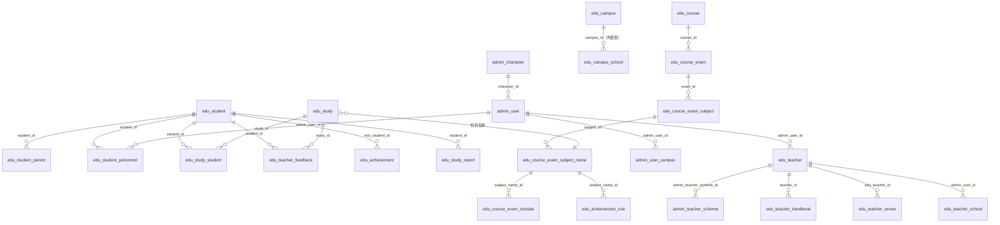
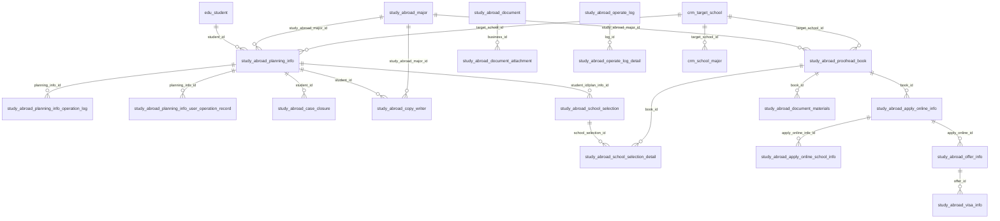
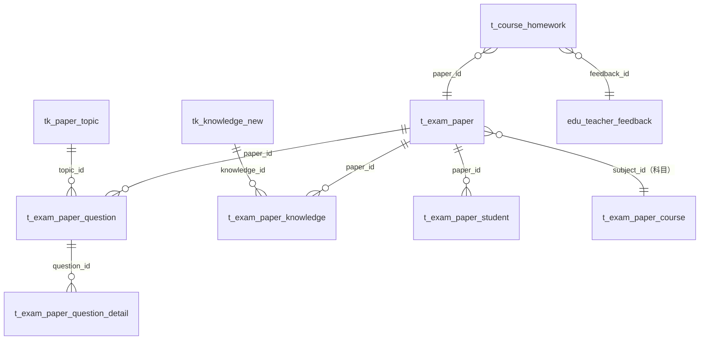

# course 项目数据库表结构梳理

> 生成日期：2026-09-02
> 数据来源：项目无建表 SQL 脚本，本文档基于 `domain/dataobject` 下 DO 类的 Javadoc 注释（表注释、字段注释）与 `domain/mapper` 下 Mapper XML 的 SQL 语句（表名、JOIN 关系）整理。
> 标注说明：表名后带"（推断）"表示无直接 SQL 证据、按类名/字段注释推断；关联中带"（推断）"表示依据字段注释推断、Mapper XML 中未出现对应 JOIN。字段注释中"（注释原文如此）"表示源码注释与字段名疑似不符，按原文保留。

## 通用约定

* 主键：几乎所有表以 `id` 为自增主键。

* 创建/更新时间：老表多用 `created_time/update_time`（时间戳），新表多用 `create_time/update_time`（默认当前时间）。

* 逻辑删除：老表用 `del`，新表用 `deleted`（0-正常，1-删除），少数表用 `del`+`rel` 双字段。

* 时间字段多为 Unix 时间戳（BIGINT），部分新表使用日期字符串。

* 表名风格：教育业务老表 `edu_` 前缀；题库/统计/报告类新表 `t_` 前缀；题库原始表 `tk_` 前缀；留学业务 `study_abroad_` 前缀；CRM 相关 `crm_` 前缀。

***

## 一、业务域总览

| #  | 业务域     | 表数 | 表清单                                                                                                                                                                                                                                                                                                                                                                                                                                                                                                                                                                                                                                                                                                                                                                                                                                                               |
| -- | ------- | -- | ----------------------------------------------------------------------------------------------------------------------------------------------------------------------------------------------------------------------------------------------------------------------------------------------------------------------------------------------------------------------------------------------------------------------------------------------------------------------------------------------------------------------------------------------------------------------------------------------------------------------------------------------------------------------------------------------------------------------------------------------------------------------------------------------------------------------------------------------------------------- |
| 1  | 用户与组织   | 14 | edu\_student、edu\_student\_parent、edu\_student\_personnel、edu\_student\_praise、admin\_user、admin\_character、admin\_teacher\_scheme、admin\_user\_campus、my\_user\_openid、edu\_customer、customer\_education\_info、edu\_campus、sys\_dict\_item、edu\_global\_config                                                                                                                                                                                                                                                                                                                                                                                                                                                                                                                                                                                                   |
| 2  | 教师管理    | 7  | edu\_teacher、edu\_teacher\_annex、edu\_teacher\_class\_type、edu\_teacher\_class\_subject\_name、edu\_teacher\_school、edu\_teacher\_handbook、lark\_sync\_log                                                                                                                                                                                                                                                                                                                                                                                                                                                                                                                                                                                                                                                                                                         |
| 3  | 课程与排课   | 18 | edu\_course、edu\_course\_exam、edu\_course\_exam\_subject、edu\_course\_exam\_subject\_tag、edu\_course\_exam\_subject\_name、edu\_course\_exam\_module、edu\_study、edu\_study\_student、edu\_student\_timetable、keqiao\_study、keqiao\_study\_student、edu\_pre\_study、edu\_pre\_study\_student、edu\_cancel\_pre\_study\_notice、edu\_activities、edu\_task、edu\_task\_feed、exams\_year\_apply\_info                                                                                                                                                                                                                                                                                                                                                                                                                                                                       |
| 4  | 成绩管理    | 6  | edu\_achievement、edu\_achievement\_type、edu\_achievement\_rule、edu\_achievement\_annex、edu\_achievement\_knowledge、edu\_achievement\_teacher                                                                                                                                                                                                                                                                                                                                                                                                                                                                                                                                                                                                                                                                                                                      |
| 5  | 教学反馈与留存 | 7  | edu\_teacher\_feedback、edu\_feed\_teacher、edu\_feed\_assistant、edu\_feedback\_annex、edu\_feedback\_knowledge、edu\_retention\_detail、edu\_retention\_stats                                                                                                                                                                                                                                                                                                                                                                                                                                                                                                                                                                                                                                                                                                         |
| 6  | 试卷与题库   | 11 | t\_course\_homework、t\_exam\_paper、t\_exam\_paper\_course、t\_exam\_paper\_config、t\_exam\_paper\_question、t\_exam\_paper\_question\_detail、t\_exam\_paper\_knowledge、t\_exam\_paper\_student、t\_exam\_result\_rule、tk\_knowledge\_new、tk\_paper\_topic                                                                                                                                                                                                                                                                                                                                                                                                                                                                                                                                                                                                            |
| 7  | 自习课     | 6  | self\_study\_course\_config、edu\_self\_study\_course、edu\_self\_study\_course\_detail、edu\_self\_study\_feedback、edu\_self\_study\_feedback\_attachments、edu\_self\_study\_feedback\_attachments\_content                                                                                                                                                                                                                                                                                                                                                                                                                                                                                                                                                                                                                                                         |
| 8  | 报告与统计   | 10 | edu\_study\_report、edu\_study\_report\_school、t\_study\_statistics、t\_study\_statistics\_homework、t\_study\_statistics\_knowledge、t\_graduation\_report、monthly\_communication、monthly\_communication\_file、planning\_report、planning\_report\_file                                                                                                                                                                                                                                                                                                                                                                                                                                                                                                                                                                                                               |
| 9  | 留学业务    | 26 | study\_abroad\_planning\_info、study\_abroad\_case\_closure、study\_abroad\_copy\_writer、study\_abroad\_student\_info\_temp、study\_abroad\_proofread\_book、study\_abroad\_school\_selection、study\_abroad\_school\_selection\_detail、study\_abroad\_apply\_online\_info、study\_abroad\_apply\_online\_person\_info、study\_abroad\_apply\_online\_account\_info、study\_abroad\_apply\_online\_school\_info、study\_abroad\_offer\_info、study\_abroad\_visa\_info、study\_abroad\_document、study\_abroad\_document\_attachment、study\_abroad\_document\_materials、study\_abroad\_attachment、study\_abroad\_operate\_log、study\_abroad\_operate\_log\_detail、study\_abroad\_planning\_info\_operation\_log、study\_abroad\_planning\_info\_user\_operation\_record、study\_abroad\_school、study\_abroad\_major、crm\_current\_school、crm\_target\_school、crm\_school\_major |
| 10 | 留学系统配置  | 4  | abroad\_standard\_field、abroad\_search\_criteria\_template、abroad\_user\_custom\_filter、abroad\_user\_defined\_field                                                                                                                                                                                                                                                                                                                                                                                                                                                                                                                                                                                                                                                                                                                                              |
| 11 | 消息与通知   | 7  | sms\_wx\_tpl、sms\_wx\_tpl\_field、sms\_wx\_msg、sms\_wx\_msg\_receiver、sms\_wx\_my\_msg、abroad\_message\_template、abroad\_message\_notice                                                                                                                                                                                                                                                                                                                                                                                                                                                                                                                                                                                                                                                                                                                           |
| 12 | 新签礼包    | 4  | new\_sign\_gift\_record、new\_sign\_gift\_push\_log、new\_sign\_gift\_operation\_log、new\_sign\_gift\_record\_sync\_cursor（另引用外部表 order\_student）                                                                                                                                                                                                                                                                                                                                                                                                                                                                                                                                                                                                                                                                                                                   |
| 13 | 通用附件    | 1  | edu\_watermark\_annex                                                                                                                                                                                                                                                                                                                                                                                                                                                                                                                                                                                                                                                                                                                                                                                                                                             |

***

## 二、核心表关系

### 2.1 教学/用户核心链路

### 2.2 留学业务链路（以学生为主线）

### 2.3 试卷/题库/作业链路

### 2.4 JOIN 关系总清单（自 Mapper XML 提取，去重）

**用户/组织域：**

* edu\_student.edu\_student\_type\_id = edu\_student\_type.id（外部表）

* edu\_student.edu\_student\_status\_id = edu\_student\_status.id（外部表）

* edu\_student.campus\_school\_id = edu\_campus\_school.id（外部表）

* edu\_student.id = order\_student.student\_id（外部表）

* edu\_student.id = edu\_student\_personnel.student\_id

* edu\_student.id = edu\_student\_praise.edu\_student\_id

* edu\_student.id = edu\_student\_timetable.edu\_student\_id

* edu\_student.id = edu\_teacher\_feedback.student\_id

* edu\_student.id = exams\_year\_apply\_info.edu\_student\_id

* edu\_student\_personnel.admin\_user\_id = admin\_user.id

* edu\_student\_personnel.admin\_user\_id = admin\_user\_campus.admin\_user\_id

* edu\_teacher.admin\_teacher\_scheme\_id = admin\_teacher\_scheme.id

* edu\_teacher.admin\_user\_id = admin\_user.id

* edu\_teacher.parent\_id = edu\_teacher.admin\_user\_id（自关联，上级）

* edu\_teacher.admin\_user\_id = edu\_teacher\_school.admin\_user\_id

* edu\_teacher.id = edu\_teacher\_handbook.teacher\_id

* edu\_teacher.id = edu\_teacher\_annex.edu\_teacher\_id

* edu\_teacher.id = edu\_pre\_study.edu\_admin\_user\_id

* edu\_teacher.id = edu\_study.edu\_admin\_user\_id

* edu\_teacher\_feedback.teacher\_id / admin\_user\_id = admin\_user.id

* edu\_teacher\_feedback.study\_id = edu\_study.id

* edu\_teacher\_feedback.school\_id = edu\_campus\_school.id（外部表）

* edu\_teacher\_feedback.id = edu\_feed\_teacher.id（1:1 扩展）

* edu\_teacher\_school.school\_id = edu\_campus\_school.id（外部表）

* edu\_campus\_school.campus\_id = edu\_campus.id（外部表）

* edu\_campus\_school\_class.campus\_school\_id = edu\_campus\_school.id（外部表）

* edu\_teacher\_annex.url = edu\_watermark\_annex.url（按 URL 关联）

* admin\_user.character\_id = admin\_character.id

* admin\_user.id = admin\_user\_campus.admin\_user\_id

* admin\_user.id = edu\_customer.admin\_user\_id

* admin\_user.department\_id = admin\_department\_manage.admin\_department\_children\_id（外部表）

* edu\_activities.edu\_course\_exam\_subject\_name\_id = edu\_course\_exam\_subject\_name.id

* edu\_activities.id = edu\_self\_study\_feedback.activity\_id

* edu\_activities.id = edu\_activities\_student.edu\_activities\_id（外部表）

* edu\_task\_feed.task\_id = edu\_task.id

* exams\_year\_apply\_info.order\_list\_id = order\_list.id（外部表）

* crm\_target\_school.country\_region = sys\_dict\_item.key（字典关联）

**课程/排课域：**

* edu\_course\_exam.course\_id = edu\_course.id

* edu\_course\_exam\_subject.exam\_id = edu\_course\_exam.id

* edu\_course\_exam\_subject.edu\_course\_exam\_subject\_tag\_id = edu\_course\_exam\_subject\_tag.id

* edu\_course\_exam\_subject\_name.subject\_id = edu\_course\_exam\_subject.id

* edu\_course\_exam\_module.subject\_name\_id = edu\_course\_exam\_subject\_name.id

* edu\_achievement\_rule.subject\_name\_id = edu\_course\_exam\_subject\_name.id

* edu\_study.edu\_course\_exam\_subject\_name\_id = edu\_course\_exam\_subject\_name.id

* edu\_study.edu\_campus\_school\_class\_id = edu\_campus\_school\_class.id（外部表）

* edu\_study.edu\_admin\_user\_id = admin\_user.id

* edu\_study\_student.edu\_study\_id = edu\_study.id

* edu\_study\_student.edu\_student\_id = edu\_student.id

* edu\_student\_studycancel.edu\_study\_id = edu\_study.id（外部表）

* edu\_teacher\_feedback.study\_id = edu\_study.id

* t\_graduation\_report.student\_id = edu\_study\_student.edu\_student\_id

* edu\_pre\_study.edu\_course\_exam\_subject\_name\_id = edu\_course\_exam\_subject\_name.id

* edu\_pre\_study\_student.edu\_pre\_study\_id = edu\_pre\_study.id

* edu\_pre\_study\_student.edu\_student\_id = edu\_student.id

* keqiao\_study\_student.keqiao\_study\_id = keqiao\_study.id（推断）

* tk\_knowledge\_course.tk\_knowledge\_id = tk\_knowledge\_new\.id（外部表）

* tk\_knowledge\_course.subject\_name\_id = edu\_course\_exam\_subject\_name.id（外部表）

* tk\_knowledge\_new\.parent\_id = tk\_knowledge\_new\.id（知识点树自关联）

**成绩/反馈/留存域：**

* edu\_achievement.edu\_student\_id = edu\_student.id

* edu\_achievement.edu\_course\_id = edu\_course.id

* edu\_achievement.edu\_course\_exam\_id = edu\_course\_exam.id

* edu\_achievement.edu\_course\_exam\_subject\_id = edu\_course\_exam\_subject.id

* edu\_achievement.edu\_course\_exam\_subject\_name\_id = edu\_course\_exam\_subject\_name.id

* edu\_achievement.edu\_course\_exam\_module\_id = edu\_course\_exam\_module.id

* edu\_achievement.type = edu\_achievement\_type.id

* edu\_achievement.exams\_year\_quarter\_id = exams\_year\_quarter.id（外部表）

* edu\_achievement.exams\_year\_season\_type\_id = exams\_year\_season\_type.id（外部表）

* edu\_achievement\_annex.edu\_achievement\_id = edu\_achievement.id

* edu\_achievement\_knowledge.edu\_achievement\_id = edu\_achievement.id

* edu\_achievement\_knowledge.tk\_knowledge\_id = tk\_knowledge\_new\.id

* edu\_achievement\_teacher.edu\_achievement\_id = edu\_achievement.id

* edu\_achievement\_teacher.admin\_user\_id = edu\_teacher.admin\_user\_id

* edu\_retention\_detail.edu\_student\_id = edu\_student.id

* edu\_retention\_detail.edu\_course\_exam\_subject\_name\_id = edu\_course\_exam\_subject\_name.id

* edu\_retention\_detail.edu\_admin\_user\_id = edu\_teacher.id

* edu\_retention\_detail.edu\_study\_id = edu\_study.id

**报告/统计域：**

* edu\_study\_report.student\_id = edu\_student.id

* edu\_study\_report.campus\_school\_id = edu\_campus\_school.id（外部表）

* edu\_study\_report\_school.report\_id = edu\_study\_report.id

* edu\_study\_report\_school.school\_id = edu\_campus\_school.id（外部表）

* t\_study\_statistics.student\_id = edu\_student.id

* t\_study\_statistics.student\_id = edu\_student\_personnel.student\_id

* t\_study\_statistics.creator / sender = admin\_user.id

* t\_study\_statistics\_homework.statistics\_id = t\_study\_statistics.id（推断）

* t\_study\_statistics\_knowledge.statistics\_id = t\_study\_statistics.id（推断）

* t\_graduation\_report.student\_id = edu\_student.id

* monthly\_communication\_file.communication\_id = monthly\_communication.id

* planning\_report\_file.report\_id = planning\_report.id

**试卷/题库/自习/礼包域：**

* t\_exam\_paper.id = t\_exam\_paper\_question.paper\_id

* t\_exam\_paper.id = t\_exam\_paper\_knowledge.paper\_id

* t\_exam\_paper.admin\_user\_id = admin\_user.id

* t\_exam\_paper\_question.id = t\_exam\_paper\_question\_detail.question\_id

* t\_exam\_paper\_question.topic\_id = tk\_knowledge\_topic\_tags.topic\_id（外部表）

* t\_exam\_paper\_knowledge.knowledge\_id = tk\_knowledge\_new\.id

* t\_exam\_paper\_student.student\_id = edu\_student.id

* tk\_paper\_topic.paper\_id = tk\_paper\_new\.id（外部表）

* t\_course\_homework.paper\_id = t\_exam\_paper.id

* edu\_self\_study\_course.edu\_student\_id = edu\_student.id

* edu\_self\_study\_course.edu\_student\_id = edu\_student\_personnel.student\_id

* edu\_self\_study\_course.id = edu\_self\_study\_course\_detail.self\_study\_course\_id

* edu\_self\_study\_feedback.activity\_id = edu\_activities.id

* edu\_self\_study\_feedback.student\_id = edu\_student.id

* edu\_self\_study\_feedback.admin\_user\_id = admin\_user.id

* edu\_self\_study\_feedback\_attachments.self\_study\_feedback\_id = edu\_self\_study\_feedback.id

* edu\_self\_study\_feedback\_attachments.content\_id = edu\_self\_study\_feedback\_attachments\_content.id

* new\_sign\_gift\_record.student\_id = edu\_student.id

* new\_sign\_gift\_record.source\_order\_student\_id = order\_student.id（外部表）

* order\_student.edu\_campus\_id = edu\_campus.id（外部表）

**留学域（另见 2.2 图）：**

* study\_abroad\_planning\_info.student\_id = edu\_student.id

* study\_abroad\_planning\_info.edu\_student\_type\_id = edu\_student\_type.id（外部表）

* study\_abroad\_planning\_info.course\_consultant\_id / planner\_id / transfer\_teacher\_id = admin\_user.id

* study\_abroad\_copy\_writer.planner\_id / transfer\_teacher\_id / copywriting\_teacher\_id = admin\_user.id

* study\_abroad\_operate\_log.operator\_id = admin\_user.id

* study\_abroad\_planning\_info.current\_school\_id = crm\_current\_school.id

* study\_abroad\_planning\_info.target\_school\_id = crm\_target\_school.id

* study\_abroad\_proofread\_book.target\_school\_id = crm\_target\_school.id

* study\_abroad\_proofread\_book.major\_id = crm\_school\_major.id

* crm\_school\_major.target\_school\_id = crm\_target\_school.id

* crm\_school\_major.direction\_id = crm\_tag\_definition.id（外部表）

* abroad\_message\_notice.template\_code = abroad\_message\_template.code

* abroad\_user\_custom\_filter.field\_id = abroad\_search\_criteria\_template.id

***

## 三、各业务域表结构明细

### 3.1 用户与组织域

#### edu\_student（EduStudent）

表注释：学生

| 字段                       | 注释                                     |
| ------------------------ | -------------------------------------- |
| id                       | 学生ID                                   |
| type                     | 类型：1学通学生 2客户 3科桥学生                     |
| myUserId                 | 注册用户ID                                 |
| classinId                | classin id                             |
| classinPhone             | classin 手机                             |
| eduStudentStatusId       | 学生状态ID（edu\_student\_status）           |
| eduStudentTypeId         | 学生类型ID                                 |
| eduStudentTypeProjectId  | 报读项目ID                                 |
| name                     | 学生姓名                                   |
| pinyinName               | 拼音                                     |
| englishName              | 英文名                                    |
| userImg                  | 用户头像                                   |
| birth                    | 生日（时间戳）                                |
| email                    | 邮箱                                     |
| phone                    | 学生手机                                   |
| sex                      | 性别：1男 2女 3其他                           |
| institutions             | 目标院校                                   |
| ingrade                  | 在读年级                                   |
| direction                | 专业方向                                   |
| characters               | 学生性格                                   |
| inschool                 | 在读学校                                   |
| examinationTime          | 考试时间（时间戳）                              |
| achievement              | 语言成绩                                   |
| abroad                   | 留学国家                                   |
| examination              | 考试局                                    |
| campusSchoolId           | 所属校区ID                                 |
| firstclassTime           | 首次课时间（时间戳）                             |
| remarks                  | 备注                                     |
| adminUserId              | 创建人ID                                  |
| certificates             | 证件号码                                   |
| certificatesType         | 证件类型（edu\_student\_certificates\_type） |
| certificatesValid        | 证件有效期（时间戳）                             |
| stopCourseTime           | 最近一次停课时间                               |
| stopCourseRemarks        | 最近一次停课原因                               |
| inSchoolTime             | 入校时间                                   |
| transferSchoolTime       | 转校时间                                   |
| exitSchoolTime           | 退学时间                                   |
| createdTime / updateTime | —                                      |
| del / rel                | —                                      |
| bankAccount              | 银行账号                                   |
| bankAccountStatus        | 银行账号是否注销：0-初始化 1-有效 2-注销               |
| updateMyUserId           | 通过小程序更新数据时的微信用户注册id                    |
| myUserUpdateTime         | 通过小程序更新数据的时间                           |
| parentInfo               | 家长情况                                   |
| studentCode              | 学生编码                                   |
| org                      | 组织：0-学通 1-科桥 2-科勒                      |
| applicationSeason        | 申请季（如 2026-2027）                       |

关联：eduStudentStatusId → edu\_student\_status；eduStudentTypeId → edu\_student\_type；campusSchoolId → edu\_campus\_school；adminUserId → admin\_user；myUserId → my\_user（注册用户）

#### edu\_student\_parent（EduStudentParent）

表注释：学生家长表

| 字段                                   | 注释                                     |
| ------------------------------------ | -------------------------------------- |
| id                                   | —                                      |
| studentId                            | 学生ID                                   |
| myUserId                             | 注册用户ID                                 |
| mainContact                          | 是否主要联系人：1是 2否                          |
| typeName                             | 家长类型（称呼）                               |
| name                                 | 家长姓名                                   |
| phone                                | 家长手机                                   |
| certificatesType                     | 证件类型（edu\_student\_certificates\_type） |
| certificates                         | 证件号码                                   |
| email                                | 邮箱                                     |
| createdTime / updateTime / del / rel | —                                      |

关联：studentId → edu\_student；myUserId → my\_user

#### edu\_student\_personnel（EduStudentPersonnel）

表注释：学生相关工作人员表

| 字段                                   | 注释                                                             |
| ------------------------------------ | -------------------------------------------------------------- |
| id                                   | —                                                              |
| studentId                            | 学生ID                                                           |
| type                                 | 人员类型：1助教 2客服(班主任) 3老师 4顾问 5生活老师（另注：1留学顾问 2班主任（原客服）3学术老师 4规划顾问） |
| adminUserId                          | 关联人员ID                                                         |
| adminUserName                        | —                                                              |
| createdTime / updateTime / del / rel | —                                                              |

关联：studentId → edu\_student；adminUserId → admin\_user

#### edu\_student\_praise（EduStudentPraiseDO）

表注释：学生好评表

| 字段                    | 注释             |
| --------------------- | -------------- |
| id                    | 学生好评记录ID       |
| eduStudentId          | 学生ID           |
| eduStudentParentName  | 学生家长名称         |
| eduStudentParentPhone | 学生家长手机号        |
| eduTeacherAdminUserId | 老师后台用户ID       |
| remarks               | 学生/家长对老师的评价    |
| createdTime           | 创建时间（时间戳）      |
| del                   | 删除标识：0-正常 1-删除 |

关联：eduStudentId → edu\_student；eduTeacherAdminUserId → admin\_user

#### admin\_user（AdminUserDO）

表注释：后台用户

| 字段            | 注释                |
| ------------- | ----------------- |
| id            | —                 |
| parentId      | 直属上级ID            |
| characterId   | 角色ID              |
| departmentId  | 部门ID              |
| unionid       | unionId           |
| user          | 用户名               |
| time          | 创建时间              |
| entryTime     | 入职时间              |
| dimissionTime | 离职时间              |
| classinId     | 老师 classin id     |
| mobile        | 手机                |
| nickName      | 昵称                |
| del           | 是否禁用：0正常 1禁用      |
| delTime       | 禁用时间              |
| crmId         | crm id            |
| weight        | 是否有绩效：0正常有绩效 1无绩效 |
| weightAuth    | 权重开关              |
| password      | 密码                |
| isadmin       | 是否是管理员：1普通用户 2管理员 |
| shareImg      | 分享图片              |
| wechat        | 微信号               |
| ddLock        | 钉钉锁：1不可编辑 2通过钉钉添加 |

关联：parentId → admin\_user（自关联）；characterId → admin\_character；departmentId → admin\_department\_manage

#### admin\_character（AdminCharacter）

表注释：管理员角色表

| 字段             | 注释             |
| -------------- | -------------- |
| id             | 管理员角色唯一标识      |
| platform       | 所属平台           |
| type           | 角色类型           |
| characterName  | 角色名称           |
| pagePermission | 页面权限           |
| apiPermission  | API 权限         |
| time           | 创建/修改时间        |
| del            | 是否删除：0未删除 1已删除 |

关联：无（被 admin\_user.character\_id 引用）

#### admin\_teacher\_scheme（AdminTeacherSchemeDO）

表注释：老师课时方案表

| 字段                        | 注释           |
| ------------------------- | ------------ |
| id                        | 主键ID         |
| name                      | 老师课时方案名称     |
| contestAmount             | 竞赛金额（精确到分）   |
| englishAmount             | 英语授课金额（精确到分） |
| teacherLevel              | 老师等级         |
| compulsoryHours           | 义务课时         |
| adminUserId               | 创建人ID        |
| updateAdminUserId         | 更新人ID        |
| createdTime / updatedTime | 时间戳          |
| del                       | 删除标识：0正常 1删除 |

关联：adminUserId / updateAdminUserId → admin\_user

#### admin\_user\_campus（无独立 DO，AdminUserCampusMapper.xml）

表注释：后台用户-校区关联表

| 字段          | 注释     |
| ----------- | ------ |
| adminUserId | 后台用户ID |
| eduCampusId | 校区ID   |

关联：adminUserId → admin\_user；eduCampusId → edu\_campus

#### my\_user\_openid（MyUserOpenid）

表注释：用户 openid 表

| 字段                       | 注释       |
| ------------------------ | -------- |
| id                       | —        |
| appid                    | 微信 appid |
| myUserId                 | 用户 id    |
| openId                   | openid   |
| createdTime / updateTime | —        |

关联：myUserId → my\_user（注册用户）

#### edu\_customer（EduCustomer）

表注释：客服表

| 字段                                   | 注释           |
| ------------------------------------ | ------------ |
| id                                   | —            |
| adminUserId                          | 后台用户ID       |
| sex                                  | 性别：1男 2女 3其他 |
| characters                           | 性格           |
| work                                 | 上班时间         |
| createdTime / updateTime / del / rel | —            |

关联：adminUserId → admin\_user

#### customer\_education\_info（CustomerEducationInfoDO）

表注释：线索教育信息表

| 字段                      | 注释                 |
| ----------------------- | ------------------ |
| id                      | 主键 id              |
| customerCode            | 线索编码               |
| gradeValue              | 在读年级               |
| schoolName              | 在读学校               |
| deleted                 | 是否删除：0未删除 1删除      |
| createTime / updateTime | —                  |
| createBy                | 创建人                |
| updateBy                | 最后更新人              |
| oldFlag                 | 是否是老数据（历销数据）：0否 1是 |
| crmId                   | CRM 系统业务主键         |

关联：createBy / updateBy → admin\_user；customerCode → 线索（客户）

#### edu\_campus（EduCampus）

表注释：校区表

| 字段                                   | 注释         |
| ------------------------------------ | ---------- |
| id                                   | —          |
| platform                             | 平台：1学通 2科桥 |
| name                                 | 校区名称       |
| simple                               | —          |
| managerId                            | —          |
| createdTime / updateTime / del / rel | —          |

关联：managerId → admin\_user（推断）

#### sys\_dict\_item（SysDictItemDO）

表注释：字典表

| 字段                      | 注释            |
| ----------------------- | ------------- |
| id                      | ID主键          |
| dictType                | 字典类型：如 GRADE  |
| businessType            | 业务类型：0默认 1留学  |
| code                    | code          |
| key                     | key           |
| title                   | 展示名称          |
| sort                    | 排序            |
| enable                  | 启用：1启用 0未启用   |
| deleted                 | 是否删除：0未删除 1删除 |
| createTime / updateTime | —             |

关联：无（被 crm\_target\_school.country\_region 按 key 值关联）

#### edu\_global\_config（无独立 DO，EduGlobalConfigMapper.xml）

表注释：全局配置表

| 字段                      | 注释   |
| ----------------------- | ---- |
| id                      | —    |
| code                    | 配置编码 |
| value                   | 配置值  |
| enable                  | 启用标识 |
| deleted                 | 是否删除 |
| createTime / updateTime | —    |

关联：无

### 3.2 教师管理域

#### edu\_teacher（EduTeacher）

表注释：老师

| 字段                                   | 注释               |
| ------------------------------------ | ---------------- |
| id                                   | —                |
| adminTeacherSchemeId                 | 课耗规则ID           |
| adminUserId                          | 后台用户ID           |
| parentId                             | 上级ID             |
| classinId                            | classin id       |
| name                                 | 姓名               |
| nickname                             | 昵称               |
| avatar                               | 头像               |
| sex                                  | 性别：1男 2女 3其他     |
| job                                  | 工作性质：1全职 2兼职 3其他 |
| courseStyle                          | 授课风格             |
| star                                 | 星级（数字1-9）        |
| appraise                             | 老师评分             |
| teacherIntroduce                     | 老师介绍             |
| studyIntroduce                       | 留学介绍             |
| remarks                              | 备注               |
| other                                | 其他               |
| createdTime / updateTime / del / rel | —                |

关联：adminTeacherSchemeId → admin\_teacher\_scheme；adminUserId → admin\_user；parentId → edu\_teacher（自关联）

#### edu\_teacher\_annex（EduTeacherAnnexDO）

表注释：老师附件表

| 字段                 | 注释                |
| ------------------ | ----------------- |
| id                 | 主键ID              |
| eduTeacherId       | 老师ID              |
| url                | 附件URL             |
| createdTime        | 创建时间（时间戳）         |
| del                | 是否删除：0正常 1删除      |
| createdAdminUserId | 创建人（管理员ID）        |
| delAdminUserId     | 删除人（管理员ID）        |
| type               | 附件类型：1普通附件 2师资册图片 |
| autoFlag           | 自动创建：0否 1是        |

关联：eduTeacherId → edu\_teacher；createdAdminUserId / delAdminUserId → admin\_user；url → edu\_watermark\_annex.url

#### edu\_teacher\_class\_type（EduTeacherClassTypeDO）

表注释：老师可教班级类型

| 字段                       | 注释           |
| ------------------------ | ------------ |
| id                       | 主键ID         |
| adminUserId              | 老师ID         |
| classTypeId              | 班级类型ID       |
| createdTime / updateTime | —            |
| del                      | 删除标识：0正常 1删除 |
| rel                      | 预留字段         |

关联：adminUserId → admin\_user；classTypeId → edu\_class\_type（推断）

#### edu\_teacher\_class\_subject\_name（无独立 DO，TeacherClassSubjectNameMapper.xml）

表注释：老师可教班级科目关联表

| 字段                                   | 注释       |
| ------------------------------------ | -------- |
| adminUserId                          | 老师后台用户ID |
| subjectNameId                        | 科目名称ID   |
| createdTime / updateTime / del / rel | —        |

关联：adminUserId → admin\_user；subjectNameId → edu\_course\_exam\_subject\_name

#### edu\_teacher\_school（无独立 DO，TeacherSchoolMapper.xml / EduTeacherSchoolMapper.xml）

表注释：老师-校区（学校）关联表

| 字段                                   | 注释       |
| ------------------------------------ | -------- |
| adminUserId                          | 老师后台用户ID |
| schoolId                             | 学校/校区ID  |
| createdTime / updateTime / del / rel | —        |

关联：adminUserId → admin\_user；schoolId → edu\_campus\_school

#### edu\_teacher\_handbook（EduTeacherHandbookDO）

表注释：老师师资册（飞书同步）

| 字段                         | 注释              |
| -------------------------- | --------------- |
| id                         | —               |
| recordId                   | 飞书记录ID          |
| teacherId                  | 老师 id           |
| englishName                | 英文名             |
| avatar                     | 头像              |
| intro                      | 个人简介            |
| style                      | 授课风格            |
| tags                       | 教师标签            |
| degreeInfo                 | 学历/提分率/获奖率      |
| experienceInfo             | 学生数/授课经验/时长     |
| studentNumber              | 学生数             |
| teachingDuration           | 授课时长            |
| teachingExperience         | 授课经验            |
| subjects                   | 可授科目            |
| features                   | 教学特色            |
| achievements               | 教学成就            |
| larkStatus                 | 飞书师资册状态         |
| handbookStatus             | 师资册状态：0未完成 1已完成 |
| name / sex / teacherStatus | —               |
| deleted                    | 是否删除：0未删除 1删除   |
| createTime / updateTime    | —               |

关联：teacherId → edu\_teacher

#### lark\_sync\_log（LarkSyncLogDO）

表注释：飞书同步日志表

| 字段                      | 注释           |
| ----------------------- | ------------ |
| id                      | 主键           |
| recordId                | 飞书原始记录ID     |
| version                 | 同步版本号        |
| rawData                 | 飞书原始数据（JSON） |
| deleted                 | 是否删除         |
| syncTime                | 同步时间         |
| createTime / updateTime | —            |

关联：无

### 3.3 课程与排课域

#### edu\_course（EduCourse）

表注释：课程（一级）

| 字段                                   | 注释         |
| ------------------------------------ | ---------- |
| id                                   | —          |
| platform                             | 平台：1学通 2科桥 |
| name                                 | 课程名称       |
| createdTime / updateTime / del / rel | —          |

关联：无（被 edu\_course\_exam.course\_id、edu\_achievement.edu\_course\_id 引用）

#### edu\_course\_exam（EduCourseExam）

表注释：考试局（二级）

| 字段                                   | 注释    |
| ------------------------------------ | ----- |
| id                                   | —     |
| courseId                             | 课程ID  |
| name                                 | 考试局名称 |
| createdTime / updateTime / del / rel | —     |

关联：courseId → edu\_course

#### edu\_course\_exam\_subject（EduCourseExamSubject）

表注释：科目（三级）

| 字段                                   | 注释        |
| ------------------------------------ | --------- |
| id                                   | —         |
| examId                               | 考试局ID     |
| eduCourseExamSubjectTagId            | 科目标签ID    |
| name                                 | 科目名称      |
| score                                | 三级科目对应的学分 |
| createdTime / updateTime / del / rel | —         |

关联：examId → edu\_course\_exam；eduCourseExamSubjectTagId → edu\_course\_exam\_subject\_tag

#### edu\_course\_exam\_subject\_tag（EduCourseExamSubjectTagDO）

表注释：科目标签表

| 字段                             | 注释     |
| ------------------------------ | ------ |
| id                             | 标签ID   |
| name                           | 科目标签名称 |
| adminUserId                    | 创建人    |
| createdTime / updateTime / del | —      |

关联：adminUserId → admin\_user

#### edu\_course\_exam\_subject\_name（EduCourseExamSubjectName / EduCourseExamSubjectNameDO，两 DO 共用一表）

表注释：科目名称（四级，关联知识点）

| 字段                                   | 注释                                 |
| ------------------------------------ | ---------------------------------- |
| id                                   | 主键                                 |
| subjectId                            | 科目ID（三级）                           |
| name                                 | 名称                                 |
| tkKnowledgeId / tkKnowledgeNewId     | 知识点 id（四级科目和知识点 tk\_knowledge 做关联） |
| title                                | 知识点标题（查询用）                         |
| ruleId                               | —                                  |
| createdTime / updateTime / del / rel | —                                  |

关联：subjectId → edu\_course\_exam\_subject；tkKnowledgeId → tk\_knowledge\_new（经 tk\_knowledge\_course）；ruleId → edu\_achievement\_rule（推断）

#### edu\_course\_exam\_module（EduCourseExamModule）

表注释：五级模块

| 字段                      | 注释                                      |
| ----------------------- | --------------------------------------- |
| id                      | ID主键                                    |
| subjectNameId           | 科目名称（四级）ID                              |
| moduleName              | 五级模块名称                                  |
| achievementType         | 成绩规则（已注释掉，规则迁移至 edu\_achievement\_rule） |
| deleted                 | 是否删除：0未删除 1删除                           |
| createTime / updateTime | —                                       |

关联：subjectNameId → edu\_course\_exam\_subject\_name

#### edu\_study（EduStudyDO）

表注释：排课（学通正式课）

| 字段                            | 注释                               |
| ----------------------------- | -------------------------------- |
| id                            | —                                |
| status                        | 课程状态：1初始化 2已结课                   |
| type                          | 课程类型：1线下课 2网课 3活动 4classin网课     |
| classTimeStart / classTimeEnd | 上课开始/结束时间（时间戳）                   |
| classWeek                     | 星期 0\~6                          |
| classHour                     | 课时数                              |
| eduCampusSchoolClassId        | 教室ID                             |
| eduCourseExamSubjectNameId    | 科目名称ID                           |
| eduClassTypeId                | 班级类型ID                           |
| eduAdminUserId                | 上课老师ID                           |
| adminUserId                   | 操作人ID                            |
| englishTeaching               | 是否英语授课：1不是 2是                    |
| jingsaiTeaching               | 是否竞赛：1不是 2是                      |
| trialTeaching                 | 是否是试听课：1不是 2是                    |
| createdTime / updateTime      | —                                |
| del                           | 取消排课：0正常 1删除                     |
| isSend                        | 老师课程提醒：1未发送 2提前150分钟发送 3提前30分钟发送 |
| isUserSend                    | 学生及家长课程提醒：1未发送 2提前150分钟发送        |
| isVideo                       | 是否录课：0不录课 1录课                    |
| videoUrl                      | 上课视频地址                           |
| remarks                       | 备注                               |
| classinCourseId               | classin 课程ID                     |
| classinClassId                | classin 课节ID                     |
| updateAdminUserId             | —                                |
| completeTime                  | 结课时间                             |

关联：eduCourseExamSubjectNameId → edu\_course\_exam\_subject\_name；eduCampusSchoolClassId → edu\_campus\_school\_class；eduClassTypeId → edu\_class\_type（推断）；eduAdminUserId / adminUserId → admin\_user

#### edu\_study\_student（EduStudyStudentDO）

表注释：排课-学生关联表

| 字段             | 注释                |
| -------------- | ----------------- |
| studyId        | 排课ID（正式课、自习课）     |
| feedbackId     | 反馈 id             |
| status         | 状态                |
| campusSchoolId | 校区 id             |
| studentId      | 学生ID              |
| studentIds     | 学生ids，用逗号分隔       |
| studentName    | 学生名称              |
| adminUserId    | 操作人ID             |
| date           | 课程日期：如 2025-10-11 |

关联：studyId → edu\_study；studentId → edu\_student；campusSchoolId → edu\_campus\_school；feedbackId → edu\_teacher\_feedback（推断）

#### edu\_student\_timetable（EduStudentTimetable）

表注释：学生课表

| 字段                      | 注释                            |
| ----------------------- | ----------------------------- |
| id                      | ID主键                          |
| date                    | 日期                            |
| courseId                | 课程 id                         |
| courseName              | 课程名称                          |
| type                    | 课程类型                          |
| eduStudentId            | 学生ID                          |
| startTime / endTime     | 开始/结束时间                       |
| eduCampusSchoolClassId  | 教室ID                          |
| eduAdminUserId          | 上课老师ID                        |
| teachingStatus          | 授课状态：-1失败 0未确定 1成功            |
| source                  | 来源：1-study 2-activity 3-exams |
| deleted                 | 是否删除：0未删除 1删除                 |
| createTime / updateTime | —                             |

关联：eduStudentId → edu\_student；courseId → 课程；eduCampusSchoolClassId → edu\_campus\_school\_class；eduAdminUserId → admin\_user

#### keqiao\_study（KeqiaoStudy）

表注释：排课（科桥日程）

| 字段                             | 注释                        |
| ------------------------------ | ------------------------- |
| id                             | —                         |
| type                           | 课程类型：1线下课程 2网课 3活动 4考试    |
| typeKinds                      | 课程类型的种类                   |
| keqiaoClassId                  | 班级ID                      |
| eduCampusSchoolId              | 所属校区分校ID                  |
| eduCourseExamSubjectNameId     | 科目名称ID                    |
| keqiaoTimeTableId              | 作息时间ID                    |
| keqiaoTimeTableSectionId       | 作息时间课节ID                  |
| classTimeStart / classTimeEnd  | 上课/活动 开始/结束时间（时间戳）        |
| name                           | 课程/活动 名称                  |
| adminUserId                    | 操作人                       |
| isClash                        | 是否冲突排课：1不冲突 2冲突           |
| eduCampusSchoolClassId         | 教室ID                      |
| address                        | 校外上课地址                    |
| remarks                        | 备注                        |
| keqiaoSurfaceId                | 课表ID                      |
| isClockin                      | 是否考勤：1未全部考勤 2全部考勤 3全部考勤缺勤 |
| createdTime / updateTime / del | —                         |

关联：eduCampusSchoolId → edu\_campus\_school；eduCourseExamSubjectNameId → edu\_course\_exam\_subject\_name；eduCampusSchoolClassId → edu\_campus\_school\_class；keqiaoClassId → keqiao\_class（推断）；adminUserId → admin\_user

#### keqiao\_study\_student（KeqiaoStudyStudent）

表注释：学生考勤表

| 字段                 | 注释                   |
| ------------------ | -------------------- |
| id                 | —                    |
| keqiaoStudyId      | 排课（日程）ID             |
| keqiaoClassId      | 班级ID                 |
| eduStudentId       | 学生ID                 |
| keqiaoStudyLeaveId | 请假ID                 |
| clockinTime        | 考勤时间（时间戳）            |
| status             | 考勤状态：1考勤 2迟到 3早退 4缺勤 |
| adminUserId        | 操作人ID                |
| remarks            | 备注                   |

关联：keqiaoStudyId → keqiao\_study；eduStudentId → edu\_student；adminUserId → admin\_user

#### edu\_pre\_study（EduPreStudyDO）

表注释：预排课

| 字段                            | 注释                           |
| ----------------------------- | ---------------------------- |
| id                            | 主键，自增                        |
| type                          | 课程类型：1线下课 2网课 3活动 4classin网课 |
| classTimeStart / classTimeEnd | 上课开始/结束时间（时间戳）               |
| classWeek                     | 星期：0周日 1周一，依此类推              |
| classHour                     | 课时数                          |
| eduCampusSchoolClassId        | 教室 ID                        |
| eduCourseExamSubjectNameId    | 科目名称 ID                      |
| eduClassTypeId                | 班级类型 ID                      |
| eduAdminUserId                | 上课老师 ID                      |
| adminUserId                   | 操作人 ID                       |
| englishTeaching               | 是否英语授课：1不是 2是                |
| jingsaiTeaching               | 是否竞赛：1不是 2是                  |
| trialTeaching                 | 是否试听课：1不是 2是                 |
| createdTime / updateTime      | —                            |
| del                           | 取消排课状态：0正常 1删除               |
| isVideo                       | 是否录课：0不录课 1录课                |
| remarks                       | 备注                           |
| syncTime                      | 同步时间（时间戳）                    |
| syncEduAdminUserId            | 同步人 ID                       |
| syncStatus                    | 课程同步状态：0未同步 1已同步 2同步失败       |
| syncRemarks                   | 同步失败原因                       |
| syncEduStudyId                | 同步后的排课 ID                    |

关联：eduCourseExamSubjectNameId → edu\_course\_exam\_subject\_name；eduCampusSchoolClassId → edu\_campus\_school\_class；eduClassTypeId → edu\_class\_type（推断）；eduAdminUserId / adminUserId / syncEduAdminUserId → admin\_user；syncEduStudyId → edu\_study

#### edu\_pre\_study\_student（EduPreStudyStudentDO）

表注释：预排课-学生关联表

| 字段            | 注释        |
| ------------- | --------- |
| id            | 主键，自增     |
| eduPreStudyId | 预排课ID     |
| eduStudentId  | 学生ID      |
| adminUserId   | 操作人ID     |
| createdTime   | 创建时间（时间戳） |

关联：eduPreStudyId → edu\_pre\_study；eduStudentId → edu\_student；adminUserId → admin\_user

#### edu\_cancel\_pre\_study\_notice（EduCancelPreStudyNoticeDO）

表注释：取消预排课通知表

| 字段                         | 注释                     |
| -------------------------- | ---------------------- |
| id                         | 主键，自增                  |
| eduPreStudyId              | 预排课ID                  |
| eduStudentId               | 学生ID                   |
| eduStudentName             | 学生姓名                   |
| adminUserId                | 通知人ID                  |
| adminUserName              | 通知人姓名                  |
| eduCourseExamSubjectNameId | 科目名称ID                 |
| eduCourseExamSubjectName   | 科目名称                   |
| classStartTime             | 上课开始时间                 |
| noticeStatus               | 通知状态：-1通知失败 0未通知 1通知成功 |
| deleted                    | 是否删除：0未删除 1删除          |
| createTime / updateTime    | —                      |

关联：eduPreStudyId → edu\_pre\_study；eduStudentId → edu\_student；eduCourseExamSubjectNameId → edu\_course\_exam\_subject\_name；adminUserId → admin\_user

#### edu\_activities（EduActivities）

表注释：课外活动表

| 字段                             | 注释                           |
| ------------------------------ | ---------------------------- |
| id                             | —                            |
| status                         | 课程状态：1初始化 2已结课               |
| type                           | 课程类型：1线下课 2网课 3活动 4classin网课 |
| activityType                   | 活动类型：1自习 2大考 3测验             |
| classTimeStart / classTimeEnd  | 活动 开始/结束时间（时间戳）              |
| isPosition                     | 位置：1校内 2校外                   |
| eduCampusSchoolClassId         | 教室ID                         |
| address                        | 校外地址                         |
| eduCourseExamSubjectNameId     | 科目名称ID                       |
| eduAdminUserId                 | 负责人                          |
| adminUserId                    | 操作人                          |
| isSend                         | 是否发送：0未发送 1已发送               |
| createdTime / updateTime / del | —                            |

关联：eduCampusSchoolClassId → edu\_campus\_school\_class；eduCourseExamSubjectNameId → edu\_course\_exam\_subject\_name；eduAdminUserId / adminUserId → admin\_user

#### edu\_task（无独立 DO，EduTaskMapper.xml）

表注释：任务表

| 字段            | 注释     |
| ------------- | ------ |
| id            | —      |
| feedTeacherId | 反馈老师ID |
| content       | 任务内容   |
| createdTime   | 创建时间   |
| del           | 删除标识   |

关联：feedTeacherId → edu\_feed\_teacher

#### edu\_task\_feed（无独立 DO，EduTaskMapper.xml）

表注释：任务反馈表

| 字段            | 注释     |
| ------------- | ------ |
| taskId        | 任务ID   |
| feedTeacherId | 反馈老师ID |
| content       | 反馈内容   |

关联：taskId → edu\_task；feedTeacherId → edu\_feed\_teacher

#### exams\_year\_apply\_info（无独立 DO，ExamsYearApplyInfoMapper.xml）

表注释：考试年度报考信息表

| 字段                     | 注释         |
| ---------------------- | ---------- |
| id                     | —          |
| orderListId            | 订单ID       |
| examsYearSeasonGoodsId | 考试年度季度商品ID |
| eduStudentId           | 学生ID       |
| examsYearSeasonId      | 考试年度季度ID   |

关联：orderListId → order\_list；examsYearSeasonGoodsId → exams\_year\_season\_goods；eduStudentId → edu\_student；examsYearSeasonId → exams\_year\_season（均为外部表）

### 3.4 成绩管理域

#### edu\_achievement（EduAchievement）

表注释：测试成绩-成绩

| 字段                          | 注释                   |
| --------------------------- | -------------------- |
| id                          | —                    |
| eduStudentId                | 学生ID                 |
| type                        | 考试类型                 |
| achievementSource           | 成绩来源：1学通内部 2外部 3暂无考试 |
| timeStart / timeEnd         | 考试开始/结束时间（时间戳）       |
| eduCourseId                 | 课程                   |
| eduCourseExamId             | 考试局                  |
| eduCourseExamSubjectId      | 科目                   |
| eduCourseExamSubjectNameId  | 科目名称                 |
| eduCourseExamModuleId       | 五级模块ID               |
| achievement                 | 考试成绩                 |
| evaluate                    | 评价                   |
| adminUserId                 | 创建人ID                |
| remarks                     | 备注                   |
| createdTime / updateTime    | —                    |
| rel                         | 是否发布：0未发布 1已发布       |
| del                         | 是否作废：0正常 1作废         |
| applyStatus                 | 当前记录是否报考             |
| firstAchievement            | 首考成绩                 |
| studentFeedback             | 是否达到学员预期             |
| eduAchievementCollectTaskId | 测试成绩-分数采集任务表ID       |
| classHours                  | 课时数                  |
| examsYearSeasonTypeId       | 考试类型ID               |
| examsYearQuarterId          | 年度报考-季度ID            |
| award                       | 奖项                   |
| firsted                     | 是否首考：0不是 1是（大考类型）    |

关联：eduStudentId → edu\_student；type → edu\_achievement\_type；eduCourseId → edu\_course；eduCourseExamId → edu\_course\_exam；eduCourseExamSubjectId → edu\_course\_exam\_subject；eduCourseExamSubjectNameId → edu\_course\_exam\_subject\_name；eduCourseExamModuleId → edu\_course\_exam\_module；adminUserId → admin\_user

#### edu\_achievement\_type（EduAchievementType）

表注释：测试成绩-类型

| 字段   | 注释   |
| ---- | ---- |
| id   | —    |
| name | 类型名称 |

关联：无（被 edu\_achievement.type 引用）

#### edu\_achievement\_rule（EduAchievementRuleDO）

表注释：成绩规则表

| 字段                      | 注释                                                           |
| ----------------------- | ------------------------------------------------------------ |
| id                      | 主键                                                           |
| achievementType         | 成绩规则类型：0无规则自定义 1为1-9 2为A\*/A/B/C/D/E/U/no result、a/b/c/d/e/u |
| subjectNameId           | 科目名称（四级）ID                                                   |
| createTime / updateTime | —                                                            |
| deleted                 | 是否删除：0未删除 1已删除                                               |

关联：subjectNameId → edu\_course\_exam\_subject\_name

#### edu\_achievement\_annex（EduAchievementAnnex）

表注释：测试成绩-附件

| 字段               | 注释   |
| ---------------- | ---- |
| id               | —    |
| eduAchievementId | 成绩ID |
| imgUrl           | 附件地址 |

关联：eduAchievementId → edu\_achievement

#### edu\_achievement\_knowledge（EduAchievementKnowledge）

表注释：测试成绩-知识点

| 字段               | 注释    |
| ---------------- | ----- |
| id               | —     |
| eduAchievementId | 成绩ID  |
| tkKnowledgeId    | 知识点ID |

关联：eduAchievementId → edu\_achievement；tkKnowledgeId → tk\_knowledge\_new

#### edu\_achievement\_teacher（EduAchievementTeacher）

表注释：测试成绩-任课老师

| 字段               | 注释   |
| ---------------- | ---- |
| id               | —    |
| eduAchievementId | 成绩ID |
| adminUserId      | 任课老师 |

关联：eduAchievementId → edu\_achievement；adminUserId → edu\_teacher.admin\_user\_id

### 3.5 教学反馈与留存域

#### edu\_teacher\_feedback（EduTeacherFeedback）

表注释：老师课后反馈表

| 字段                              | 注释                                             |
| ------------------------------- | ---------------------------------------------- |
| id                              | —                                              |
| status                          | 反馈状态：1草稿 2已发送 3已反馈 4驳回                         |
| studyId                         | 学通排课ID                                         |
| subjectNameId                   | 科目ID                                           |
| courseTimeStart / courseTimeEnd | 授课开始/结束时间（时间戳）                                 |
| courseNumber                    | 课程节数                                           |
| studentId                       | 学生ID                                           |
| studentIds                      | 学生ids                                          |
| adminUserId                     | 老师ID（创建人）                                      |
| teacherId                       | 老师ID                                           |
| kqStudyId                       | 科桥课程ID                                         |
| courseName                      | 课程名称                                           |
| schoolId                        | 校区ID                                           |
| courseType                      | 课程反馈类型：1新课 2复习课                                |
| courseProgress                  | 课程进度                                           |
| reviewProgress                  | 复习课进度                                          |
| homework                        | 课程作业                                           |
| lastHomeworkStatus              | 上次完成作业情况：1已完成 2部分完成 3完全没做 4首课无上次作业             |
| lastHomeworkAccuracy            | 作业正确率                                          |
| lastHomeworkProgress            | 上次作业进度                                         |
| attendance                      | 出勤：1正常 2迟到 3早退 4旷课                             |
| focus                           | 学习专注：1高效专注 2认真听讲 3积极主动 4渐入佳境 5缺乏主动 6投入不足 7走神敷衍 |
| interaction                     | 学习互动：1互动活跃 2踊跃发言 3积极应答 4尝试互动 5应答缓慢 6沉默寡言 7不敢表达 |
| ability                         | 学习能力：1举一反三 2触类旁通 3快速理解 4尝试拓展 5有所领悟 6理解困难 7不善总结 |
| comprehensiveEvaluation         | 课堂综合表现（五星评价）                                   |
| summary                         | 课程总结                                           |
| type                            | 数据类型：1老数据 2新数据                                 |
| homeworkStatus                  | 作业布置状态：0未布置 1已布置（班主任）2已布置 3已反馈                 |
| assignStatus                    | 分配状态                                           |
| deleted                         | 是否删除：0未删除 1已删除                                 |
| createTime / updateTime         | —                                              |

关联：studentId → edu\_student；adminUserId / teacherId → admin\_user；studyId → edu\_study；subjectNameId → edu\_course\_exam\_subject\_name；schoolId → edu\_campus\_school

#### edu\_feed\_teacher（EduFeedTeacher）

表注释：课程反馈（老师，旧版）

| 字段                                             | 注释                     |
| ---------------------------------------------- | ---------------------- |
| id                                             | —                      |
| status                                         | 反馈状态：1草稿 2已发送 3已反馈 4驳回 |
| studyId                                        | 排课ID                   |
| keqiaoStudyId                                  | 科桥排课ID                 |
| courseTime / courseTimeEnd                     | 授课开始/结束时间（时间戳）         |
| courseName                                     | 授课名称                   |
| courseContent                                  | 授课内容                   |
| taskTime                                       | 预计作业完成时间（字符）           |
| studentId                                      | 学生ID                   |
| adminUserId                                    | 创建人老师ID                |
| tkKnowledgeIds                                 | 知识点ids                 |
| eduCourseExamSubjectNameId                     | 科目名称（四级）ID             |
| content                                        | 反馈内容                   |
| classroomLearningNum / classroomLearningText   | 课堂学习表现（评分/说明）          |
| classroomExercisesNum / classroomExercisesText | 课堂练习（评分/说明）            |
| remarks                                        | 备注                     |
| createdTime / updateTime / del                 | —                      |

关联：studyId → edu\_study；keqiaoStudyId → keqiao\_study；studentId → edu\_student；eduCourseExamSubjectNameId → edu\_course\_exam\_subject\_name；adminUserId → admin\_user

#### edu\_feed\_assistant（EduFeedAssistant）

表注释：课程反馈（助教）

| 字段                             | 注释                                                              |
| ------------------------------ | --------------------------------------------------------------- |
| id                             | 老师反馈ID（与 edu\_feed\_teacher/edu\_teacher\_feedback 同一主键，1:1 扩展） |
| status                         | 反馈状态：1草稿 2已发送反馈                                                 |
| courseContent                  | 授课内容                                                            |
| content                        | 反馈内容                                                            |
| classroomLearningText          | 课堂学习表现（说明）                                                      |
| classroomExercisesText         | 课堂练习（说明）                                                        |
| createdTime / updateTime / del | —                                                               |

关联：id → 老师反馈主表

#### edu\_feedback\_annex（EduFeedbackAnnex）

表注释：反馈附件表

| 字段                      | 注释     |
| ----------------------- | ------ |
| id                      | —      |
| businessId              | 业务ID   |
| type                    | 附件业务类型 |
| url                     | 附件地址   |
| deleted                 | 是否删除   |
| createTime / updateTime | —      |

关联：businessId → 老师反馈（按 type 区分业务）

#### edu\_feedback\_knowledge（EduFeedbackKnowledge）

表注释：反馈知识点表

| 字段                      | 注释                           |
| ----------------------- | ---------------------------- |
| id                      | —                            |
| studentId               | 学生ID                         |
| feedbackId              | 反馈ID                         |
| subjectNameId           | 科目名称ID                       |
| knowledgeId             | 知识点ID                        |
| level                   | 掌握程度：1熟练运用 2基本掌握 3初步理解 4亟待巩固 |
| type                    | 课程反馈类型：1新课 2复习课              |
| status                  | —                            |
| deleted                 | 是否删除                         |
| createTime / updateTime | —                            |

关联：studentId → edu\_student；feedbackId → 课程反馈；subjectNameId → edu\_course\_exam\_subject\_name；knowledgeId → tk\_knowledge\_new（推断）

#### edu\_retention\_detail（EduRetentionDetailDO）

表注释：留存明细表

| 字段                            | 注释              |
| ----------------------------- | --------------- |
| id                            | 自增ID            |
| eduStudentId                  | 学生ID            |
| eduAdminUserId                | 上课老师ID          |
| eduStudyId                    | 排课ID            |
| eduCourseExamSubjectNameId    | 上课科目            |
| classTimeStart / classTimeEnd | 上课开始/结束时间（时间戳）  |
| month                         | 月份（格式如：2025-08） |
| deleted                       | 删除标识：0正常 1删除    |
| createTime / updateTime       | —               |

关联：eduStudentId → edu\_student；eduAdminUserId → edu\_teacher；eduStudyId → edu\_study；eduCourseExamSubjectNameId → edu\_course\_exam\_subject\_name

#### edu\_retention\_stats（EduRetentionStatsDO）

表注释：留存统计表

| 字段                      | 注释                        |
| ----------------------- | ------------------------- |
| id                      | 自增ID/主键ID                 |
| type                    | 类型：0校区 1教师                |
| campusId                | 校区ID                      |
| eduTeacherId            | 老师ID                      |
| preCompletedCnt         | 上月结课人数：截止统计时间为止的上月结课人数    |
| curEnrolledCnt          | 当月排课人数：在上月结课人数中的当月继续排课的人数 |
| retentionRate           | 留存率                       |
| curMonth                | 当前月份（格式：202505）           |
| deleted                 | 删除标识：0正常 1删除              |
| createTime / updateTime | —                         |

关联：campusId → edu\_campus\_school（推断）；eduTeacherId → edu\_teacher（推断）

### 3.6 试卷与题库域

#### t\_course\_homework（CourseHomework）

表注释：课程作业表

| 字段                      | 注释                              |
| ----------------------- | ------------------------------- |
| id                      | —                               |
| feedbackId              | 反馈id（edu\_teacher\_feedback.id） |
| paperId                 | 试卷id                            |
| adminUserId             | 创建人                             |
| homeworkType            | 作业方式：0书面作业 1口头作业                |
| fileType                | 试题文件类型：0文件上传 1三方平台              |
| thirdType               | 三方平台类型：1校校 2豆豆贝 3托福TPO          |
| remark                  | 备注                              |
| status                  | 课上完成状态：0关 1开                    |
| deleted                 | 是否删除：0未删除 1删除                   |
| createTime / updateTime | —                               |
| paperUrl                | 试卷 url                          |
| answerUrl               | 答案 url                          |
| knowledgeIds            | 关联知识点ID                         |
| homeworkSource          | 作业来源类型：0班主任 1老师                 |
| courseId                | 课程Id                            |
| courseName              | 课程名称                            |
| teacherId               | 老师Id                            |
| teacherName             | 老师名称                            |
| studentInfos            | 课程关联学生信息                        |

关联：feedbackId → edu\_teacher\_feedback；paperId → t\_exam\_paper；courseId → edu\_course（推断）；teacherId → edu\_teacher（推断）

#### t\_exam\_paper（ExamPaperDO）

表注释：试卷表

| 字段                      | 注释               |
| ----------------------- | ---------------- |
| id                      | ID主键             |
| type                    | 试卷类型：0题库组卷 1自由组卷 |
| org                     | org              |
| adminUserId             | 创建人              |
| title                   | 标题               |
| subTitle                | 副标题              |
| subTitleRemark          | 副标题备注            |
| useType                 | 使用场景：1作业 2测试 3模考 |
| useTypePresent          | 是否使用场景           |
| source                  | 来源：1老师 0班主任      |
| status                  | 状态：0草稿 1已发布      |
| duration                | 考试时长             |
| note                    | 注意事项             |
| subjectId               | 科目 id            |
| questionCount           | 题目数量             |
| choiceCount             | 选择题数量            |
| shotAnswerCount         | 简答题数量            |
| useCount                | 使用次数             |
| url                     | url              |
| answerUrl               | 答案 url           |
| answerFileCode          | 答案文件编码           |
| qrCode                  | 二维码              |
| remark                  | 备注               |
| deleted                 | 是否删除：0未删除 1删除    |
| createTime / updateTime | —                |

关联：adminUserId → admin\_user；subjectId → t\_exam\_paper\_course（推断）；id ← t\_exam\_paper\_question / t\_exam\_paper\_knowledge / t\_exam\_paper\_student

#### t\_exam\_paper\_course（ExamPaperCourseDO）

表注释：试卷科目表

| 字段                      | 注释    |
| ----------------------- | ----- |
| id                      | ID主键  |
| adminUserId             | 创建人   |
| subjectId               | 科目 id |
| subjectName             | 科目名称  |
| deleted                 | 是否删除  |
| createTime / updateTime | —     |

关联：adminUserId → admin\_user（推断）

#### t\_exam\_paper\_config（ExamPaperConfigDO）

表注释：试卷配置表

| 字段                                   | 注释   |
| ------------------------------------ | ---- |
| id                                   | ID主键 |
| userId                               | 创建人  |
| subjectId                            | 科目   |
| yearFlag / gradeFlag / knowledgeFlag | —    |
| deleted                              | 是否删除 |
| createTime / updateTime              | —    |

关联：userId → admin\_user（推断）；subjectId → t\_exam\_paper\_course.subject\_id（推断）

#### t\_exam\_paper\_question（ExamPaperQuestionDO）

表注释：试卷题目表

| 字段                      | 注释                    |
| ----------------------- | --------------------- |
| id                      | —                     |
| paperId                 | 试卷id                  |
| topicId                 | tk\_paper\_topic 的 id |
| score                   | 分值                    |
| sort                    | 排序                    |
| url                     | url                   |
| style                   | 样式                    |
| deleted                 | 是否删除                  |
| createTime / updateTime | —                     |

关联：paperId → t\_exam\_paper；topicId → tk\_paper\_topic

#### t\_exam\_paper\_question\_detail（ExamPaperQuestionDetailDO）

表注释：试卷题目明细表

| 字段                      | 注释                          |
| ----------------------- | --------------------------- |
| id                      | —                           |
| paperId                 | 试卷id                        |
| questionId              | 题目id                        |
| topicInfoId             | tk\_paper\_topic\_info 的 id |
| url                     | url                         |
| style                   | 样式                          |
| deleted                 | 是否删除                        |
| createTime / updateTime | —                           |

关联：questionId → t\_exam\_paper\_question；paperId → t\_exam\_paper；topicInfoId → tk\_paper\_topic\_info（外部表）

#### t\_exam\_paper\_knowledge（ExamPaperKnowledgeDO）

表注释：试卷知识点表

| 字段                      | 注释    |
| ----------------------- | ----- |
| id                      | —     |
| adminUserId             | —     |
| type                    | —     |
| paperId                 | 试卷id  |
| knowledgeId             | 知识点id |
| deleted                 | —     |
| createTime / updateTime | —     |

关联：paperId → t\_exam\_paper；knowledgeId → tk\_knowledge\_new

#### t\_exam\_paper\_student（ExamPaperStudentDO）

表注释：试卷-学生关联表

| 字段                      | 注释    |
| ----------------------- | ----- |
| id                      | ID主键  |
| paperId                 | 试卷 id |
| studentId               | 学生 id |
| deleted                 | 是否删除  |
| createTime / updateTime | —     |

关联：paperId → t\_exam\_paper；studentId → edu\_student

#### t\_exam\_result\_rule（ExamResultRuleDo）

表注释：成绩结果规则表

| 字段                                                                | 注释     |
| ----------------------------------------------------------------- | ------ |
| id                                                                | —      |
| subjectNameId                                                     | 科目名称ID |
| adminUserId                                                       | —      |
| places / letterCase / upLimit / lowLimit / type / interval / mark | —      |
| deleted                                                           | —      |
| createTime / updateTime                                           | —      |

关联：subjectNameId → 科目名称表（推断）

#### tk\_knowledge\_new（TkKnowledge）

表注释：知识点库

| 字段                           | 注释             |
| ---------------------------- | -------------- |
| id                           | —              |
| parentId                     | 父级id（知识点树自关联）  |
| title                        | 知识点标题          |
| mechanismId                  | 课程id           |
| examinationId                | 考试局id          |
| subjectId                    | 科目id           |
| resolve                      | 知识点解析          |
| videoUrl / audioUrl / imgUrl | 媒体 url         |
| operator                     | 操作人            |
| createdTime / updateTime     | —              |
| rel                          | 是否发布：0未发布 1已发布 |
| del / deleted                | —              |

关联：parentId → tk\_knowledge\_new（自关联）；id ← tk\_knowledge\_topic\_tags.knowledge\_id

#### tk\_paper\_topic（TkPaperTopicDO）

表注释：题库题目表

| 字段                                                  | 注释                   |
| --------------------------------------------------- | -------------------- |
| id                                                  | —                    |
| paperId                                             | 所属题库（tk\_paper\_new） |
| title                                               | 题目标题                 |
| type                                                | 题型                   |
| selectNum                                           | 选项数                  |
| answerType / answer                                 | 答案类型/答案              |
| answerImg / answerImgBack                           | 答案图片                 |
| operator                                            | 操作人                  |
| parsing / parsingType / parsingImg / parsingImgBack | 解析                   |
| grade                                               | 年级                   |
| createdTime / updateTime / sort / rel / del         | —                    |
| errMsg / errStatus                                  | 错误信息/状态              |
| useCount                                            | 使用次数                 |

关联：paperId → tk\_paper\_new（外部表）；id ← t\_exam\_paper\_question.topic\_id、tk\_knowledge\_topic\_tags.topic\_id

### 3.7 自习课域

#### self\_study\_course\_config（SelfStudyCourseConfig）

表注释：自习课排课配置表

| 字段                      | 注释            |
| ----------------------- | ------------- |
| id                      | ID主键          |
| courseDate              | 日期            |
| org                     | org           |
| enable                  | 是否启用：0未启用 1启用 |
| deleted                 | 是否删除          |
| createTime / updateTime | —             |

关联：无

#### edu\_self\_study\_course（EduSelfStudyCourse）

表注释：学生自习课表（主表）

| 字段                      | 注释   |
| ----------------------- | ---- |
| id                      | ID主键 |
| org                     | org  |
| eduStudentId            | 学生ID |
| adminUserId             | 班主任  |
| selfStudyDate           | 自习日期 |
| deleted                 | 是否删除 |
| createTime / updateTime | —    |

关联：eduStudentId → edu\_student；adminUserId → admin\_user；id ← edu\_self\_study\_course\_detail.self\_study\_course\_id

#### edu\_self\_study\_course\_detail（EduSelfStudyCourseDetail）

表注释：学生自习课表明细表

| 字段                      | 注释                   |
| ----------------------- | -------------------- |
| id                      | ID主键                 |
| selfStudyCourseId       | 所属自习课ID              |
| type                    | 自习课类型：0自动创建 1课外活动自习课 |
| eduStudentId            | 学生ID                 |
| startTime / endTime     | 开始/结束时间              |
| isSend                  | 发送标记：0未发送 1已发送       |
| homeworkIds             | 作业IDs                |
| deleted                 | 是否删除                 |
| createTime / updateTime | —                    |

关联：selfStudyCourseId → edu\_self\_study\_course；eduStudentId → edu\_student

#### edu\_self\_study\_feedback（EduSelfStudyFeedback）

表注释：自习反馈表

| 字段                      | 注释                            |
| ----------------------- | ----------------------------- |
| id                      | 主键id                          |
| code                    | 唯一编码                          |
| activityId              | 自习id（自定义反馈没有该Id）              |
| status                  | 反馈状态：0未反馈 1已反馈                |
| studentId               | 学员id                          |
| startTime / endTime     | 自习开始/结束时间                     |
| feedBackTime            | 反馈时间                          |
| feedBackPerformance     | 自习表现（评分）                      |
| feedBackContent         | 自习反馈                          |
| feedBackType            | 反馈类型：0正常反馈 1自定义反馈             |
| finishedFlag            | 是否完成：0未完成 1已完成                |
| feedBackAttendance      | 是否出勤：0未出勤 1已出勤                |
| deleted                 | 是否删除                          |
| createTime / updateTime | —                             |
| createBy / updateBy     | 创建人/最后更新人                     |
| selfStudyCourseId       | 自动创建自习课 id                    |
| adminUserId             | 班主任id                         |
| studyId                 | study\_id                     |
| date                    | —                             |
| focus                   | 自习专注度：1专注投入 2投入缓慢 3不能专注 4认真踏实 |
| discipline              | 自习纪律：1安静自律 2纪律涣散              |
| efficiency              | 自习效率：1高效务实 2效率一般 3拖延懈怠 4效率低下  |
| completion              | 自习任务完成：1已完成 2部分完成 3完全没做       |
| type                    | 数据类型：1老数据 2新数据                |
| previewUrl              | 预览 url                        |

关联：activityId → edu\_activities；studentId → edu\_student；selfStudyCourseId → edu\_self\_study\_course；adminUserId → admin\_user

#### edu\_self\_study\_feedback\_attachments（EduSelfStudyFeedbackAttachments）

表注释：自习反馈附件表

| 字段                      | 注释                                                          |
| ----------------------- | ----------------------------------------------------------- |
| id                      | 主键id                                                        |
| selfStudyFeedbackId     | 自习反馈id                                                      |
| contentId               | 附件内容id（edu\_self\_study\_feedback\_attachments\_content.id） |
| fileUrl                 | 文件路径                                                        |
| deleted                 | 是否删除                                                        |
| createTime / updateTime | —                                                           |
| createBy / updateBy     | —                                                           |

关联：selfStudyFeedbackId → edu\_self\_study\_feedback；contentId → edu\_self\_study\_feedback\_attachments\_content

#### edu\_self\_study\_feedback\_attachments\_content（EduSelfStudyFeedbackAttachmentsContent）

表注释：自习反馈附件内容表

| 字段                      | 注释                  |
| ----------------------- | ------------------- |
| id                      | 主键id                |
| selfStudyFeedbackId     | 自习反馈id              |
| content                 | 文件路径                |
| deleted                 | 是否删除                |
| type                    | 内容类型：0自习内容 1是否有测试内容 |
| createTime / updateTime | —                   |
| createBy / updateBy     | —                   |

关联：selfStudyFeedbackId → edu\_self\_study\_feedback

### 3.8 报告与统计域

#### edu\_study\_report（EduStudyReport）

表注释：学习日报表

| 字段                                                    | 注释                 |
| ----------------------------------------------------- | ------------------ |
| id                                                    | ID主键               |
| studentId                                             | 学生ID               |
| adminUserId                                           | 班主任 id             |
| reportDate                                            | 报告日期               |
| campusSchoolId                                        | 校区 ID              |
| commitNumber                                          | 提交数量               |
| totalNumber                                           | 总数量                |
| finishStatus                                          | 完成度：0待填写 1待完善 2已完成 |
| sendStatus                                            | 发送状态：0未发送 1已发送     |
| updateStatus                                          | 更新状态：0无更新 1有更新     |
| sendNumber                                            | 发送次数               |
| previewUrl                                            | 预览 url             |
| fileCode                                              | fileCode           |
| sendTeacherFeedbackIds / unSendTeacherFeedbackIds     | 已发送/待发送老师反馈id      |
| sendSelfStudyFeedbackIds / unSendSelfStudyFeedbackIds | 已发送/待发送自习反馈id      |
| sendTime                                              | 发送时间               |
| deleted                                               | 是否删除               |
| createTime / updateTime                               | —                  |

关联：studentId → edu\_student；campusSchoolId → edu\_campus\_school；adminUserId → admin\_user

#### edu\_study\_report\_school（StudyReportSchoolDO）

表注释：学习日报-学校关联表

| 字段                      | 注释    |
| ----------------------- | ----- |
| id                      | ID主键  |
| reportId                | 日报 id |
| schoolId                | 学校 id |
| deleted                 | 是否删除  |
| createTime / updateTime | —     |

关联：reportId → edu\_study\_report；schoolId → edu\_campus\_school

#### t\_study\_statistics（StudyStatisticsDO）

表注释：学习统计报表（周报/月报）

| 字段                      | 注释           |
| ----------------------- | ------------ |
| id                      | ID主键         |
| studentId               | 学生id         |
| courseName              | 课程名称         |
| type                    | 报告类型：0周报 1月报 |
| status                  | 状态：0未发送 1已发送 |
| startDate / endDate     | 开始/结束日期      |
| courseProgress          | 新课进度         |
| reviewProgress          | 复习课进度        |
| focus                   | 学习专注         |
| interaction             | 学习互动         |
| ability                 | 学习能力         |
| sendTime                | 发送时间         |
| sender                  | 发送人          |
| creator                 | 生成人          |
| url                     | 报告 url       |
| deleted                 | 是否删除         |
| createTime / updateTime | —            |

关联：studentId → edu\_student；sender / creator → admin\_user；id ← t\_study\_statistics\_homework / t\_study\_statistics\_knowledge

#### t\_study\_statistics\_homework（StudyStatisticsHomeworkDO）

表注释：学习统计-作业明细表

| 字段               | 注释     |
| ---------------- | ------ |
| id               | —      |
| statisticsId     | 统计ID   |
| homeworkName     | 作业名称   |
| homeworkRealName | 作业真实名称 |
| progress         | 进度     |
| accuracy         | 正确率    |
| sort             | 排序     |
| startTime        | 开始时间   |

关联：statisticsId → t\_study\_statistics

#### t\_study\_statistics\_knowledge（StudyStatisticsKnowledgeDO）

表注释：学习统计-知识点明细表

| 字段            | 注释    |
| ------------- | ----- |
| id            | —     |
| statisticsId  | 统计ID  |
| knowledgeName | 知识点名称 |
| level         | 掌握程度  |

关联：statisticsId → t\_study\_statistics

#### t\_graduation\_report（GraduationReportDO）

表注释：毕业报告表

| 字段                                        | 注释          |
| ----------------------------------------- | ----------- |
| id                                        | ID主键        |
| studentId                                 | 学生 id       |
| myUserId                                  | —           |
| studentName                               | 学生名称        |
| sex                                       | 性别          |
| adminUserId                               | 班主任 id      |
| completeStatus                            | 完成状态        |
| publishStatus                             | 发布状态        |
| editStatus                                | 编辑状态        |
| avatar                                    | 头像          |
| offer                                     | offer       |
| blessings                                 | 祝福语         |
| label                                     | 标签          |
| firstClassDate                            | 首课时间        |
| totalDate                                 | 总学习天数       |
| totalClass                                | 总课程数        |
| totalSubject                              | 总科目数        |
| rank                                      | 课程数排名       |
| earliestClassName / latestClassName       | 最早的/最晚的课程   |
| earliestClassTeacher / latestClassTeacher | 最早的/最晚的课程老师 |
| earliestClassTime / latestClassTime       | 最早的/最晚的课程时间 |
| keyword                                   | 关键字         |
| totalHour                                 | 总课时         |
| totalIntegral                             | 总积分         |
| achievement                               | 成绩          |
| totalTeacher                              | 总老师数        |
| totalClassmate                            | 总同学数        |
| persona                                   | 人设          |
| publishTime                               | 发布时间        |
| picture                                   | —           |
| deleted                                   | 是否删除        |
| createTime / updateTime                   | —           |

关联：studentId → edu\_student；adminUserId → edu\_student\_personnel.admin\_user\_id

#### monthly\_communication（MonthlyCommunication）

表注释：月度沟通报告表

| 字段                        | 注释           |
| ------------------------- | ------------ |
| id                        | 主键ID         |
| studentId                 | 学生ID         |
| communicationDate         | 沟通日期         |
| communicationTopic        | 沟通主题，最多50字符  |
| communicationType         | 沟通类型：1线上 2线下 |
| remarks                   | 备注，最多2000字符  |
| createdTime / updatedTime | —            |
| createdBy / updatedBy     | 创建人/更新人ID    |
| del                       | 是否删除：0否 1是   |

关联：studentId → edu\_student；id ← monthly\_communication\_file.communication\_id

#### monthly\_communication\_file（MonthlyCommunicationFile）

表注释：月度沟通报告文件表

| 字段              | 注释       |
| --------------- | -------- |
| id              | 主键ID     |
| communicationId | 月度沟通报告ID |
| fileName        | 文件名      |
| filePath        | 文件存储路径   |
| fileSize        | 文件大小（字节） |
| fileType        | 文件类型扩展名  |
| uploadTime      | 上传时间     |
| createdTime     | —        |
| del             | 是否删除     |

关联：communicationId → monthly\_communication

#### planning\_report（PlanningReport）

表注释：规划报告表

| 字段                        | 注释            |
| ------------------------- | ------------- |
| id                        | 主键ID          |
| studentId                 | 学生ID          |
| description               | 建议描述，最多2000字符 |
| uploadTime                | 上传时间          |
| createdTime / updatedTime | —             |
| createdBy / updatedBy     | 创建人/更新人ID     |
| del                       | 是否删除          |

关联：studentId → edu\_student；id ← planning\_report\_file.report\_id

#### planning\_report\_file（PlanningReportFile）

表注释：规划报告文件表

| 字段          | 注释       |
| ----------- | -------- |
| id          | 主键ID     |
| reportId    | 规划报告id   |
| fileName    | 文件名      |
| filePath    | 文件存储路径   |
| fileSize    | 文件大小（字节） |
| fileType    | 文件类型扩展名  |
| uploadTime  | 上传时间     |
| createdTime | —        |
| del         | 是否删除     |

关联：reportId → planning\_report

### 3.9 留学业务域

#### study\_abroad\_planning\_info（StudyAbroadPlanningInfo）

表注释：留学规划信息表（留学业务主表）

| 字段                                        | 注释                                    |
| ----------------------------------------- | ------------------------------------- |
| id                                        | 信息ID                                  |
| planningInfoName                          | 规划信息表名称                               |
| orderId                                   | 订单ID                                  |
| clueNumber                                | 线索编号                                  |
| productName                               | 产品名称                                  |
| courseConsultantId                        | 课程顾问ID                                |
| eduStudentTypeId                          | 学员类型ID                                |
| collectionAmount                          | 回款金额                                  |
| studentId                                 | 学生ID                                  |
| nationality                               | 国籍                                    |
| currentSchool                             | 在读学校                                  |
| currentSchoolId                           | 在读学校ID（新数据保存 CRM 学校库 ID，历史数据可能为空）     |
| currentGrade                              | 在读年级                                  |
| phone                                     | 手机号                                   |
| wechat                                    | 微信号                                   |
| studyAbroadCountry                        | 留学国家（支持多个国家）                          |
| courseSystem                              | 课程体系                                  |
| targetUniversity                          | 目标大学                                  |
| targetSchoolId                            | CRM 学校库目标学校 ID                        |
| majorDirection                            | 专业方向                                  |
| applicationTime                           | 申请时间                                  |
| courseSelection                           | 选课情况                                  |
| existingAcademics                         | 已有学业                                  |
| languageScores                            | 语言成绩                                  |
| backgroundActivities                      | 背提/活动经验                               |
| status                                    | 状态：0待提交 2已提交 3已驳回 4已分配                |
| plannerId                                 | 规划师ID                                 |
| plannerAssignTime                         | 规划师分配时间                               |
| serviceStartTime / serviceEndTime         | 服务开始/结束时间                             |
| infoSubmitTime                            | 信息表提交时间                               |
| transferTeacherId                         | 转案老师ID                                |
| send                                      | 是否发送：0未发送 1已发送                        |
| createdTime / updatedTime                 | —                                     |
| del                                       | 是否删除                                  |
| applicationStartTime / applicationEndTime | 申请季开始/结束时间                            |
| applicationLevel                          | 申请级别：1中学 2本科 3硕士 4博士                  |
| planStatus                                | 当前进度：1规划中 2申请中 3结案 4暂停 5退费            |
| planServiceStatus                         | 规划服务状态（保存 planStatus 的正常状态：1规划中 2申请中） |
| remark                                    | 备注                                    |
| studyAbroadMajorId                        | 专业方向ID                                |

关联：studentId → edu\_student；eduStudentTypeId → edu\_student\_type；courseConsultantId / plannerId / transferTeacherId → admin\_user；studyAbroadMajorId → study\_abroad\_major；targetSchoolId → crm\_target\_school；currentSchoolId → crm\_current\_school

#### study\_abroad\_case\_closure（StudyAbroadCaseClosure）

表注释：留学结案表

| 字段                      | 注释                   |
| ----------------------- | -------------------- |
| id                      | 自增ID                 |
| studentId               | 学生ID                 |
| caseClosureStatus       | 结案状态：0未结案 1已结案       |
| documentStatus          | 有无文书服务：0无 1有         |
| planServiceStaus        | 规划服务状态：0无规划服务 1有规划服务 |
| del                     | 是否删除                 |
| createTime / updateTime | —                    |

关联：studentId → study\_abroad\_planning\_info.student\_id

#### study\_abroad\_copy\_writer（StudyAbroadCopyWriter）

表注释：留学文案表

| 字段                                        | 注释                   |
| ----------------------------------------- | -------------------- |
| id                                        | 自增ID                 |
| studentId                                 | 学生ID                 |
| transferCaseTime                          | 转案时间                 |
| eduStudentTypeId                          | 学生类型                 |
| applicationStartTime / applicationEndTime | 申请季开始/结束时间           |
| applicationLevel                          | 申请级别：1中学 2本科 3硕士 4博士 |
| productName                               | 产品名称                 |
| plannerId                                 | 规划师ID                |
| transferTeacherId                         | 转案老师ID               |
| copywritingTeacherId                      | 文案老师ID               |
| applicationCountry                        | 申请国家                 |
| applicationMajor                          | 专业方向                 |
| transferStatus                            | 转案状态：0未转案 1已转案       |
| del                                       | 是否删除                 |
| createTime / updateTime                   | —                    |
| studyAbroadMajorId                        | 专业方向ID               |

关联：studentId → study\_abroad\_planning\_info.student\_id；plannerId / transferTeacherId / copywritingTeacherId → admin\_user；studyAbroadMajorId → study\_abroad\_major

#### study\_abroad\_student\_info\_temp（StudyAbroadStudentInfoTemp）

表注释：留学历史数据导入临时表

| 字段                      | 注释                      |
| ----------------------- | ----------------------- |
| id                      | 自增ID                    |
| studentId               | 学生ID                    |
| applicationSeaon        | 申请季开始时间（字段名拼写原文如此）      |
| applicationLevel        | 申请级别：1中学 2本科 3硕士 4博士    |
| plannerName             | 规划师ID（注释原文如此，实为规划师姓名）   |
| copywritingTeacherName  | 文案老师ID（注释原文如此，实为文案老师姓名） |
| applicationCountry      | 申请国家                    |
| applicationMajor        | 专业方向                    |
| del                     | 是否删除                    |
| createTime / updateTime | —                       |
| studyAbroadMajorId      | 专业方向ID                  |

关联：studentId → edu\_student；studyAbroadMajorId → study\_abroad\_major

#### study\_abroad\_proofread\_book（StudyAbroadProofreadBook）

表注释：留学定校书

| 字段                                           | 注释                         |
| -------------------------------------------- | -------------------------- |
| id                                           | 自增ID                       |
| studentId                                    | 学生ID                       |
| applicationCountry                           | 申请国家                       |
| applicationSchool                            | 申请学校                       |
| targetSchoolId                               | CRM 学校库目标学校 ID             |
| applicationMajor                             | 专业方向                       |
| courseCode                                   | 课程代码                       |
| courseWebsiteAddress                         | 课程网址地址                     |
| status                                       | 定校状态：0未定校 1已定校             |
| bookTime                                     | 最新定校时间                     |
| operatorUserId                               | 操作人                        |
| customizedSchool                             | 自定义学校                      |
| courseName                                   | 课程名称                       |
| majorId                                      | CRM 学校库专业 ID               |
| admissionTime / admissionTimeStr             | 入学时间（年-月-日 / yyyy-MM-dd）   |
| applicationDeadline / applicationDeadlineStr | 申请截止时间（年-月-日 / yyyy-MM-dd） |
| qsRanking                                    | QS排名                       |
| academicRequirements                         | 学术要求                       |
| languageRequirements                         | 语言要求                       |
| writtenTestRequirements                      | 笔试要求                       |
| operatorUserName                             | 操作人名称                      |
| statusName                                   | 定校状态名称                     |
| studyAbroadMajorId                           | 专业方向                       |
| del                                          | 是否删除                       |
| createTime / updateTime                      | —                          |

关联：studentId → study\_abroad\_planning\_info.student\_id；targetSchoolId → crm\_target\_school；majorId → crm\_school\_major；studyAbroadMajorId → study\_abroad\_major；id ← study\_abroad\_apply\_online\_info.book\_id、study\_abroad\_school\_selection\_detail.book\_id

#### study\_abroad\_school\_selection（StudyAbroadSchoolSelection）

表注释：留学生成定校书 pdf 表（选校确认单）

| 字段                                     | 注释                           |
| -------------------------------------- | ---------------------------- |
| id                                     | 自增ID                         |
| studentId                              | 学生ID                         |
| studentParentName                      | 签约人姓名（家长）                    |
| planInfoId                             | 规划信息表ID                      |
| idCardNo                               | 身份证号（注释原文写成"规划信息表ID"，疑为复制错误） |
| country                                | 赴读国家                         |
| firstPartStudent                       | 甲方签字确认学生（签署图片的url）           |
| firstPartParent                        | 甲方法定代理人签字确认家长（签署图片的url）      |
| secondPartUserId                       | 乙方签约人签字确认                    |
| secondPartPersonalId                   | 乙方项目负责人签字确认                  |
| firstPartSignTime / secondPartSignTime | 甲方/乙方签字时间                    |
| signStatus                             | 是否签署：0未签署 1已签署               |
| syncStatus                             | 同步状态：0未同步 1已同步               |
| fileCode                               | 文件唯一编码                       |
| fileName                               | 文件名                          |
| del                                    | 是否删除                         |
| createTime / updateTime                | —                            |

关联：planInfoId → study\_abroad\_planning\_info；studentId → study\_abroad\_planning\_info.student\_id；id ← study\_abroad\_school\_selection\_detail.school\_selection\_id

#### study\_abroad\_school\_selection\_detail（StudyAbroadSchoolSelectionDetail）

表注释：留学生成定校书 pdf 明细表

| 字段                      | 注释                                     |
| ----------------------- | -------------------------------------- |
| id                      | 自增ID                                   |
| schoolSelectionId       | study\_abroad\_school\_selection 表主键ID |
| bookId                  | study\_abroad\_proofread\_book 表主键ID   |
| customOptions           | 定校书自定义 title 选项ID，多个用逗号分隔              |
| del                     | 是否删除                                   |
| createTime / updateTime | —                                      |

关联：schoolSelectionId → study\_abroad\_school\_selection；bookId → study\_abroad\_proofread\_book

#### study\_abroad\_apply\_online\_info（StudyAbroadApplyOnlineInfo）

表注释：留学网申信息主表

| 字段                      | 注释                       |
| ----------------------- | ------------------------ |
| id                      | 自增ID                     |
| bookId                  | 定校书ID                    |
| studentId               | 学生ID                     |
| status                  | 操作状态：0未提交 1已提交 2已录取 3已放弃 |
| interview               | 是否有面试：0没有 1有             |
| del                     | 是否删除                     |
| createTime / updateTime | —                        |

关联：bookId → study\_abroad\_proofread\_book；studentId → edu\_student

#### study\_abroad\_apply\_online\_person\_info（StudyAbroadApplyOnlinePersonInfo）

表注释：留学网申个人信息表

| 字段            | 注释    |
| ------------- | ----- |
| id            | 自增ID  |
| studentId     | 学生ID  |
| operatorId    | 操作人ID |
| operationTime | 操作时间  |
| del           | 是否删除  |
| createTime    | —     |

关联：studentId → edu\_student；operatorId → admin\_user

#### study\_abroad\_apply\_online\_account\_info（StudyAbroadApplyOnlineAccountInfo）

表注释：留学网申账户信息表

| 字段                      | 注释     |
| ----------------------- | ------ |
| id                      | 自增ID   |
| studentId               | 学生ID   |
| email                   | 网申邮箱   |
| emailPwd                | 邮箱密码   |
| ucasAccount             | UCAS账号 |
| ucasPwd                 | UCAS密码 |
| del                     | 是否删除   |
| createTime / updateTime | —      |

关联：studentId → edu\_student

#### study\_abroad\_apply\_online\_school\_info（StudyAbroadApplyOnlineSchoolInfo）

表注释：留学网申信息学校信息表

| 字段                      | 注释              |
| ----------------------- | --------------- |
| id                      | 自增ID            |
| applyOnlineInfoId       | 网申信息主表ID        |
| schoolSysName           | 学校系统名           |
| referenceNumber         | 参考编号            |
| onlineLink              | 网申链接            |
| applyAccnount           | 申请账号（字段名拼写原文如此） |
| applyPwd                | 申请密码            |
| del                     | 是否删除            |
| createTime / updateTime | —               |

关联：applyOnlineInfoId → study\_abroad\_apply\_online\_info

#### study\_abroad\_offer\_info（StudyAbroadOfferInfo）

表注释：留学 offer 表

| 字段                      | 注释               |
| ----------------------- | ---------------- |
| id                      | 自增ID             |
| applyOnlineId           | 网申信息ID           |
| finalSchool             | 是否是最终入读学校：0不是 1是 |
| studentId               | 学生ID             |
| offerCondition          | offer 条件         |
| offerCashPledge         | offer 押金         |
| offerExpirationDate     | offer 截止日期       |
| languageReach           | 语言达标情况           |
| academicReach           | 学术达标情况           |
| del                     | 是否删除             |
| createTime / updateTime | —                |

关联：applyOnlineId → study\_abroad\_apply\_online\_info；studentId → edu\_student

#### study\_abroad\_visa\_info（StudyAbroadVisaInfo）

表注释：留学签证表

| 字段                      | 注释                       |
| ----------------------- | ------------------------ |
| id                      | 自增ID                     |
| offerId                 | offer 的 ID               |
| status                  | 签证进度：0未提交 1已提交 2已获得 3被拒签 |
| studentId               | 学生ID                     |
| del                     | 是否删除                     |
| createTime / updateTime | —                        |

关联：offerId → study\_abroad\_offer\_info；studentId → edu\_student

#### study\_abroad\_document（StudyAbroadDocument）

表注释：留学文书表

| 字段                      | 注释     |
| ----------------------- | ------ |
| id                      | 自增ID   |
| studentId               | 学生ID   |
| applicationCountry      | 申请国家   |
| applicationMajor        | 申请专业   |
| studyAbroadMajorId      | 专业方向ID |
| del                     | 是否删除   |
| createTime / updateTime | —      |

关联：studentId → edu\_student；studyAbroadMajorId → study\_abroad\_major；id ← study\_abroad\_document\_attachment.business\_id

#### study\_abroad\_document\_attachment（StudyAbroadDocumentAttachment）

表注释：留学文书附件表

| 字段                      | 注释                                               |
| ----------------------- | ------------------------------------------------ |
| id                      | 自增ID                                             |
| businessId              | 业务ID（留学文书ID）                                     |
| documentType            | 文书类型：1PS 2CV 3RL 4CommonEssay 5US 6Essays 7Other |
| remark                  | 备注                                               |
| del                     | 是否删除                                             |
| createTime / updateTime | —                                                |

关联：businessId → study\_abroad\_document

#### study\_abroad\_document\_materials（StudyAbroadDocumentMaterials）

表注释：留学文书材料表

| 字段                      | 注释                |
| ----------------------- | ----------------- |
| id                      | 自增ID              |
| bookId                  | 定校书 id            |
| studentId               | 学生ID              |
| relevancyId             | 关联文书主表ID          |
| relevancyAttachId       | 关联文书附表ID          |
| status                  | 文书状态：0未开始 1初稿 2定稿 |
| remark                  | 备注                |
| del                     | 是否删除              |
| createTime / updateTime | —                 |

关联：bookId → study\_abroad\_proofread\_book；relevancyId → study\_abroad\_document；relevancyAttachId → study\_abroad\_document\_attachment；studentId → edu\_student

#### study\_abroad\_attachment（StudyAbroadAttachment）

表注释：留学附件表（通用）

| 字段                      | 注释                                       |
| ----------------------- | ---------------------------------------- |
| id                      | 自增ID                                     |
| businessId              | 业务ID                                     |
| fileCode                | 文件唯一编码                                   |
| fileName                | 文件名                                      |
| type                    | 0网申个人信息附件 1网申申请信息附件 2offer附件 3签证附件 4文书附件 |
| del                     | 是否删除                                     |
| createTime / updateTime | —                                        |

关联：businessId → 按 type 指向不同业务表（网申个人信息/网申申请信息/offer/签证/文书）

#### study\_abroad\_operate\_log（StudyAbroadOperateLog）

表注释：留学操作记录主表

| 字段            | 注释                                                                           |
| ------------- | ---------------------------------------------------------------------------- |
| id            | 主键ID                                                                         |
| moduleType    | 模块类型：DOCUMENT\_MANAGE 文书管理、DOCUMENT 文书材料、NET\_APPLY 网申信息、OFFER offer、VISA 签证 |
| businessId    | 业务数据ID（如网申信息ID、文书材料ID等）                                                      |
| operationType | 操作类型：INSERT 新增、UPDATE 更新、DELETE 删除                                           |
| operationDesc | 操作描述                                                                         |
| operatorId    | 操作人ID                                                                        |
| operationTime | 操作时间                                                                         |
| del           | 是否删除                                                                         |
| createTime    | —                                                                            |

关联：businessId → 按 moduleType 指向 study\_abroad\_apply\_online\_info / study\_abroad\_document\_materials / study\_abroad\_offer\_info / study\_abroad\_visa\_info；operatorId → admin\_user

#### study\_abroad\_operate\_log\_detail（StudyAbroadOperateLogDetail）

表注释：留学操作记录详情表

| 字段                  | 注释                                    |
| ------------------- | ------------------------------------- |
| id                  | 主键ID                                  |
| logId               | 操作记录主表ID                              |
| fieldName           | 字段名称                                  |
| oldValue / newValue | 原始值/新值                                |
| changeType          | 变更类型：ADD 新增字段、UPDATE 更新字段、DELETE 删除字段 |
| del                 | 是否删除                                  |
| createTime          | —                                     |

关联：logId → study\_abroad\_operate\_log

#### study\_abroad\_planning\_info\_operation\_log（StudyAbroadPlanningInfoOperationLog）

表注释：规划信息操作日志表

| 字段             | 注释     |
| -------------- | ------ |
| id             | 日志ID   |
| planningInfoId | 规划信息ID |
| operatorId     | 操作人ID  |
| operatorName   | 操作人姓名  |
| operation      | 操作内容   |
| createdTime    | 操作时间   |

关联：planningInfoId → study\_abroad\_planning\_info；operatorId → admin\_user

#### study\_abroad\_planning\_info\_user\_operation\_record（StudyAbroadPlanningInfoUserOperationRecord）

表注释：规划信息用户操作记录表

| 字段                        | 注释                             |
| ------------------------- | ------------------------------ |
| id                        | 记录ID                           |
| studentId                 | 用户ID                           |
| planningInfoId            | 规划信息ID                         |
| lastStep                  | 最后操作步骤：1基本信息 2申请目标 3教育经历 4查看页面 |
| lastOperationTime         | 最后操作时间                         |
| createdTime / updatedTime | —                              |

关联：planningInfoId → study\_abroad\_planning\_info；studentId → edu\_student

#### study\_abroad\_school（StudyAbroadSchool）

表注释：留学学校信息表

| 字段                      | 注释    |
| ----------------------- | ----- |
| id                      | 自增ID  |
| country                 | 国家    |
| schoolChName            | 学校中文名 |
| schoolEnName            | 学校英文名 |
| del                     | 是否删除  |
| createTime / updateTime | —     |

关联：无（独立字典表）

#### study\_abroad\_major（StudyAbroadMajorDO）

表注释：留学专业方向字典表

| 字段                      | 注释   |
| ----------------------- | ---- |
| id                      | —    |
| majorCategory           | 专业大类 |
| subMajor                | 子专业  |
| del                     | —    |
| createTime / updateTime | —    |

关联：无（被 study\_abroad\_planning\_info / study\_abroad\_copy\_writer / study\_abroad\_proofread\_book 的 study\_abroad\_major\_id 引用）

#### crm\_current\_school / crm\_target\_school（SchoolLibraryNameDO，跨库查询 DO）

表注释：CRM 学校库名称查询对象（在读学校/目标学校）。只承载业务保存和展示需要的稳定 ID、中英文名称，不映射发布状态等管理字段。

| 字段     | 注释                          |
| ------ | --------------------------- |
| id     | CRM 学校库学校或专业 ID             |
| nameZh | 中文名称（在读学校的 name 字段也统一映射到这里） |
| nameEn | 英文名称（在读学校没有英文名称时为空）         |

关联：id ← study\_abroad\_planning\_info.current\_school\_id（在读）、study\_abroad\_planning\_info.target\_school\_id / study\_abroad\_proofread\_book.target\_school\_id（目标）

#### crm\_school\_major（SchoolLibraryMajorDO，跨库查询 DO）

表注释：CRM 学校库专业详情查询对象。仅用于定校书保存专业代码、专业链接时生成与 CRM 学校库一致的操作前后快照。

| 字段                     | 注释         |
| ---------------------- | ---------- |
| id                     | 专业 ID      |
| nameZh / nameEn        | 专业中文/英文全称  |
| targetSchoolId         | 所属目标学校 ID  |
| targetSchoolNameZh     | 所属目标学校中文名称 |
| directionId            | 专业方向 ID    |
| directionName          | 专业方向名称     |
| directionPublishStatus | 专业方向发布状态   |
| majorCode              | 专业代码       |
| majorLink              | 专业详情链接     |
| publishStatus          | 专业发布状态     |
| version                | 乐观锁版本号     |
| createdTime            | 专业创建时间     |

关联：targetSchoolId → crm\_target\_school；directionId → crm\_tag\_definition；id ← study\_abroad\_proofread\_book.major\_id

### 3.10 留学系统配置域（CRM 筛选/自定义字段）

#### abroad\_standard\_field（AbroadStandardField）

表注释：标准字段定义表（类注释原文为"线索操作日志表"，按字段语义应为标准字段定义表）

| 字段                      | 注释                                                      |
| ----------------------- | ------------------------------------------------------- |
| id                      | 主键id                                                    |
| name                    | 名称                                                      |
| code                    | 字段编码                                                    |
| source                  | 标准字段来源：1tmk线索列表 2销售列表 3主管列表 4公海池列表 5市场线索列表 6名单线索列表 7渠道… |
| isFixed                 | 是否是固定字段：0否 1是                                           |
| deleted                 | 是否删除                                                    |
| createTime / updateTime | —                                                       |
| createBy / updateBy     | 创建人/最后更新人                                               |
| sortNo                  | 排序字段                                                    |

关联：无

#### abroad\_search\_criteria\_template（AbroadSearchCriteriaTemplate）

表注释：crm 自定义筛选项模版表

| 字段                      | 注释                      |
| ----------------------- | ----------------------- |
| id                      | 主键                      |
| fieldName               | 字段名称                    |
| fieldValue              | 字段值                     |
| sourceType              | 来源：2跟进池 3分配池 4公海池 7全部线索 |
| org                     | 0渊学通 1科桥 2克勒            |
| createTime / updateTime | —                       |
| deleteFalg              | 是否删除（字段名拼写原文如此）         |
| defaultType             | 0可选 1不可选默认项             |
| searchPropertyType      | 组件类型：input/select/time  |
| sortId                  | 排序ID                    |

关联：id ← abroad\_user\_custom\_filter.field\_id

#### abroad\_user\_custom\_filter（AbroadUserCustomFilter）

表注释：crm 用户自定义筛选条件表

| 字段                      | 注释            |
| ----------------------- | ------------- |
| id                      | 主键            |
| userId                  | 用户ID          |
| org                     | 1渊学通 2科桥 3克勒  |
| fieldId                 | 字段ID          |
| deleteFalg              | 是否删除          |
| sortId                  | 排序ID          |
| isChecked               | 是否选中：0选中 1未选中 |
| createTime / updateTime | —             |

关联：fieldId → abroad\_search\_criteria\_template；userId → admin\_user（推断）

#### abroad\_user\_defined\_field（AbroadUserDefinedField）

表注释：用户自定义表头字段表

| 字段                      | 注释      |
| ----------------------- | ------- |
| id                      | 主键id    |
| adminUserId             | 员工ID    |
| showField               | 展示字段    |
| source                  | 0市场线索列表 |
| deleted                 | 是否删除    |
| createTime / updateTime | —       |
| createBy / updateBy     | —       |

关联：adminUserId → admin\_user（推断）

### 3.11 消息与通知域

#### sms\_wx\_tpl（SmsWTplDO）

表注释：微信模板表

| 字段         | 注释   |
| ---------- | ---- |
| id         | 主键   |
| templateId | 模板ID |
| name       | 模板名称 |

关联：无（被 sms\_wx\_tpl\_field / sms\_wx\_msg 引用）

#### sms\_wx\_tpl\_field（SmsWxTplFieldDO）

表注释：微信模板字段表

| 字段         | 注释           |
| ---------- | ------------ |
| id         | 主键，自增        |
| smsWxTplId | 模版ID         |
| field      | 字段           |
| name       | 字段名称         |
| isnulls    | 是否必填：1必填 2选填 |

关联：smsWxTplId → sms\_wx\_tpl

#### sms\_wx\_msg（SmsWxMsgDO）

表注释：站内/微信消息表

| 字段          | 注释                |
| ----------- | ----------------- |
| id          | 主键，自增             |
| smsWxTplId  | 模版ID              |
| msg         | 消息内容              |
| data        | 消息模版格式化           |
| linksType   | 链接类型：1普通链接 2小程序链接 |
| links       | 链接                |
| createdTime | 发送时间              |

关联：smsWxTplId → sms\_wx\_tpl

#### sms\_wx\_msg\_receiver（SmsWxMsgReceiverDO）

表注释：消息接收人表

| 字段          | 注释                       |
| ----------- | ------------------------ |
| id          | 主键，自增                    |
| smsWxMsgId  | 消息ID                     |
| adminUserId | 接受人ID                    |
| isRead      | 是否已读：1未读 2已读             |
| isWxSend    | 微信模版是否发送：1未发送 2已发送 3发送失败 |
| err         | 错误信息                     |

关联：smsWxMsgId → sms\_wx\_msg；adminUserId → admin\_user

#### sms\_wx\_my\_msg（SmsWxMyMsg）

表注释：用户微信模版消息表

| 字段          | 注释                   |
| ----------- | -------------------- |
| id          | —                    |
| myUserId    | 用户ID                 |
| openId      | 用户openid             |
| appid       | 服务号                  |
| wxTplId     | 微信模版ID               |
| data        | 数据内容                 |
| createdTime | 创建时间                 |
| isSend      | 是否发送：1未发送 2已发送 3发送失败 |
| err         | 错误信息                 |

关联：myUserId → 用户表（推断）；wxTplId → sms\_wx\_tpl.template\_id（推断）

#### abroad\_message\_template（AbroadMessageTemplate）

表注释：消息模板表（留学）

| 字段                      | 注释        |
| ----------------------- | --------- |
| id                      | 主键id      |
| code                    | 唯一编码      |
| title                   | 模板标题      |
| content                 | 模板内容      |
| type                    | 模板类型：0站内信 |
| deleted                 | 是否删除      |
| createTime / updateTime | —         |
| createBy / updateBy     | —         |

关联：code ← abroad\_message\_notice.template\_code

#### abroad\_message\_notice（AbroadMessageNotice）

表注释：消息提醒表（留学）

| 字段                      | 注释             |
| ----------------------- | -------------- |
| id                      | 主键id           |
| templateCode            | 模板编码           |
| msgContent              | 消息内容           |
| adminUserId             | 需要通知员工ID       |
| studentId               | 关联的学生ID        |
| status                  | 通知状态：0未提醒 1已提醒 |
| detailSource            | 详情跳转：0我的学生列表   |
| deleted                 | 是否删除           |
| createTime / updateTime | —              |
| createBy / updateBy     | —              |

关联：templateCode → abroad\_message\_template.code；adminUserId → admin\_user；studentId → edu\_student

### 3.12 新签礼包域

#### new\_sign\_gift\_record（NewSignGiftRecordDO）

表注释：新签礼活动记录表

| 字段                         | 注释                         |
| -------------------------- | -------------------------- |
| id                         | 主键                         |
| activityCode               | 活动编码，当前固定为 NEW\_SIGN\_GIFT |
| studentId                  | 学生ID                       |
| sourceType                 | 来源类型：1订单同步 2后台手工           |
| sourceOrderStudentId       | 来源订单ID                     |
| fillStatus                 | 填写状态：1未填写 2已填写             |
| giftStatus                 | 礼包状态：1未发货 2已发货 3不领取        |
| consigneeName              | 收货人姓名                      |
| consigneeMobile            | 收货人手机号                     |
| detailAddress              | 详细地址                       |
| province / city / district | 省/市/区                      |
| trackingNumber             | 快递单号                       |
| fillSource                 | 填写来源：1学生 2家长 3班主任后台        |
| fillTime                   | 填写时间                       |
| fillUser                   | 填写人                        |
| remark                     | 备注                         |
| shippingTime               | 发货时间                       |
| createBy                   | 创建人                        |
| deleted                    | 是否删除：0未删 1已删               |
| createTime / updateTime    | —                          |
| expectedUpdateTime         | 乐观锁使用的旧更新时间，不直接落库          |

关联：studentId → edu\_student；sourceOrderStudentId → order\_student；createBy → admin\_user（推断）

#### new\_sign\_gift\_push\_log（NewSignGiftPushLogDO）

表注释：新签礼推送日志表

| 字段                      | 注释            |
| ----------------------- | ------------- |
| id                      | 主键            |
| activityCode            | 活动编码          |
| activityRecordId        | 活动记录ID        |
| studentId               | 学生ID          |
| receiverMyUserId        | 当前登录人ID       |
| receiverType            | 接收人类型：1学生 2家长 |
| pushDate                | 推送日期          |
| pushTime                | 推送时间          |
| deleted                 | 是否删除          |
| createTime / updateTime | —             |

关联：activityRecordId → new\_sign\_gift\_record；studentId → edu\_student（推断）

#### new\_sign\_gift\_operation\_log（NewSignGiftOperationLogDO）

表注释：新签礼操作日志表

| 字段                                 | 注释      |
| ---------------------------------- | ------- |
| id                                 | —       |
| activityCode                       | 活动编码    |
| interfaceName                      | 接口名     |
| operationType                      | 操作类型    |
| activityRecordId                   | 活动记录ID  |
| studentId                          | 学生ID    |
| operatorUserId                     | 操作人ID   |
| operatorSource                     | 操作来源    |
| beforeChangeData / afterChangeData | 变更前/后数据 |
| deleted                            | —       |
| createTime / updateTime            | —       |

关联：activityRecordId → new\_sign\_gift\_record；studentId → edu\_student（推断）；operatorUserId → 用户表（推断）

#### new\_sign\_gift\_record\_sync\_cursor（NewSignGiftRecordSyncCursorDO）

表注释：新签礼活动记录同步游标表

| 字段                      | 注释       |
| ----------------------- | -------- |
| id                      | 主键       |
| taskCode                | 任务编码     |
| launchTime              | 定时服务上线时间 |
| lastSuccessTime         | 上次成功同步时间 |
| remark                  | 备注       |
| createTime / updateTime | —        |

关联：无

#### order\_student（NewSignGiftOrderCandidateDO，查询载体，无独立落库表）

表注释：新签礼同步时命中的首签订单信息（查询 order\_student 表的结果载体）

| 字段                | 注释                        |
| ----------------- | ------------------------- |
| orderStudentId    | 订单ID，对应 order\_student.id |
| studentId         | 学生ID                      |
| orderCreatedTime  | 订单创建时间（毫秒时间戳）             |
| orderStatus       | 订单状态                      |
| transactionAmount | 订单实际金额，单位分                |

关联：studentId → edu\_student（推断）

### 3.13 通用附件域

#### edu\_watermark\_annex（EduWatermarkAnnex）

表注释：水印附件表

| 字段                      | 注释             |
| ----------------------- | -------------- |
| id                      | 主键ID           |
| userId                  | 用户ID           |
| url                     | 附件URL          |
| fileCode                | 加完水印的 fileCode |
| deleted                 | 是否删除           |
| createTime / updateTime | —              |

关联：userId → 用户表（推断）；url → edu\_teacher\_annex.url（按 URL 关联）

***

## 四、外部/跨库引用表（本项目未定义，仅在 SQL 中引用）

以下表在 Mapper XML 的 JOIN/查询中出现，但不属于本项目 DO 范围（多为其他服务或历史库的表），梳理关系时需注意：

| 表名                                                                                                                                     | 引用位置示例                              | 说明                    |
| -------------------------------------------------------------------------------------------------------------------------------------- | ----------------------------------- | --------------------- |
| edu\_campus\_school                                                                                                                    | 多处 JOIN                             | 校区分校表，edu\_campus 的下级 |
| edu\_campus\_school\_class                                                                                                             | edu\_study、edu\_activities 等        | 教室表                   |
| edu\_class\_type                                                                                                                       | edu\_study、edu\_pre\_study          | 班级类型                  |
| edu\_student\_status / edu\_student\_type                                                                                              | edu\_student 字段注释                   | 学生状态/类型字典             |
| edu\_activities\_student                                                                                                               | edu\_activities JOIN                | 活动-学生关联               |
| edu\_student\_studycancel                                                                                                              | edu\_study JOIN                     | 学生取消排课                |
| my\_user                                                                                                                               | my\_user\_openid 等字段注释              | C 端注册用户表              |
| admin\_department\_manage                                                                                                              | admin\_user JOIN                    | 部门管理表                 |
| tk\_paper\_new                                                                                                                         | tk\_paper\_topic JOIN               | 题库（卷）主表               |
| tk\_knowledge\_topic\_tags                                                                                                             | t\_exam\_paper\_question JOIN       | 题目-知识点关联              |
| tk\_paper\_topic\_info                                                                                                                 | t\_exam\_paper\_question\_detail 注释 | 题目信息表                 |
| tk\_knowledge\_course                                                                                                                  | 知识点 JOIN                            | 知识点-科目关联              |
| order\_student / order\_list / edu\_goods / edu\_goods\_section / order\_student\_received                                             | 留学订单链路、新签礼包                         | 订单域表（外部服务）            |
| exams\_year\_season / exams\_year\_season\_goods / exams\_year\_season\_type / exams\_year\_quarter / exams\_year\_season\_goods\_unit | 成绩报考                                | 考试年度域表                |
| crm\_target\_school / crm\_current\_school / crm\_school\_major / crm\_tag\_definition                                                 | 留学学校库                               | CRM 学校库（跨库）           |
| edu\_student\_info / edu\_student\_integral\_record / edu\_student\_integral\_goods                                                    | 毕业报告统计链路                            | 学生扩展信息/积分             |
| keqiao\_class / keqiao\_surface 等                                                                                                      | keqiao\_study 注释                    | 科桥班级/课表等              |
| edu\_room\_study                                                                                                                       | edu\_teacher JOIN                   | 教室排课表                 |

***

## 五、数据质量备注（源码注释与实际语义存疑处）

1. `study_abroad_school_selection.idCardNo`：字段为身份证号，注释却写"规划信息表ID"，疑为复制错误。
2. `study_abroad_student_info_temp.plannerName / copywritingTeacherName`：注释写"ID"，字段名与业务实为姓名。
3. `study_abroad_copy_writer.applicationEndTime`：注释写"申请季开始时间"，实为结束时间。
4. `abroad_standard_field`：类注释为"线索操作日志表"，按字段语义实为标准字段定义表。
5. `abroad_search_criteria_template.deleteFalg`、`abroad_user_custom_filter.deleteFalg`：字段名拼写错误（Falg），已上线不可改。
6. `study_abroad_apply_online_school_info.applyAccnount`：字段名拼写错误（Accnount）。
7. `study_abroad_student_info_temp.applicationSeaon`：字段名拼写错误（Seaon）。
8. `sms_wx_msg`、`sms_wx_msg_receiver`：Mapper XML 为空，表名来自 Java Mapper 接口的注解 SQL。
9. `EduCourseExamSubjectName` 与 `EduCourseExamSubjectNameDO` 共用同一张表 `edu_course_exam_subject_name`，前者为查询用精简视图。
10. `edu_feed_assistant` 与 `edu_feed_teacher`/`edu_teacher_feedback` 通过同一 id 构成 1:1 扩展关系（代码中 `assistant.setId(反馈id)`）。
11. `NewSignGiftOrderCandidateDO` 无独立落库表，是查询外部表 `order_student` 的结果载体。
12. 本项目 `application.yml` 中 MyBatis `typeAliasesPackage`/`mapperLocations` 指向 `com.yxuetong.crm` 遗留路径，实际由启动类 `@MapperScan` 兜底，详见 `docs/codex-project-guide.md`。

